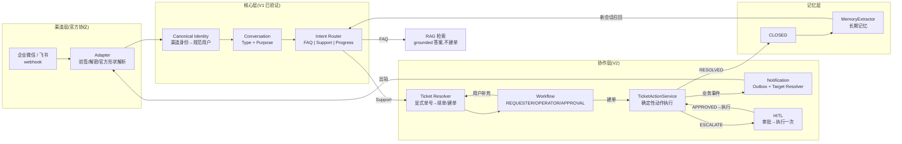
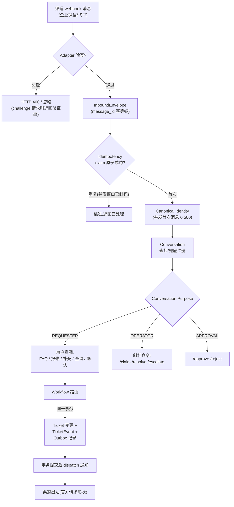
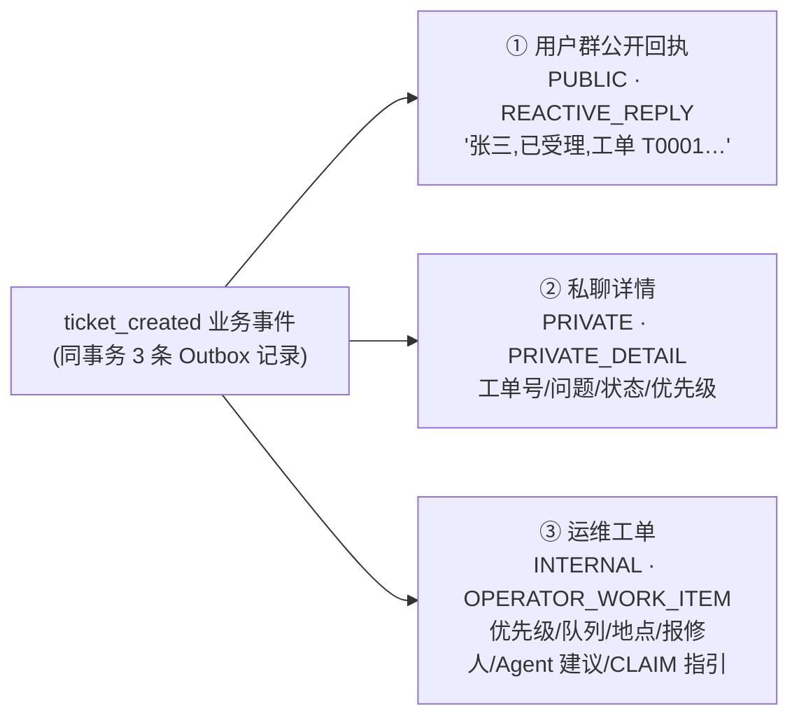
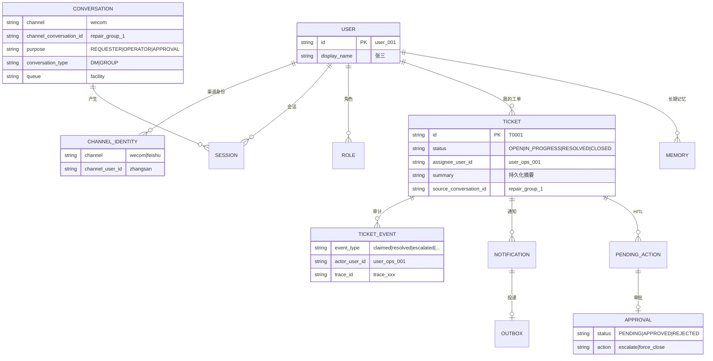

# Support Agent Lite

> 跨渠道企业支持代理(Cross-Channel Enterprise Support Agent)——**用户为中心(User-Centric)、工作流优先(Workflow-First)**。

企业微信 / 飞书消息 → 规范用户身份 → Conversation Purpose 路由 → FAQ 直答(不建单)或自动建单 → 三面协作(用户群回执 / 私聊详情 / 运维工单)→ 人工认领 → 解决 → **用户确认关闭** → 记忆抽取 → 新会话召回。完整闭环,本地可跑、离线可演示、面试可展示。

- **V1(Core)** AC-01 ~ AC-10:Canonical Identity、跨渠道工单解析、四状态单状态机、RAG grounding、Agent advice-only、Long-term Memory、全链路 Trace
- **V2(Collaboration Layer)** AC-11 ~ AC-30:Conversation Purpose / Role / Canonical Operator / 三面可见性 / 事务性通知 Outbox / 官方协议契约 / 确认关闭 / HITL 执行链 / 并发修复

> 旧项目 `support-agent-platform` 以只读方式保存在 `reference/`,仅作参考,禁止修改/提交。

---

## 目录

- [总体架构](#总体架构)
- [核心不变量](#核心不变量)
- [消息处理流程图](#消息处理流程图)
- [工单状态机](#工单状态机)
- [协作与通知链路](#协作与通知链路)
- [技术栈](#技术栈)
- [目录结构](#目录结构)
- [领域模型](#领域模型)
- [渠道协议(Mock network, not protocol)](#渠道协议)
- [API 一览](#api-一览)
- [快速开始](#快速开始)
- [一键演示](#一键演示)
- [测试与质量指标](#测试与质量指标)
- [真实渠道接入(未来)](#真实渠道接入未来)
- [文档](#文档)

---

## 总体架构

### 分层视图

```text
┌─────────────────────────────────────────────────────────────────────┐
│ transport / HTTP                                                     │
│   GET|POST /webhooks/{channel}   渠道入口(验签 + challenge + 消息)      │
│   POST /conversations/register   会话注册(purpose/queue/location)     │
│   POST /tickets/{id}/actions     认领 / 解决 / 强制关闭 / 升级         │
│   POST /tickets/{id}/approval    审批(approve / reject)              │
│   GET  /tickets/{id}/case        全案追踪(事件/通知/记忆/actor)         │
│   GET  /memories · /traces · /approvals · /health                    │
├─────────────────────────────────────────────────────────────────────┤
│ application(服务层)                                                    │
│   IdentityResolver · ConversationService · RoleService               │
│   TicketService · TicketActionService(确定性执行器)                   │
│   NotificationService(事务性 Outbox) · TargetResolver                │
│   CommandParser · Workflow(purpose 路由) · SupportAgent(只出建议)      │
│   MemoryService · ApprovalService · TraceLogger                      │
├─────────────────────────────────────────────────────────────────────┤
│ domain(领域模型)                                                       │
│   User / ChannelIdentity / Session · Conversation(Type/Purpose)     │
│   Role(requester|operator|approver) · Ticket(单状态) / TicketEvent   │
│   Approval(独立状态机) · PendingAction(HITL) · Notification(Outbox)   │
│   Outbound(Capability/Target/Message) · Memory · Message · Trace     │
├─────────────────────────────────────────────────────────────────────┤
│ infrastructure                                                        │
│   repositories(事务性仓储 + txn() 嵌套安全) · SQLite(串行化连接)         │
│   IdempotencyStore(原子幂等) · Retriever(FAQ 索引)                     │
│   LlmClient(可选,超时自动降级) · TraceStore                            │
├─────────────────────────────────────────────────────────────────────┤
│ adapters(协议适配,严禁触碰业务)                                           │
│   FeishuAdapter(官方 im.message.receive_v1 / token / challenge / AES) │
│   WeComAdapter(官方 sha1 签名 / AES 解密 / XML / echostr)              │
│   OutboundClient(Feishu im/v1/messages · WeCom message/send+appchat) │
│   HttpTransport(记录型,离线) · RealHttpTransport(未来真实联网)           │
└─────────────────────────────────────────────────────────────────────┘
```

### 核心职责链(一张图看懂 V2)



---

## 核心不变量

1. **渠道身份 ≠ 规范用户**(`wecom/zhangsan` 与 `feishu/ou_001` → 同一个 `user_001`)
2. **Session ≠ 用户**(会话属于用户,但不是身份)
3. **Session ≠ 记忆**(记忆由规范用户承载,与渠道/会话无关)
4. **Agent 只出建议**(summary/category/priority/推荐动作/回复草稿),claim/resolve/close/escalate/approve 必须走确定性 Domain Service
5. **Ticket 状态与 TicketEvent 同事务**(外加 V2:Notification Outbox 记录也同事务)
6. **Approval 是独立状态机**(PENDING 不冻结工单)
7. **低置信 RAG 不得自由发挥**(无可靠资料 → 真实转人工或诚实告知)
8. **跨渠道续单必须经规范用户身份解析**
9. **Channel ≠ Role**(同一渠道可有 Requester/Operator/Approver 会话;群/单聊能力是 Channel Capability,不是业务规则)
10. **共享 Operator 群无隐式 active ticket**(动作必须显式带工单号 `/claim T0001`)
11. **Mock network, not protocol**(协议只依据官方文档;无法证明的能力标 `UNSUPPORTED / PENDING_OFFICIAL_SPEC`)

---

## 消息处理流程图

### 入站流程(每条消息)



### 用户视角黄金路径(16 步离线 Demo)

```text
 ┌──────────────┐    ┌──────────────┐    ┌───────────────┐
 │ 张三(用户群)   │    │ 李师傅(运维群) │    │ 张三(飞书私聊) │
 └──────┬───────┘    └──────┬───────┘    └──────┬───────┘
        │ 1.A3空调坏了       │                    │
        ▼                   │                    │
 2.user_001 3.T0001 建单    │                    │
 4.群回执 5.私聊详情 6.运维工单│                    │
        │                   │ 7./claim T0001     │
        │                   ▼                    │
        │                  8.原子认领成功          │
 9.接单通知◄────────────────┤                    │
        │                   │ 10./resolve T0001   │
 11.确认请求◄───────────────┘                    │
        │                    │                   │ 12.跨渠道确认
        ▼                    ▼                   ▼
        │                  13.CLOSED 14.记忆抽取  │
        │                  15.新会话"空调又坏了"   │
        │◄──────────────16.记忆召回───────────────┘
```

---

## 工单状态机

```text
                    ┌───────────────┐
                    ▼               │
 ┌──────┐  claim  ┌──────────┐  resolve ┌──────────┐  confirm  ┌──────┐
 │ OPEN │ ──────▶ │IN_PROGRESS│ ───────▶ │ RESOLVED │ ────────▶ │CLOSED│
 └──────┘         └──────────┘          └──────────┘           └──────┘
     ▲                  │                    │  ▲
     └──── force_close ─┘                    └──┴── reject(用户说"还没好")
              (需原因+审批)                      resolution_rejected
```

| 迁移 | 动作 | 说明 |
| --- | --- | --- |
| `OPEN → IN_PROGRESS` | `claim` | 原子化:`WHERE status='OPEN' AND assignee_user_id IS NULL` + rowcount 校验,25 并发仅 1 胜 |
| `IN_PROGRESS → RESOLVED` | `resolve` | 进入"等待用户确认",**不自动关闭** |
| `RESOLVED → CLOSED` | `confirm` | 用户确认(可跨渠道),触发记忆抽取 |
| `RESOLVED → IN_PROGRESS` | `reject` | 用户驳回,产生 `resolution_rejected` 事件,不建新单 |
| `IN_PROGRESS → CLOSED` | `force_close` | 高风险动作:必须带原因 + 走审批 |

每个迁移同事务写入 `TicketEvent`,且带审计上下文:`actor_user_id`(谁)+ `trace_id`(哪条链路)+ `conversation_id`(在哪个会话)。

---

## 协作与通知链路

### 建单即三面输出(同一个 `ticket_created` 业务事件)



### 通知流水线(Business Event → Channel)

```text
Business Event
      ↓
Notification Policy(事件→通知类型)
      ↓
Notification Type(表达"为什么发",与平台无关)
      ↓
Audience / Visibility(PUBLIC | PRIVATE | INTERNAL)
      ↓
Target Resolver(用户群 / 私聊 / 运维群 / 操作发生会话 / 审批会话)
      ↓
Outbound Message(官方请求形状)
      ↓
Channel Transport(记录型,离线)
```

### 通知类型

| 类型 | 可见性 | 受众 | 示例 |
| --- | --- | --- | --- |
| `REACTIVE_REPLY` | PUBLIC | 用户群 | 已受理回执 |
| `PRIVATE_DETAIL` | PRIVATE | 报修人 DM | 工单详情 |
| `REQUESTER_STATUS_UPDATE` | PUBLIC/PRIVATE | 报修人 | 已由李师傅接手 |
| `OPERATOR_WORK_ITEM` | INTERNAL | 运维群 | 新工单 + CLAIM 指引 |
| `OPERATOR_ACTION_RECEIPT` | INTERNAL | 操作发生会话 | 认领成功回执 |
| `REQUESTER_CONFIRMATION_REQUEST` | PUBLIC/PRIVATE | 报修人 | 请确认是否恢复 |
| `APPROVAL_REQUEST` | INTERNAL | 审批会话 | 升级审批请求 |
| `APPROVAL_RESULT` | INTERNAL | 运维/发起人 | 审批结果 |
| `INTERNAL_NOTE` | INTERNAL | 运维/审批 | 内部备注 |

**去重**:`UNIQUE(source_event_id, notification_type, target)`,同一业务事件不会给同一目标发两遍。
**可靠**:Ticket 变更 + TicketEvent + Outbox 记录同事务提交;渠道发送在提交后执行,失败保留重试(≤3 次)。

### HITL 执行链

```text
ESCALATE T0001(运维群,显式单号)
      ↓
Policy 校验(动作白名单:escalate | force_close)
      ↓
PendingAction 落库(PENDING) + Approval(PENDING,独立状态机)
      ↓
审批群 /approve apr_xxx(CAS 原子,rowcount 守卫)
      ↓
APPROVED → Action Executor 确定性执行(恰好一次)
      ↓
Business Effect(工单 + escalated 事件 + 审计 actor)
      ↓
Notification(通知各方)
```

---

## 技术栈

| 层 | 选型 |
| --- | --- |
| 语言 | Python ≥ 3.12(现代特性:dataclass / type hints / `from __future__ import annotations`) |
| Web | FastAPI ≥ 0.110 + Uvicorn |
| 校验 | Pydantic ≥ 2.7 |
| 存储 | SQLite(单文件,`SerializedConnection` 串行化 + 嵌套安全 `txn()`) |
| 协议加密 | `cryptography` ≥ 42(AES-256-CBC,Feishu/WeCom 官方加密回调) |
| 检索 | 确定性 TF 检索(`Retriever`,FAQ 语料,无向量库) |
| LLM | 可选(OpenRouter),摘要/回复草稿润色;未配置或超时**自动降级为确定性规则** |
| 测试 | pytest ≥ 8(unit / integration / acceptance / concurrency / protocol contract) |
| 部署 | 单体 FastAPI 进程,零外部依赖(未来换 Redis/Kafka 前的刻意取舍) |

## 目录结构

```text
.
├── AGENTS.md                     # 智能体协作约定(只读)
├── README.md                     # 本文件
├── v2.md                         # V2 实现规格(AC-11~30 全量要求)
├── pyproject.toml
├── app/
│   ├── main.py                   # FastAPI 装配:build_core/build_ops/build_ingress/create_app
│   ├── domain/                   # 领域模型(与基础设施零耦合)
│   │   ├── envelope.py           #   InboundEnvelope
│   │   ├── identity.py           #   User / ChannelIdentity / Session
│   │   ├── conversation.py       #   Conversation(Type/Purpose)
│   │   ├── role.py               #   Role(requester|operator|approver)
│   │   ├── ticket.py             #   Ticket / TicketEvent / 状态机
│   │   ├── approval.py           #   Approval(独立状态机)
│   │   ├── pending_action.py     #   PendingAction(HITL 待执行动作)
│   │   ├── notification.py       #   NotificationType / Visibility / Outbox
│   │   ├── outbound.py           #   ChannelCapability / DeliveryTarget / Message
│   │   ├── memory.py · message.py · trace.py
│   ├── application/              # 服务层(业务编排,全部确定性)
│   │   ├── identity_service.py   #   并发安全身份解析
│   │   ├── conversation_service.py · role_service.py
│   │   ├── ticket_service.py     #   TicketResolver(显式单号→续单/建单)
│   │   ├── ticket_action_service.py # 动作执行器 + HITL _execute
│   │   ├── notification_service.py # 事务性 Outbox + dispatch(重试)
│   │   ├── target_resolver.py · command_parser.py
│   │   ├── workflow.py           #   purpose 路由(REQUESTER/OPERATOR/APPROVAL)
│   │   ├── ingress_service.py    #   原子幂等入口
│   │   ├── intent_router.py · retriever.py · context_builder.py
│   │   ├── support_agent.py      #   Agent(只出建议,invariant #4)
│   │   ├── memory_service.py · memory_extractor.py
│   │   ├── approval_service.py · session_service.py
│   ├── adapters/                 # 渠道协议(严禁触碰业务)
│   │   ├── base.py               #   ChannelAdapter 协议 + VerificationError
│   │   ├── feishu.py             #   官方事件/URL 验证/AES
│   │   ├── wecom.py              #   官方签名/AES/XML/能力诚实声明
│   │   ├── outbound.py           #   官方出站请求构造
│   │   └── transports.py         #   HttpTransport(记录/fail_next) + RealHttpTransport
│   └── infrastructure/           # 基础设施
│       ├── db.py                 #   SerializedConnection(RLock)+ apply_migrations
│       ├── idempotency.py        #   原子幂等(同事务 claim)
│       ├── repositories.py       #   txn() + 全部仓储
│       └── llm_client.py         #   可选 LLM,降级安全
├── storage/migrations/           # 0001~0012(含 V2 的 0009~0012)
├── seed/
│   ├── faq/                      # FAQ 语料(检索/评估)
│   └── conversations.json        # 演示会话注册(4 个群)
├── tests/                        # 179 个测试(详见测试章节)
├── docs/                         # 全部设计文档
└── reference/                    # 旧项目只读快照(gitignored)
```

---

## 领域模型



---

## 渠道协议

> 原则:**Mock 网络,不能 Mock 协议。** 所有实现能力都记录在 `docs/CHANNEL_PROTOCOL_MATRIX.md`(含官方文档 URL 与 2026-08-13 验证日期);官方无法证明的能力一律 `UNSUPPORTED / PENDING_OFFICIAL_SPEC`。

| 能力 | Feishu | WeCom |
| --- | --- | --- |
| `DM_INBOUND` | ✅ `im.message.receive_v1`(`message_id` 幂等) | ✅ 文本消息回调(`MsgId` 幂等,AES-256-CBC) |
| `GROUP_INBOUND` | ✅ `chat_type=group` | ⛔ `PENDING_OFFICIAL_SPEC`(官方文本消息格式无 chat_id) |
| `DM_OUTBOUND` | ✅ `POST /open-apis/im/v1/messages?receive_id_type=open_id` | ✅ `POST /cgi-bin/message/send`(`touser`) |
| `GROUP_OUTBOUND` | ✅ `receive_id_type=chat_id` | ✅ `POST /cgi-bin/appchat/send`(`chatid`) |
| `WEBHOOK_VERIFICATION` | ✅ token / challenge / Encrypt Key | ✅ `sha1(sort(token,timestamp,nonce,encrypt))` / echostr / AES |

**出站请求契约测试**(RecordingTransport 断言):

```text
Feishu DM :  URL=https://open.feishu.cn/open-apis/im/v1/messages?receive_id_type=open_id
             Authorization: Bearer <tenant_access_token>
             body={receive_id, msg_type:"text", content:'{"text":"…"}', uuid}
WeCom DM  :  URL=https://qyapi.weixin.qq.com/cgi-bin/message/send?access_token=…
             body={touser, msgtype:"text", agentid, text:{content}}
WeCom 群  :  URL=…/cgi-bin/appchat/send?access_token=…
             body={chatid, msgtype:"text", text:{content}}
```

**离线默认值**:`REAL_CHANNEL_NETWORK` 未设置 → 使用记录型 `HttpTransport`,所有 Demo/测试零凭证、零外网。启用真实联网只需设置该变量 + 配置凭据(见下文"真实渠道接入")。

---

## API 一览

### 消息入口

| 方法 | 端点 | 说明 |
| --- | --- | --- |
| `GET/POST` | `/webhooks/wecom` | WeCom 验签(`msg_signature` sha1 + AES 解密 + XML);GET 返回 echostr 验证串 |
| `GET/POST` | `/webhooks/feishu` | Feishu token 校验 / `url_verification` challenge / Encrypt Key 解密;消息按官方形状解析 |
| `POST` | `/webhooks/{channel}` | 统一入站:`message_id` 原子幂等 → 身份 → purpose 路由 → 业务 + 通知 |

### 会话与权限

| 方法 | 端点 | 说明 |
| --- | --- | --- |
| `POST` | `/conversations/register` | 注册会话:`{channel, channel_conversation_id, purpose, type, queue, location}` |
| `GET` | `/conversations` | 列出已注册会话(purpose 路由依据) |

### 工单与协作

| 方法 | 端点 | 说明 |
| --- | --- | --- |
| `POST` | `/tickets/{id}/actions` | 确定性动作:`claim` / `resolve` / `force-close` / `escalate`(非法迁移 409;claim 原子化) |
| `POST` | `/tickets/{id}/claim` | V1 兼容入口(保留,同一实现) |
| `POST` | `/tickets/{id}/resolve` · `/close` | V1 兼容入口 |
| `POST` | `/tickets/{id}/escalate` | 发起升级审批(返回 `approval_id`) |
| `POST` | `/tickets/{id}/approval` | `approve` / `reject`(幂等,AC-22 执行链) |
| `GET` | `/tickets/{id}/case` | **全案追踪**:事件(actor/trace)+ 通知 + 记忆 + 工单 |

### 查询

| 方法 | 端点 | 说明 |
| --- | --- | --- |
| `GET` | `/approvals` | 审批列表(独立状态机) |
| `POST` | `/approvals/{id}/approve` · `/reject` | V1 兼容审批入口 |
| `GET` | `/memories?user_id=&kind=` | 长期记忆(CLOSED 工单抽取) |
| `GET` | `/traces/{trace_id}` | 单条消息全链路(channel→identity→intent→ticket/agent→reply) |
| `GET` | `/health` | 健康检查 |

> **单一 Ticket API**:不存在第二套生命周期接口;斜杠命令、REST、webhook 都只是 `TicketAction` 的输入适配器。

---

## 快速开始

```bash
python -m venv .venv && source .venv/bin/activate
pip install -e ".[dev]"

pytest                 # 179 passed(离线、确定性)
uvicorn app.main:app   # http://127.0.0.1:8000
```

可选 LLM(OpenRouter,`.env` 配置,已被 gitignore):

```bash
LLM_API_KEY=...        # Agent 摘要/回复草稿润色
LLM_BASE_URL=...       # 默认 https://openrouter.ai/api/v1
LLM_MODEL=...          # 默认 nvidia/nemotron-3-ultra-550b-a55b:free
```

> 未配置或超时自动降级为确定性规则,永不阻塞主流程。

## 一键演示

`seed/conversations.json` 预注册了 4 个会话(完整离线):

```json
[
  {"channel": "wecom", "channel_conversation_id": "repair_group_1", "purpose": "REQUESTER",  "type": "GROUP", "queue": "facility", "location": "A3"},
  {"channel": "wecom", "channel_conversation_id": "op_group_facility", "purpose": "OPERATOR", "type": "GROUP", "queue": "facility"},
  {"channel": "wecom", "channel_conversation_id": "approval_room",   "purpose": "APPROVAL",  "type": "GROUP"},
  {"channel": "feishu", "channel_conversation_id": "oc_op_facility", "purpose": "OPERATOR", "type": "GROUP", "queue": "facility"}
]
```

```bash
# 1. 用户报修群:建单 T0001(群回执 + 私聊详情 + 运维工单 三面输出)
curl -s -X POST http://127.0.0.1:8000/webhooks/wecom -H 'Content-Type: application/json' \
  -d '{"MsgId":"m1","FromUserName":"zhangsan","Content":"A3 空调坏了","CreateTime":1000,"conversation_id":"repair_group_1"}'

# 2. 运维群显式认领(无隐式 active ticket)
curl -s -X POST http://127.0.0.1:8000/webhooks/wecom -H 'Content-Type: application/json' \
  -d '{"MsgId":"m2","FromUserName":"lihua","Content":"/claim T0001","CreateTime":2000,"conversation_id":"op_group_facility"}'

# 3. 解决 → 等待用户确认
curl -s -X POST http://127.0.0.1:8000/webhooks/wecom -H 'Content-Type: application/json' \
  -d '{"MsgId":"m3","FromUserName":"lihua","Content":"/resolve T0001 已更换空调滤网","CreateTime":3000,"conversation_id":"op_group_facility"}'

# 4. 用户从绑定的飞书 DM 跨渠道确认 → CLOSED → 记忆抽取
curl -s -X POST http://127.0.0.1:8000/webhooks/feishu -H 'Content-Type: application/json' \
  -d '{"event_id":"e1","event":{"message":{"message_id":"om1","chat_type":"p2p","content":"{\"text\":\"T0001 已恢复\"}"},
        "sender":{"sender_id":{"open_id":"ou_zhangsan"}},"chat_id":"oc_dm"}}'

# 5. 新会话记忆召回
curl -s -X POST http://127.0.0.1:8000/webhooks/wecom -H 'Content-Type: application/json' \
  -d '{"MsgId":"m5","FromUserName":"zhangsan","Content":"空调又坏了","CreateTime":5000,"conversation_id":"conv_new"}'

# 6. 全案追踪(actor/trace/通知/记忆)
curl -s http://127.0.0.1:8000/tickets/T0001/case
```

完整 16 步场景在 `tests/test_demo_v2.py::test_demo_v2_full_golden_path`。

---

## 测试与质量指标

### 测试矩阵

| 类型 | 文件 | 覆盖 |
| --- | --- | --- |
| unit / integration | `test_*.py`(V1) | 领域/状态机/仓储/服务/适配器 |
| acceptance | `test_golden_path.py` · `test_v2_collaboration.py` | AC-01~AC-21 |
| concurrency | `test_v2_concurrency.py` | AC-15 / AC-25 / 身份并发 / 幂等释放 |
| HITL + 通知 | `test_v2_hitl_notifications.py` | AC-22~24 + outbox 存活 |
| protocol contract | `test_v2_protocol.py` | AC-26~28(14 个:官方形状/验签/AES/出站契约) |
| demo | `test_demo_v2.py` | 16 步黄金路径 + FAQ + HITL + Case Trace |

### 质量指标(测试实测,非预设)

| 指标 | 目标 | 实测 |
| --- | --- | --- |
| 全量测试 | — | **179 passed / 0 failed** |
| Golden Path AC-01~AC-10 | 全绿 | 10/10 |
| V2 验收 AC-11~AC-30 | 全绿 | 20/20 |
| FAQ 检索 Recall@3 | ≥ 90% | **100%**(14/14) |
| 记忆抽取 Precision | ≥ 85% | **100%**(11/11) |
| 并发重复 webhook(25 线程) | 1 执行 / 0 500 | 1 执行 / 0 重复 / 0 500 |
| 并发认领(25 线程) | exactly 1 winner | 1 胜 / 1 claimed 事件 |
| 并发首次消息同身份(25 线程) | 0 500 / 1 规范用户 | 0 错误 / 1 用户 |
| 通知去重 | 每(事件,类型,目标)1 条 | 1 条 |
| 模拟投递失败 | 业务不丢 / 可重试 | 保留 + 重试成功 |
| 真实联网 / 真实凭证 | 不需要 | 未使用 |

---

## 真实渠道接入(未来)

当前所有 Demo/测试默认离线(`REAL_CHANNEL_NETWORK` 未设置)。未来接入真实渠道:

```bash
# 企业微信
export WECOM_CORP_ID=... WECOM_CORP_SECRET=... WECOM_AGENT_ID=...
export WECOM_TOKEN=... WECOM_ENCODING_AES_KEY=...     # 回调验签/解密
# 飞书
export FEISHU_APP_ID=... FEISHU_APP_SECRET=...
export FEISHU_VERIFICATION_TOKEN=... FEISHU_ENCRYPT_KEY=...
# 真实出站
export REAL_CHANNEL_NETWORK=true
```

然后配置平台回调 URL 指向 `/webhooks/{channel}`,提供真实 conversation ids 并注册。**只需 config + transport,无需重设计** Identity / Conversation / Ticket / Notification / Workflow。

当前唯一能力缺口:WeCom `GROUP_INBOUND`(官方文档未证明群消息回调携带 chat_id,标 `PENDING_OFFICIAL_SPEC`)。

---

## 文档

| 文档 | 内容 |
| --- | --- |
| `docs/PRODUCT_SCOPE.md` | 产品范围(做什么 / 不做什么) |
| `docs/ARCHITECTURE.md` | 架构、分层与 11 条核心不变量 |
| `docs/DOMAIN_MODEL.md` | 领域实体、状态机、事务约束 |
| `docs/GOLDEN_PATH.md` | 黄金路径与里程碑 |
| `docs/ACCEPTANCE_TESTS.md` | 验收契约 AC-01 ~ AC-30 |
| `docs/CHANNEL_PROTOCOL_MATRIX.md` | **渠道协议证据矩阵**(官方 URL + 字段 + 幂等 + 能力状态) |
| `docs/V2_IMPLEMENTATION_REPORT.md` | **V2 实现报告**(schema/模型/指标/遗留) |
| `docs/DEVELOPMENT_PLAN.md` | 分阶段开发计划 |
| `docs/IMPLEMENTATION_BACKLOG.md` | 已完成 / 未来工作清单 |
| `docs/LEGACY_PORT_MAP.md` | 旧代码移植 / 改写 / 忽略对照 |
| `docs/HANDOVER.md` | 会话交接 |
| `V1_TO_V2_ARCHITECTURE_AUDIT.md` | V1→V2 只读审计 |
| `docs/reference/LEGACY_ARCHITECTURE_AUDIT.md` | 旧项目架构审计(仅参考) |
| `v2.md` | V2 实现规格(任务原文) |
