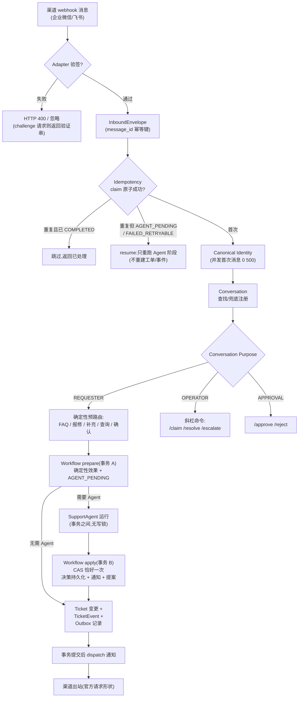
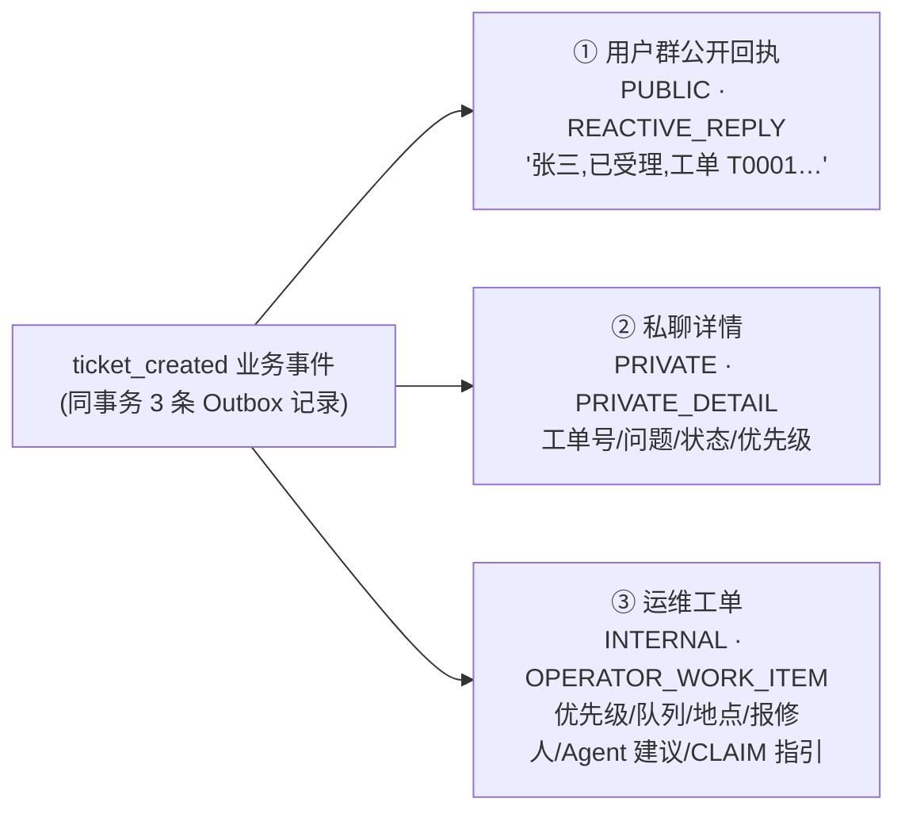

# Support Agent Lite

> 跨渠道企业支持代理(Cross-Channel Enterprise Support Agent)——**用户为中心(User-Centric)、工作流优先(Workflow-First)**。

企业微信 / 飞书消息 → 规范用户身份 → Conversation Purpose 路由 → FAQ 直答(不建单)或自动建单 → **有状态 SupportAgent 语义理解(多轮续单 / 紧急度识别 / 记忆召回 / RAG 证据问答 / 澄清追问 / 动作提案)** → 三面协作(用户群回执 / 私聊详情 / 运维工单)→ 人工认领 → 解决 → **用户确认关闭** → 记忆抽取 → 新会话召回。完整闭环,本地可跑、离线可演示、面试可展示。

- **V1(Core)** AC-01 ~ AC-10:Canonical Identity、跨渠道工单解析、四状态单状态机、RAG grounding、Agent advice-only、Long-term Memory、全链路 Trace
- **V2(Collaboration Layer)** AC-11 ~ AC-30:Conversation Purpose / Role / Canonical Operator / 三面可见性 / 事务性通知 Outbox / 官方协议契约 / 确认关闭 / HITL 执行链 / 并发修复
- **V2.1(Agent Core)** AC-A01 ~ AC-A20:有状态有边界的 SupportAgent(AgentContext 全感知 → 有限只读工具 → 结构化 AgentDecision)、两阶段事务(LLM 不占写锁)、崩溃可恢复处理状态、PromptRegistry、Agent eval 套件、PRIVATE_DETAIL 首联直投、关闭后门收口、REST actor/role 信任边界
- **V3(Enterprise Retrieval & Multi-Agent)** C9/C2/C10/B1:**五实体检索路由**(意图级工具白名单 + L4 实体拦截 + 脱敏输出)、**混合检索**(TF-IDF+向量 RRF 双路召回 + Qwen3-Reranker 重排,419 条中文语料)、**问数子代理**(NL→受限统计规格→只读执行,首个多 Agent 组件)、**LLM Provider 注册表**(openrouter/bailian/deepseek 内置,FallbackLLMClient)

> 旧项目 `support-agent-platform` 以只读方式保存在 `reference/`,仅作参考,禁止修改/提交。

---

## 目录

- [总体架构](#总体架构)
- [核心不变量](#核心不变量)
- [V2.1 Agent Core](#v21-agent-core)
- [V3 企业级检索路由(C9)](#v3-企业级检索路由c9)
- [V3 混合检索(C2)](#v3-混合检索c2)
- [V3 问数子代理(C10)](#v3-问数子代理c10)
- [消息处理流程图](#消息处理流程图)
- [工单状态机](#工单状态机)
- [协作与通知链路](#协作与通知链路)
- [技术栈](#技术栈)
- [目录结构](#目录结构)
- [领域模型](#领域模型)
- [渠道协议(Mock network, not protocol)](#渠道协议)
- [API 一览](#api-一览)
- [快速开始](#快速开始)
- [一键演示](#一键演示)
- [测试与质量指标](#测试与质量指标)
- [真实渠道接入](#真实渠道接入)
- [文档](#文档)

---

## 总体架构

### 分层视图

```text
┌─────────────────────────────────────────────────────────────────────┐
│ transport / HTTP                                                     │
│   GET|POST /webhooks/{channel}   渠道入口(验签 + challenge + 消息)      │
│   POST /conversations/register   会话注册(purpose/queue/location)     │
│   POST /tickets/{id}/actions     认领 / 解决 / 强制关闭 / 升级         │
│   POST /tickets/{id}/approval    审批(approve / reject)              │
│   GET  /tickets/{id}/case        全案追踪(事件/通知/记忆/actor)         │
│   GET  /memories · /traces · /approvals · /health                    │
├─────────────────────────────────────────────────────────────────────┤
│ application(服务层)                                                    │
│   IdentityResolver · ConversationService · RoleService               │
│   TicketService · TicketActionService(确定性执行器)                   │
│   NotificationService(事务性 Outbox) · TargetResolver                │
│   CommandParser · Workflow(purpose 路由 + 工具白名单装配)              │
│   SupportAgent(有状态 Agent) · EntityGuard(L4 实体拦截)              │
│   AgentToolPort(只读 8 工具) · PolicyValidator(提案门禁)             │
│   PromptRegistry · MemoryService · ApprovalService · TraceLogger     │
│   StatsAgent(问数子代理,C10) · IngressService(两阶段)                │
├─────────────────────────────────────────────────────────────────────┤
│ domain(领域模型)                                                       │
│   User / ChannelIdentity / Session · Conversation(Type/Purpose)     │
│   Role(requester|operator|approver) · Ticket(单状态) / TicketEvent   │
│   Approval(独立状态机) · PendingAction(HITL) · Notification(Outbox)   │
│   Outbound(Capability/Target/Message) · Memory · Message · Trace     │
├─────────────────────────────────────────────────────────────────────┤
│ infrastructure                                                        │
│   repositories(事务性仓储 + txn() 嵌套安全) · SQLite(串行化连接)         │
│   IdempotencyStore(原子幂等) · Retriever(TF-IDF 关键词路)              │
│   HybridRetriever(RRF 融合) · VectorStore(numpy 默认/Chroma 可选)      │
│   SiliconFlow Embedding/Reranker 客户端(Qwen3-8B 双模型)               │
│   DirectoryService(通讯录+资产台账,L4 精确实体,严禁向量化)              │
│   LLM Provider 注册表(openrouter/bailian/deepseek+Fallback 链)        │
│   TraceStore · InboundProcessingStore                                 │
│   (RECEIVED→AGENT_PENDING→AGENT_COMPLETED→COMPLETED/FAILED_RETRYABLE) │
├─────────────────────────────────────────────────────────────────────┤
│ adapters(协议适配,严禁触碰业务)                                           │
│   FeishuAdapter(官方 im.message.receive_v1 / token / challenge / AES) │
│   WeComAdapter(官方 sha1 签名 / AES 解密 / XML / echostr)              │
│   OutboundClient(Feishu im/v1/messages · WeCom message/send+appchat) │
│   HttpTransport(记录型,离线) · RealHttpTransport(真实联网)              │
│   Feishu WS Bridge(长连接入站桥,生产验证)                               │
└─────────────────────────────────────────────────────────────────────┘
```

### 核心职责链(一张图看懂 V2.1)

```mermaid
flowchart LR
    subgraph Channel["渠道层(官方协议)"]
        W["企业微信 / 飞书<br/>webhook"]
        A["Adapter<br/>验签/解密/官方形状解析"]
    end
    subgraph Core["核心层(V1 已验证)"]
        ID["Canonical Identity<br/>渠道身份→规范用户"]
        CV["Conversation<br/>Type + Purpose"]
        IR["Intent Router<br/>FAQ / Support / Progress"]
    end
    subgraph AgentCore["Agent 层(V2.1)"]
        CTX["AgentContext<br/>消息/角色/会话/工单/记忆/RAG"]
        AGT["SupportAgent<br/>有状态·有边界·结构化决策"]
        WL["工具白名单装配<br/>意图级最小授权(C9)"]
        TOOL["只读工具 ×8(≤2 次)<br/>历史/知识/记忆/动作/<br/>通讯录/资产/统计/问数"]
        GUARD["EntityGuard L4 拦截<br/>PII 禁入向量+脱敏"]
    end
    subgraph Retrieval["检索层(V3)"]
        HY["HybridRetriever<br/>TF-IDF + 向量 RRF 融合"]
        RR["Qwen3-Reranker 重排"]
        VEC["VectorStore<br/>numpy / Chroma"]
        GATE["AnswerabilityGate<br/>低置信拒答(Invariant 7)"]
    end
    subgraph SubAgent["子代理(V3 C10)"]
        SA["StatsAgent 问数<br/>NL→受限规格→只读执行"]
    end
    subgraph Collab["协作层(V2)"]
        TS["Ticket Resolver<br/>显式单号→续单/建单"]
        WF["Workflow<br/>REQUESTER/OPERATOR/APPROVAL"]
        POL["PolicyValidator<br/>提案→审批门禁"]
        ACT["TicketActionService<br/>确定性动作执行"]
        NOT["Notification<br/>Outbox + Target Resolver"]
        HITL["HITL<br/>审批→执行一次"]
    end
    subgraph Memory["记忆层"]
        CLOSE["CLOSED"]
        MEM["MemoryExtractor<br/>长期记忆"]
    end

    W --> A --> ID --> CV --> IR
    IR -->|FAQ| GATE
    IR -->|Support| TS
    TS --> WF
    WF -->|建单| ACT
    WF -->|Agent 决策| CTX
    CTX --> GUARD
    GUARD -->|"实体命中→只留查询工具"| AGT
    GUARD -->|"正常"| WL
    WL --> AGT
    AGT -->|信息不足| TOOL
    TOOL -->|知识检索| HY
    HY --> VEC
    HY --> RR --> GATE
    TOOL -->|统计问题| SA
    SA -->|口径明确答案| AGT
    TOOL -->|只读结果| AGT
    AGT -->|AgentDecision| WF
    WF -->|proposal| POL
    POL -->|审批| HITL
    HITL -->|APPROVED→执行| ACT
    ACT -->|业务事件| NOT
    NOT -->|出站| A
    ACT -->|RESOLVED| CLOSE
    CLOSE --> MEM
    MEM -->|新会话召回| CTX
```



---

## 核心不变量

1. **渠道身份 ≠ 规范用户**(`wecom/zhangsan` 与 `feishu/ou_001` → 同一个 `user_001`)
2. **Session ≠ 用户**(会话属于用户,但不是身份)
3. **Session ≠ 记忆**(记忆由规范用户承载,与渠道/会话无关)
4. **Agent 只出建议**(`AgentProposes. Policy validates. Domain decides.`):Agent 理解、总结、推荐并输出结构化 `AgentDecision`,但 claim/resolve/close/escalate/approve/assign/update 必须走确定性 Policy → Domain Service → HITL;Agent 无任何写工具,`action_proposal` 无业务效果
5. **Ticket 状态与 TicketEvent 同事务**(外加 V2:Notification Outbox 记录也同事务)
6. **Approval 是独立状态机**(PENDING 不冻结工单)
7. **低置信 RAG 不得自由发挥**(无可靠资料 → 真实转人工或诚实告知)
8. **跨渠道续单必须经规范用户身份解析**
9. **Channel ≠ Role**(同一渠道可有 Requester/Operator/Approver 会话;群/单聊能力是 Channel Capability,不是业务规则)
10. **共享 Operator 群无隐式 active ticket**(动作必须显式带工单号 `/claim T0001`)
11. **Mock network, not protocol**(协议只依据官方文档;无法证明的能力标 `UNSUPPORTED / PENDING_OFFICIAL_SPEC`)

---

## V2.1 Agent Core

> SupportAgent 是一个**有状态、有边界、可解释的企业支持 Agent**:消费完整对话/工单/记忆/知识上下文,可调用少量只读工具,输出 schema 校验过的 `AgentDecision`。敏感业务状态变更仍完全由确定性 Policy / Domain Service / HITL 控制。**不是 autonomous agent,没有无限 ReAct loop。**

### 运行模型

```text
Inbound Message
      ↓
Deterministic Ingress(身份 / 会话 / 幂等 / processing state)
      ↓
Deterministic Pre-routing(IntentRouter · TicketResolver · 显式命令)
      ↓
AgentContext(全感知:消息/角色/会话用途/工单/最近对话/记忆/RAG 证据)
      ↓
Bounded SupportAgent(max 3 steps · max 2 只读工具)
      ↓
Structured AgentDecision(validate_decision 兜底全部失败模式)
      ↓
PolicyValidator(角色/工单状态/允许动作/原因/风险/审批要求)
      ↓
HITL(需审批 → PendingAction → Approval)
      ↓
TicketActionService(确定性执行 → TicketEvent → Notification/Outbox)
```

### AgentDecision 契约(核心字段)

| 字段 | 含义 |
| --- | --- |
| `understanding` / `summary` | 语义理解 / 持久化摘要 |
| `category` · `priority_suggestion` | 分类 / 优先级建议(枚举校验) |
| `recommended_action` | `dispatch_repair \| network_triage \| software_support \| credential_reset \| finance_review \| hr_review \| assign_operator \| ask_clarification \| faq_answer` |
| `missing_information[]` | 信息不足 → 真实澄清能力 |
| `confidence`(0~1,越界钳制) | 决策置信度 |
| `memory_refs[]` / `knowledge_refs[]` | 只允许引用上下文真实存在的 id(反幻觉) |
| `action_proposal` | `ESCALATE \| FORCE_CLOSE`,**无业务效果**,必须过 Policy + Approval |
| `rationale` | 给系统/审计的简短可解释理由,**绝不保存 chain-of-thought** |
| `reply_draft` | ≤300 字的回复草稿(超长即 fallback) |

### 只读工具(V3 五实体矩阵,共 8 个,全部 READ ONLY)

| 工具 | 用途 | 数据路径 | 限制 |
| --- | --- | --- | --- |
| `get_ticket_history(ticket_id)` | 工单完整事件历史 + 最近会话 | L2 工单 | ≤2 次/run |
| `search_knowledge(query)` | 混合检索企业知识库(关键词+向量+重排) | L1 知识库 | ≤2 次/run |
| `recall_memory(query)` | 该员工既往工单记忆 | 长期记忆 | ≤2 次/run |
| `get_allowed_actions(ticket_id, actor_role)` | 当前状态允许的动作 | 权限 | ≤2 次/run |
| `contact_lookup(query)` | 通讯录精确查询(姓名/工号/分机/部门) | **L4 精确实体** | 拦截轮专属 |
| `asset_lookup(query)` | IT 资产台账查询(资产号/型号/领用人) | **L4 精确实体** | 拦截轮专属 |
| `ticket_stats(group_by)` | 受限分组统计(列名白名单) | L3 统计 | support 意图 |
| `ask_stats(question)` | **问数子代理**:NL→受限规格→口径明确答案 | L3 统计 | support/progress |

**没有** claim/resolve/close/approve/reject/assign/update/execute_action——写工具不存在。
工具按**意图白名单装配**(C9):FAQ 轮只见知识工具,闲聊轮零检索面,L4 拦截轮只留实体查询。

### 两阶段事务模型(LLM 不占 DB 写锁)

```text
事务 A(入站事务)
  claim 幂等键 → 身份/会话/会话 → 确定性业务效果(建单/事件/运维工作项/确认/命令动作)
  → processing state = AGENT_PENDING
  COMMIT

Agent Run(事务之间)
  LLM + 只读工具,无 DB 写锁(AC-A11)

事务 B(CAS 守卫,恰好一次)
  advance(AGENT_PENDING→AGENT_COMPLETED) → 持久化决策/通知/提案
  → state = COMPLETED
  COMMIT → post-commit dispatch outbox
```

崩溃安全:`AGENT_PENDING / FAILED_RETRYABLE` 可由重复投递**恢复**(resume 只重跑 Agent 阶段,绝不重建工单/事件);`COMPLETED` 重复投递为 no-op。处理状态机:`RECEIVED → AGENT_PENDING → AGENT_COMPLETED → COMPLETED`,`FAILED_RETRYABLE` 可恢复。

### 确定性降级

LLM 不可用 / 超时 / 非法 JSON / 枚举越界 / 超长回复 / 工具被拒 → 全部安全降级到确定性规则分类,业务永不卡死、异常永不外泄。

---

## V3 企业级检索路由(C9)

> **先分类,后检索**:向量检索只占企业 RAG 的 30%,其余是精确查询、关键词与权限。五类实体各走各的检索路径,由确定性代码路由,LLM 只在白名单内选择工具。

### 五实体 × 数据载体

| 实体 | 载体 | 检索路径 | 安全规则 |
| --- | --- | --- | --- |
| 知识文档 | `seed/faq/`(419 条中文语料) | L1 混合检索 + 重排 + AnswerabilityGate | 低置信拒答(Invariant 7) |
| 工单 | tickets/messages(SQLite) | ticket_history / case trace | requester 仅本人 |
| 人员通讯录 | `seed/directory/employees.json`(30 人,**纯虚构**) | **L4 SQL/LIKE 精确查询** | **严禁向量化**;requester 手机号强制脱敏 |
| IT 资产 | `seed/directory/assets.json`(30 条,**纯虚构**) | L4 精确查询 | 同上 |
| 历史记忆 | memories 表 | recall_memory | 规范用户承载 |

### 路由决策流(每条消息)

```text
用户输入
   │
   ▼
IntentRouter ──► faq / support / progress_query / other
   │
   ▼
EntityGuard 正则拦截(手机号 / 身份证 / E0001 工号 / AST-0307 资产号)
   │
   ├─ 命中 ──► 本轮锁死:只挂 contact_lookup + asset_lookup
   │           并注入「输出必须脱敏」系统指令 ─────────┐
   │                                                │
   └─ 未命中 ──► 按意图装配工具白名单:                  │
        faq         → search_knowledge + recall_memory│
        support     → 全量只读 7 工具                 │
        progress    → history + actions + ask_stats  │
        no_answer   → 零检索面(转人工无需查库)          │
                      │                              │
                      ▼                              │
        SupportAgent(白名单内自由选择 ≤2 次)◄──────────┘
```

### L4 为什么不能走向量?

身份证号 "110" 与 "120" 在向量空间可能很近但业务含义天差地别;分机号、工号、资产号的正确姿势是精确匹配。`EntityGuard` 用正则在入口拦截,命中即禁用向量类工具——**既是检索正确性问题,更是数据安全问题**。

---

## V3 混合检索(C2)

> 用户说"电脑开不了机"靠关键词,"屏幕一直黑着"靠语义——双路召回各取所长,重排去伪存真。

### 检索流水线

```text
                用户 Query
                    │
          ┌─────────┴──────────┐
          ▼                    ▼
   TF-IDF 关键词路        Qwen3-Embedding-8B
   Retriever(419 条)      4096 维向量化
          │                    │
          │                    ▼
          │             VectorStore 检索
          │           numpy 默认 / Chroma 可选
          ▼                    ▼
       RRF 融合(k=60 倒数排名)
                    │
                    ▼ Top ~10 候选
       Qwen3-Reranker-8B 交叉编码重排
                    │
                    ▼
       Top-K RetrievalHit(rerank 分数 0~1)

任一外部环节失败 → 自动回落关键词结果,检索永不因外网抖动而失败
```

### 关键设计:Invariant 7 不动摇

- `answer()` 门控(分数阈值 ≥0.25 + 匹配词数下限)**保留在关键词侧**,语义不变;
- 向量/重排只升级 `search()` 质量与 agent 工具召回;
- **外部服务故障静默降级**:embedding/rerank 任一失败 → 自动回落关键词结果,检索管线永不因外网抖动而失败;
- 实测:「电脑一插U盘就蓝屏」→ `kb-hw-0004` @0.9994;语料无答案的问题(如「空调不制冷」)全候选得分 ≈0.0001 = 正确的拒答信号。

### 语料

| 来源 | 条数 | 说明 |
| --- | --- | --- |
| 手工 FAQ/SOP/方法论 | 113 | 9 大类全覆盖,verify_kb 门禁守护 |
| 开源数据集中文化(customer-support-tickets) | 306 | 百炼批量本地化,零失败,IT 相关性过滤+标题相似度去重 |

索引构建:`python scripts/build_vector_index.py`(需 `SILICONFLOW_API_KEY`)。

---

## V3 问数子代理(C10)

> 首个多 Agent 组件:**单一职责、无状态、无共享内存、全只读**(AGENTS.md 多 Agent 硬条件全满足)。主 Agent 通过 `ask_stats` 工具调用它,说完即销毁。

```text
 用户            主 Agent(SupportAgent)        问数子代理(StatsAgent)       TicketStore(只读)
  │ "最近一周网络类 │                              │                          │
  │  工单有几个?"   │                              │                          │
  ├───────────────►│ ask_stats(question)          │                          │
  │                ├─────────────────────────────►│ LLM→规格 JSON             │
  │                │                              │ + 规则信号交叉校验          │
  │                │                              │ + 白名单清洗 _clean()      │
  │                │                              ├─────────────────────────►│
  │                │                              │   stats_filtered(         │
  │                │                              │     category=network,     │
  │                │                              │     since=7 天前)          │
  │                │                              │◄─────────────────────────┤
  │                │                              │   {OPEN: 3}               │
  │                │◄─────────────────────────────┤                          │
  │                │ 「统计口径:last_7d、类别=network。3 单」                    │
  │◄───────────────┤ 引用子代理结果作答             │                          │
  │                │      (子代理无状态,结果即销毁)  │                          │
```

### 三道防线

1. **不生成裸 SQL**:NL 只转换为受限 spec(group_by/status/category/time 全枚举白名单),列名插值前校验;
2. **LLM 输出不可信**:`deterministic_spec()` 规则提取作为交叉校验与兜底,LLM 漏掉的过滤信号以规则为准;
3. **口径可审计**:每个答案都带「统计口径」前缀,时间窗/过滤条件显式可见。

---

## 消息处理流程图

### 入站流程(每条消息,V2.1 两阶段)



### 用户视角黄金路径(离线 Demo,含 V2.1 多轮/紧迫度/记忆)

```text
 ┌──────────────┐    ┌──────────────┐    ┌───────────────┐
 │ 张三(用户群)   │    │ 李师傅(运维群) │    │ 张三(飞书私聊) │
 └──────┬───────┘    └──────┬───────┘    └──────┬───────┘
        │ 1.A3空调坏了       │                    │
        ▼                   │                    │
 2.user_001 3.T0001 建单    │                    │
 4.Agent 决策→群回执 5.私聊详情│                    │
 6.运维工单                  │                    │
        │ 7."下午领导要来,很急"│                    │
        ▼                   │                    │
 Agent 识别紧迫度↑ → 优先级 P2 + 运维更新提示         │
        │                   │ 8./claim T0001     │
        │                   ▼                    │
        │                  9.原子认领成功          │
 10.接单通知◄────────────────┤                    │
        │                   │ 11./resolve T0001   │
 12.确认请求◄───────────────┘                    │
        │                    │                   │ 13.跨渠道确认
        ▼                    ▼                   ▼
        │                  14.CLOSED 15.记忆抽取 │
        │                  16.新会话"A3空调又坏了" │
        │◄───────────17.记忆召回→memory_refs─────┘
```

---

## 工单状态机

```text
                    ┌───────────────┐
                    ▼               │
 ┌──────┐  claim  ┌──────────┐  resolve ┌──────────┐  confirm  ┌──────┐
 │ OPEN │ ──────▶ │IN_PROGRESS│ ───────▶ │ RESOLVED │ ────────▶ │CLOSED│
 └──────┘         └──────────┘          └──────────┘           └──────┘
     ▲                  │                    │  ▲
     └──── force_close ─┘                    └──┴── reject(用户说"还没好")
              (需原因+审批)                      resolution_rejected
```

| 迁移 | 动作 | 说明 |
| --- | --- | --- |
| `OPEN → IN_PROGRESS` | `claim` | 原子化:`WHERE status='OPEN' AND assignee_user_id IS NULL` + rowcount 校验,25 并发仅 1 胜 |
| `IN_PROGRESS → RESOLVED` | `resolve` | 进入"等待用户确认",**不自动关闭** |
| `RESOLVED → CLOSED` | `confirm` | 用户确认(可跨渠道),触发记忆抽取 |
| `RESOLVED → IN_PROGRESS` | `reject` | 用户驳回,产生 `resolution_rejected` 事件,不建新单 |
| `IN_PROGRESS → CLOSED` | `force_close` | 高风险动作:必须带原因 + 走审批 |

每个迁移同事务写入 `TicketEvent`,且带审计上下文:`actor_user_id`(谁)+ `trace_id`(哪条链路)+ `conversation_id`(在哪个会话)。

---

## 协作与通知链路

### 建单即三面输出(同一个 `ticket_created` 业务事件)



### 通知流水线(Business Event → Channel)

```text
Business Event
      ↓
Notification Policy(事件→通知类型)
      ↓
Notification Type(表达"为什么发",与平台无关)
      ↓
Audience / Visibility(PUBLIC | PRIVATE | INTERNAL)
      ↓
Target Resolver(用户群 / 私聊 / 运维群 / 操作发生会话 / 审批会话)
      ↓
Outbound Message(官方请求形状)
      ↓
Channel Transport(记录型,离线)
```

### 通知类型

| 类型 | 可见性 | 受众 | 示例 |
| --- | --- | --- | --- |
| `REACTIVE_REPLY` | PUBLIC | 用户群 | 已受理回执 |
| `PRIVATE_DETAIL` | PRIVATE | 报修人 DM | 工单详情 |
| `REQUESTER_STATUS_UPDATE` | PUBLIC/PRIVATE | 报修人 | 已由李师傅接手 |
| `OPERATOR_WORK_ITEM` | INTERNAL | 运维群 | 新工单 + CLAIM 指引 |
| `OPERATOR_ACTION_RECEIPT` | INTERNAL | 操作发生会话 | 认领成功回执 |
| `REQUESTER_CONFIRMATION_REQUEST` | PUBLIC/PRIVATE | 报修人 | 请确认是否恢复 |
| `APPROVAL_REQUEST` | INTERNAL | 审批会话 | 升级审批请求 |
| `APPROVAL_RESULT` | INTERNAL | 运维/发起人 | 审批结果 |
| `INTERNAL_NOTE` | INTERNAL | 运维/审批 | 内部备注 |

**去重**:`UNIQUE(source_event_id, notification_type, target)`,同一业务事件不会给同一目标发两遍。
**可靠**:Ticket 变更 + TicketEvent + Outbox 记录同事务提交;渠道发送在提交后执行,失败保留重试(≤3 次)。

### HITL 执行链

```text
ESCALATE T0001(运维群,显式单号)
      ↓
Policy 校验(动作白名单:escalate | force_close)
      ↓
PendingAction 落库(PENDING) + Approval(PENDING,独立状态机)
      ↓
审批群 /approve apr_xxx(CAS 原子,rowcount 守卫)
      ↓
APPROVED → Action Executor 确定性执行(恰好一次)
      ↓
Business Effect(工单 + escalated 事件 + 审计 actor)
      ↓
Notification(通知各方)
```

---

## 技术栈

| 层 | 选型 |
| --- | --- |
| 语言 | Python ≥ 3.12(现代特性:dataclass / type hints / `from __future__ import annotations`) |
| Web | FastAPI ≥ 0.110 + Uvicorn |
| 校验 | Pydantic ≥ 2.7 |
| 存储 | SQLite(单文件,`SerializedConnection` 串行化 + 嵌套安全 `txn()`) |
| 协议加密 | `cryptography` ≥ 42(AES-256-CBC,Feishu/WeCom 官方加密回调) |
| 检索 | TF-IDF 关键词路 + 向量混合(RRF 融合);向量库 numpy 默认 / Chroma 可选(`KB_VECTOR_BACKEND`) |
| Embedding/Rerank | 硅基流动 Qwen3-Embedding-8B(4096 维)+ Qwen3-Reranker-8B(故障自动降级关键词路) |
| LLM | Provider 注册表:OpenRouter / 阿里百炼 / DeepSeek 内置 + 通用 `<NAME>_API_KEY/_BASE_URL/_MODEL` env 解析 + FallbackLLMClient;未配置 / 超时 / 非法输出**自动降级为确定性规则** |
| 测试 | pytest ≥ 8(unit / integration / acceptance / concurrency / protocol contract),278 个,强制离线封闭运行 |
| 部署 | 单体 FastAPI 进程;Feishu 生产经 WebSocket 长连接桥(`scripts/feishu_ws_bridge.py`),无需公网回调 |

## 目录结构

```text
.
├── AGENTS.md                     # 智能体协作约定(只读)
├── README.md                     # 本文件
├── v2.md                         # V2 实现规格(AC-11~30 全量要求)
├── pyproject.toml
├── app/
│   ├── main.py                   # FastAPI 装配:build_core/build_ops/build_ingress/create_app
│   ├── domain/                   # 领域模型(与基础设施零耦合)
│   │   ├── envelope.py           #   InboundEnvelope
│   │   ├── identity.py           #   User / ChannelIdentity / Session
│   │   ├── conversation.py       #   Conversation(Type/Purpose)
│   │   ├── role.py               #   Role(requester|operator|approver)
│   │   ├── ticket.py             #   Ticket / TicketEvent / 状态机
│   │   ├── approval.py           #   Approval(独立状态机)
│   │   ├── pending_action.py     #   PendingAction(HITL 待执行动作)
│   │   ├── notification.py       #   NotificationType / Visibility / Outbox
│   │   ├── outbound.py           #   ChannelCapability / DeliveryTarget / Message
│   │   ├── memory.py · message.py · trace.py
│   ├── application/              # 服务层(业务编排,全部确定性)
│   │   ├── identity_service.py   #   并发安全身份解析
│   │   ├── conversation_service.py · role_service.py
│   │   ├── ticket_service.py     #   TicketResolver(显式单号→续单/建单)
│   │   ├── ticket_action_service.py # 动作执行器 + HITL _execute
│   │   ├── notification_service.py # 事务性 Outbox + dispatch(重试)
│   │   ├── target_resolver.py · command_parser.py
│   │   ├── workflow.py           #   purpose 路由 + prepare/run_agent/apply 两阶段 + 工具白名单装配
│   │   ├── ingress_service.py    #   原子幂等入口 + 处理状态机
│   │   ├── intent_router.py · retriever.py · context_builder.py
│   │   ├── hybrid_retriever.py   #   C2 混合检索(RRF 融合 + 重排 + 降级)
│   │   ├── entity_guard.py       #   C9 L4 实体拦截(PII 禁入向量)
│   │   ├── stats_agent.py        #   C10 问数子代理(NL→受限规格→只读执行)
│   │   ├── support_agent.py      #   V2.1 有状态 Agent(全感知→只读工具→决策)
│   │   ├── agent_decision.py     #   AgentDecision schema + validate_decision
│   │   ├── agent_tools.py        #   只读工具端口 ×8(≤2 次/run,意图白名单)
│   │   ├── policy.py             #   PolicyValidator(提案→HITL 门禁)
│   │   ├── prompt_registry.py · prompts/  # 版本化安全渲染 Prompt 模板
│   │   ├── memory_service.py · memory_extractor.py
│   │   ├── approval_service.py · session_service.py
│   ├── adapters/                 # 渠道协议(严禁触碰业务)
│   │   ├── base.py               #   ChannelAdapter 协议 + VerificationError
│   │   ├── feishu.py             #   官方事件/URL 验证/AES
│   │   ├── wecom.py              #   官方签名/AES/XML/能力诚实声明
│   │   ├── outbound.py           #   官方出站请求构造
│   │   └── transports.py         #   HttpTransport(记录/fail_next) + RealHttpTransport
│   └── infrastructure/           # 基础设施
│       ├── db.py                 #   SerializedConnection(RLock)+ apply_migrations
│       ├── idempotency.py        #   原子幂等(同事务 claim)
│       ├── processing.py         #   InboundProcessingStore(崩溃可恢复状态机)
│       ├── repositories.py       #   txn() + 全部仓储(stats_grouped/stats_filtered 受限统计)
│       ├── directory.py          #   C9 通讯录+资产台账(L4 精确实体,角色感知脱敏)
│       ├── vector_store.py       #   C2 NumpyVectorStore / ChromaVectorStore + 硅基流动客户端
│       └── llm.py                #   Provider 注册表(多供应商 + FallbackLLMClient)
├── storage/migrations/           # 0001~0014(含 V2 的 0009~0012,V2.1 的 0013~0014)
├── seed/
│   ├── faq/                      # 中文知识库语料(419 条:手工 113 + 数据集本地化 306)
│   ├── directory/                # C9 通讯录/资产台账(30+30,纯虚构 fictitious:true)
│   └── conversations.json        # 演示会话注册
├── scripts/
│   ├── build_kb.py               # 语料合并(idempotent)
│   ├── verify_kb.py              # KB 质量门禁(schema/去重/冒烟检索)
│   ├── build_vector_index.py     # C2 向量索引构建(numpy/chroma)
│   ├── localize_dataset.py       # 开源数据集中文化流水线(百炼批量)
│   └── feishu_ws_bridge.py       # 飞书 WebSocket 长连接入站桥(生产验证)
├── tests/                        # 278 个测试(详见测试章节)
├── docs/                         # 全部设计文档
└── reference/                    # 旧项目只读快照(gitignored)
```

---

## 领域模型


---

## 渠道协议

> 原则:**Mock 网络,不能 Mock 协议。** 所有实现能力都记录在 `docs/CHANNEL_PROTOCOL_MATRIX.md`(含官方文档 URL 与 2026-08-13 验证日期);官方无法证明的能力一律 `UNSUPPORTED / PENDING_OFFICIAL_SPEC`。

| 能力 | Feishu | WeCom |
| --- | --- | --- |
| `DM_INBOUND` | ✅ `im.message.receive_v1`(`message_id` 幂等) | ✅ 文本消息回调(`MsgId` 幂等,AES-256-CBC) |
| `GROUP_INBOUND` | ✅ `chat_type=group` | ⛔ `PENDING_OFFICIAL_SPEC`(官方文本消息格式无 chat_id) |
| `DM_OUTBOUND` | ✅ `POST /open-apis/im/v1/messages?receive_id_type=open_id` | ✅ `POST /cgi-bin/message/send`(`touser`) |
| `GROUP_OUTBOUND` | ✅ `receive_id_type=chat_id` | ✅ `POST /cgi-bin/appchat/send`(`chatid`) |
| `WEBHOOK_VERIFICATION` | ✅ token / challenge / Encrypt Key | ✅ `sha1(sort(token,timestamp,nonce,encrypt))` / echostr / AES |

**出站请求契约测试**(RecordingTransport 断言):

```text
Feishu DM :  URL=https://open.feishu.cn/open-apis/im/v1/messages?receive_id_type=open_id
             Authorization: Bearer <tenant_access_token>
             body={receive_id, msg_type:"text", content:'{"text":"…"}', uuid}
WeCom DM  :  URL=https://qyapi.weixin.qq.com/cgi-bin/message/send?access_token=…
             body={touser, msgtype:"text", agentid, text:{content}}
WeCom 群  :  URL=…/cgi-bin/appchat/send?access_token=…
             body={chatid, msgtype:"text", text:{content}}
```

**离线默认值**:`REAL_CHANNEL_NETWORK` 未设置 → 使用记录型 `HttpTransport`,所有 Demo/测试零凭证、零外网。启用真实联网只需设置该变量 + 配置凭据(见下文"真实渠道接入")。

---

## API 一览

### 消息入口

| 方法 | 端点 | 说明 |
| --- | --- | --- |
| `GET/POST` | `/webhooks/wecom` | WeCom 验签(`msg_signature` sha1 + AES 解密 + XML);GET 返回 echostr 验证串 |
| `GET/POST` | `/webhooks/feishu` | Feishu token 校验 / `url_verification` challenge / Encrypt Key 解密;消息按官方形状解析 |
| `POST` | `/webhooks/{channel}` | 统一入站:`message_id` 原子幂等 → 身份 → purpose 路由 → 业务 + 通知 |

### 会话与权限

| 方法 | 端点 | 说明 |
| --- | --- | --- |
| `POST` | `/conversations/register` | 注册会话:`{channel, channel_conversation_id, purpose, type, queue, location}` |
| `GET` | `/conversations` | 列出已注册会话(purpose 路由依据) |

### 工单与协作

| 方法 | 端点 | 说明 |
| --- | --- | --- |
| `POST` | `/tickets/{id}/claim` | 确定性认领(REST,需 operator 角色,见信任边界) |
| `POST` | `/tickets/{id}/resolve` | 解决 → 等待用户确认(需 operator 角色) |
| `POST` | `/tickets/{id}/close` | **DEPRECATED(V2.1)**:无审批直接关闭已移除;必须带 `reason`,走 FORCE_CLOSE 审批流水线 |
| `POST` | `/tickets/{id}/escalate` | 发起升级审批(返回 `approval_id`) |
| `POST` | `/approvals/{id}/approve` · `/reject` | 审批决策(需 approver 角色,幂等 CAS) |
| `GET` | `/approvals` | 审批列表(独立状态机) |
| `GET` | `/tickets/{id}/case` | **全案追踪**:事件(actor/trace)+ 通知 + 投递尝试 + 审批 + pending actions + 记忆 + 工单 |

> **REST 信任边界(V2.1)**:控制面 API 不再信任任意 actor 字符串。每个动作必须携带 `{"actor_user_id": "user_xxx"}` 或 `{"actor": {"channel": "wecom", "channel_user_id": "lihua"}}`,系统先解析规范 actor、再校验角色(claim/resolve 需 operator,approve/reject 需 approver),不存在或角色不符返回 401/403。

### 查询

| 方法 | 端点 | 说明 |
| --- | --- | --- |
| `GET` | `/memories?user_id=&kind=` | 长期记忆(CLOSED 工单抽取;recall 排序消费 confidence) |
| `GET` | `/traces/{trace_id}` | 单条消息全链路(channel→identity→intent→ticket/agent/retrieval→reply;agent 阶段含 prompt 版本/模型/时延/工具/refs/fallback,**不落原始 prompt**) |
| `GET` | `/health` | 健康检查 |

> **单一 Ticket API**:不存在第二套生命周期接口;斜杠命令、REST、webhook 都只是 `TicketAction` 的输入适配器。

---

## 快速开始

```bash
python -m venv .venv && source .venv/bin/activate
pip install -e ".[dev]"

pytest                 # 278 passed(离线、确定性、封闭运行)
uvicorn app.main:app   # http://127.0.0.1:8000
```

可选增强(`.env` 配置,已被 gitignore):

```bash
# LLM(主决策;多供应商注册表,主选 openrouter)
LLM_API_KEY=...        # 默认 https://openrouter.ai/api/v1
LLM_MODEL=...          # 默认 nvidia/nemotron-3-ultra-550b-a55b:free

# 硅基流动(C2 向量混合检索:embedding + rerank)
SILICONFLOW_API_KEY=...
SILICONFLOW_EMBEDDING_MODEL=Qwen/Qwen3-Embedding-8B
SILICONFLOW_RERANK_MODEL=Qwen/Qwen3-Reranker-8B

# 阿里百炼(离线批量加工,如数据集中文化)
BAILIAN_API_KEY=...
```

启用向量混合检索(默认关闭):

```bash
python scripts/build_vector_index.py   # 构建索引(需 SILICONFLOW_API_KEY)
# .env 加 KB_VECTOR_ENABLED=true 后重启即生效
```

> 未配置 / 超时 / 非法输出自动降级为确定性规则,永不阻塞主流程。
> 默认测试**永远离线且封闭**:即使 `.env` 配了真实凭据与 `KB_VECTOR_ENABLED=true`,普通 `pytest` 也强制记录型 transport + 关键词检索;真实联网测试必须显式 `RUN_REAL_CHANNEL_TESTS=1`。

## 一键演示

`seed/conversations.json` 预注册了 4 个会话(完整离线):

```json
[
  {"channel": "wecom", "channel_conversation_id": "repair_group_1", "purpose": "REQUESTER",  "type": "GROUP", "queue": "facility", "location": "A3"},
  {"channel": "wecom", "channel_conversation_id": "op_group_facility", "purpose": "OPERATOR", "type": "GROUP", "queue": "facility"},
  {"channel": "wecom", "channel_conversation_id": "approval_room",   "purpose": "APPROVAL",  "type": "GROUP"},
  {"channel": "feishu", "channel_conversation_id": "oc_op_facility", "purpose": "OPERATOR", "type": "GROUP", "queue": "facility"}
]
```

```bash
# 1. 用户报修群:建单 T0001(群回执 + 私聊详情 + 运维工单 三面输出)
curl -s -X POST http://127.0.0.1:8000/webhooks/wecom -H 'Content-Type: application/json' \
  -d '{"MsgId":"m1","FromUserName":"zhangsan","Content":"A3 空调坏了","CreateTime":1000,"conversation_id":"repair_group_1"}'

# 2. 运维群显式认领(无隐式 active ticket)
curl -s -X POST http://127.0.0.1:8000/webhooks/wecom -H 'Content-Type: application/json' \
  -d '{"MsgId":"m2","FromUserName":"lihua","Content":"/claim T0001","CreateTime":2000,"conversation_id":"op_group_facility"}'

# 3. 解决 → 等待用户确认
curl -s -X POST http://127.0.0.1:8000/webhooks/wecom -H 'Content-Type: application/json' \
  -d '{"MsgId":"m3","FromUserName":"lihua","Content":"/resolve T0001 已更换空调滤网","CreateTime":3000,"conversation_id":"op_group_facility"}'

# 4. 用户从绑定的飞书 DM 跨渠道确认 → CLOSED → 记忆抽取
curl -s -X POST http://127.0.0.1:8000/webhooks/feishu -H 'Content-Type: application/json' \
  -d '{"event_id":"e1","event":{"message":{"message_id":"om1","chat_type":"p2p","content":"{\"text\":\"T0001 已恢复\"}"},
        "sender":{"sender_id":{"open_id":"ou_zhangsan"}},"chat_id":"oc_dm"}}'

# 5. 新会话记忆召回
curl -s -X POST http://127.0.0.1:8000/webhooks/wecom -H 'Content-Type: application/json' \
  -d '{"MsgId":"m5","FromUserName":"zhangsan","Content":"空调又坏了","CreateTime":5000,"conversation_id":"conv_new"}'

# 6. 全案追踪(actor/trace/通知/记忆)
curl -s http://127.0.0.1:8000/tickets/T0001/case
```

完整 16 步场景(含 V2.1 多轮续单 / 紧迫度升级 / 记忆召回)在 `tests/test_demo_v2.py::test_demo_v2_full_golden_path`。Agent 决策演示脚本(FAQ grounded 回答、低置信转人工真实建单、Agent 提案→审批→确定性执行)见 `test_demo_faq_rag` / `test_demo_unknown_knowledge_real_handoff` / `test_demo_agent_proposes_hitl_executes`。

---

## 测试与质量指标

### 测试矩阵

| 类型 | 文件 | 覆盖 |
| --- | --- | --- |
| unit / integration | `test_*.py`(V1) | 领域/状态机/仓储/服务/适配器 |
| acceptance | `test_golden_path.py` · `test_v2_collaboration.py` | AC-01~AC-21 |
| concurrency | `test_v2_concurrency.py` | AC-15 / AC-25 / 身份并发 / 幂等释放 |
| HITL + 通知 | `test_v2_hitl_notifications.py` | AC-22~24 + outbox 存活 |
| protocol contract | `test_v2_protocol.py` | AC-26~28(14 个:官方形状/验签/AES/出站契约) |
| demo | `test_demo_v2.py` | 升级版黄金路径 + FAQ RAG + 低置信转人工 + Agent 提案 HITL + Case Trace |
| **agent core (V2.1)** | `test_agent_core.py` | AC-A01~A18 + prompt injection + 恶意模型不可改状态 |
| **agent eval (V2.1)** | `test_agent_eval.py` | AC-A20 golden set(14 例,100% 通过率) |
| **processing (V2.1)** | `test_processing_state.py` | AC-A11~A14 + 并发重复恰好一次 |
| **prompt registry (V2.1)** | `test_prompt_registry.py` | 版本/加载/变量校验/字面大括号/schema |
| **hybrid retrieval (V3 C2)** | `test_hybrid_retriever.py` | RRF 融合/去重/numpy 存储往返/外部故障降级关键词路 |
| **directory + router (V3 C9)** | `test_directory.py` | 种子有效性/精确查询/角色脱敏/L4 正则拦截/意图白名单拒绝 |
| **stats agent (V3 C10)** | `test_stats_agent.py` | NL→规格(规则+LLM+坏 JSON 三路)/只读断言/SQL 注入拒绝 |

### 质量指标(测试实测,非预设)

| 指标 | 目标 | 实测 |
| --- | --- | --- |
| 全量测试 | — | **278 passed / 0 failed**(11 秒封闭运行) |
| Golden Path AC-01~AC-10 | 全绿 | 10/10 |
| V2 验收 AC-11~AC-30 | 全绿 | 20/20 |
| V2.1 Agent AC-A01~AC-A20 | 全绿 | 20/20 |
| Agent golden eval set | 10+ 例 | **14/14(100%)** |
| FAQ 检索 Recall@3 | ≥ 90% | **100%**(14/14) |
| KB 质量门禁 verify_kb | 全绿 | 419 条语料,14/14 冒烟查询命中,零近似重复 |
| 混合检索 rerank 精度 | 可用 | 「插U盘蓝屏」→ kb-hw-0004 @0.999;无答案问题全候选 ≈0(正确拒答信号) |
| 问数子代理口径可审计 | 是 | 每答案带「统计口径」前缀(测试) |
| L4 PII 脱敏 | requester 永不见完整手机号 | 正则断言通过 |
| 记忆抽取 Precision | ≥ 85% | **100%**(11/11) |
| 记忆 confidence 参与排序 | 是 | 相同相关性按 confidence 排序(测试) |
| LLM 延迟不占写锁 | 是 | SlowLLM 0.6s 期间锁可被其他事务获取 |
| 崩溃恢复(phase A 后) | 无重复工单/事件 | resume 测试通过 |
| 并发重复 webhook(10 线程,agent 路径) | 1 执行 / 0 500 | 1 执行 / 0 重复 |
| 并发重复 webhook(25 线程) | 1 执行 / 0 500 | 1 执行 / 0 重复 / 0 500 |
| 并发认领(25 线程) | exactly 1 winner | 1 胜 / 1 claimed 事件 |
| 通知去重 | 每(事件,类型,目标)1 条 | 1 条 |
| 模拟投递失败 | 业务不丢 / 可重试 | 保留 + 重试成功 |
| 真实联网 / 真实凭证 | 不需要 | 未使用(默认强制离线) |

---

## 真实渠道接入

**飞书渠道已真实接入并生产验证**(2026-08):

```bash
# .env(已 gitignore)
REAL_CHANNEL_NETWORK=true
FEISHU_APP_ID=... FEISHU_APP_SECRET=...
FEISHU_VERIFICATION_TOKEN=... FEISHU_ENCRYPT_KEY=...

# WebSocket 长连接桥:无需公网回调 URL,本地开发机即可收发
python scripts/feishu_ws_bridge.py
```

真实环境已完成全链路验证:群报修 → 建单三面通知 → 运维认领/解决 → 用户跨渠道确认关闭 → 记忆抽取 → 新会话召回。

企业微信接入(未来):配置 `WECOM_CORP_ID / WECOM_CORP_SECRET / WECOM_AGENT_ID / WECOM_TOKEN / WECOM_ENCODING_AES_KEY`,平台回调 URL 指向 `/webhooks/wecom`。**只需 config + transport,无需重设计** Identity / Conversation / Ticket / Notification / Workflow / Agent。

> 注意:`.env` 中即使配置了 `REAL_CHANNEL_NETWORK=true` 与真实凭据,普通 `pytest` 仍不会联网——测试套件在 import 时强制离线,真实联网测试需 `RUN_REAL_CHANNEL_TESTS=1` 显式开启。

当前唯一能力缺口:WeCom `GROUP_INBOUND`(官方文档未证明群消息回调携带 chat_id,标 `PENDING_OFFICIAL_SPEC`)。

---

## 文档

| 文档 | 内容 |
| --- | --- |
| `docs/PRODUCT_SCOPE.md` | 产品范围(做什么 / 不做什么) |
| `docs/ARCHITECTURE.md` | 架构、分层与 11 条核心不变量 |
| `docs/DOMAIN_MODEL.md` | 领域实体、状态机、事务约束 |
| `docs/GOLDEN_PATH.md` | 黄金路径与里程碑 |
| `docs/ACCEPTANCE_TESTS.md` | 验收契约 AC-01 ~ AC-30 |
| `docs/CHANNEL_PROTOCOL_MATRIX.md` | **渠道协议证据矩阵**(官方 URL + 字段 + 幂等 + 能力状态) |
| `docs/V2_IMPLEMENTATION_REPORT.md` | **V2 实现报告**(schema/模型/指标/遗留) |
| `docs/V2_1_AGENT_CORE_IMPLEMENTATION_REPORT.md` | **V2.1 Agent Core 实现报告**(before/after、决策 schema、工具/事务边界、安全不变量、eval 结果) |
| `docs/DEVELOPMENT_PLAN.md` | 分阶段开发计划 |
| `docs/IMPLEMENTATION_BACKLOG.md` | 已完成 / 未来工作清单 |
| `docs/LEGACY_PORT_MAP.md` | 旧代码移植 / 改写 / 忽略对照 |
| `docs/HANDOVER.md` | 会话交接 |
| `V1_TO_V2_ARCHITECTURE_AUDIT.md` | V1→V2 只读审计 |
| `docs/reference/LEGACY_ARCHITECTURE_AUDIT.md` | 旧项目架构审计(仅参考) |
| `v2.md` | V2 实现规格(任务原文) |
| `升级计划.md` | **V3 升级计划**(Top14 关键词落地 + C9 检索路由定稿 + 数据资产) |
| `3.md` | 方向 B 决策记录(pi 学习 / JD 对照 / Top14 状态表,持续更新) |
| `检索.md` | 企业级 RAG 方法论参考(五层数据金字塔 / 多路路由) |
