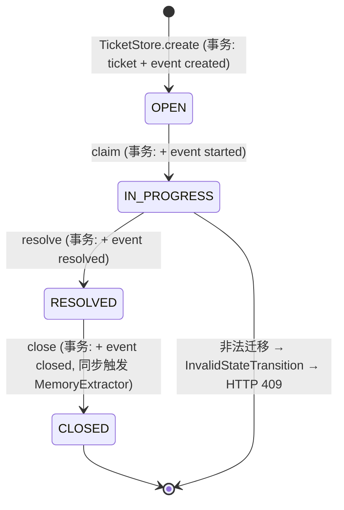
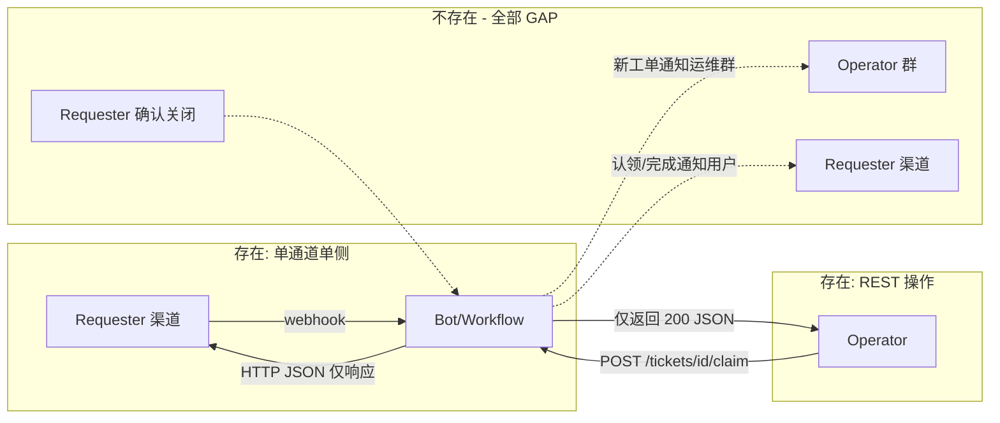

# Support Agent Lite — V1 to V2 Architecture Audit

> 本报告由只读审计生成:READ / SEARCH / TRACE / RUN TESTS / ANALYZE / DOCUMENT。
> 未修改任何业务代码,未创建任何 V2 设计。
> 供后续 AI 架构师在 V1 基础上定义 Lite V2 使用。

---

## 0. Audit Metadata

| 项 | 值 |
| --- | --- |
| 审计日期 | 2026-08-13 |
| 审计方式 | 全量读 V1 源码(每个 app 模块、8 个迁移、14 个测试文件)+ 运行官方测试 + 定向取证旧项目 V2 相关代码 |
| V1 repository | `/home/kkk/Project/support-agent-platform`(即当前工作目录) |
| V1 branch | `main` |
| V1 HEAD | `8627b0fbe1cae77661d66080045a49b76f79e102`(`feat: Phase 7 trace, golden path tests and demo`) |
| V1 working tree | 干净 |
| V1 commit 历史 | 10 个提交(868e1bb first commit → 8627b0f Phase 7) |
| Legacy repository | **NOT 一个独立 git 仓库**。旧项目是 V1 仓库内的 `reference/` 目录,被 `.gitignore` 的 `/reference/` 排除(git 不跟踪,`git ls-files reference` 为空)。它是"V1 仓库中的只读快照目录"。 |
| Legacy 版本标识 | 无独立 git 元数据;只能以目录内容与 docs(升级1~升级6)为准 |

```text
V1 repo:    main @ 8627b0f  (git 仓库, 工作区干净)
Legacy:     reference/      (同一仓库内 gitignored 的只读快照, 非独立 repo)
```

> ⚠️ 两个代码库的边界必须写清楚:本报告所有 "V1" 均指 `app/`、`storage/`、`tests/`、`docs/`;所有 "Legacy" 均指 `reference/` 下的旧项目代码。

---

## 1. Executive Summary

**V1 是什么**:一个用户中心(user-centric)、工作流优先(workflow-first)的跨渠道(WeCom/Feishu 入站)企业内部支持代理的**单进程本地可运行原型**。7 个 Phase 全部落地,**139 个测试全绿**,Golden Path(AC-01~AC-10)可端到端跑通。

**V1 真实做到**:
- 规范用户身份(Canonical User)+ 渠道身份绑定 + 跨渠道续单(AC-05)
- 意图路由(规则优先 + 可选 LLM fallback)+ 本地词法 RAG(带出处、无答案保护)
- 严格 4 状态工单状态机,Ticket 状态与 TicketEvent 同事务
- Agent 只出建议(不直接改工单)
- Operator REST API(claim/resolve/close/escalate)+ 独立审批状态机(原子决策)
- 长期记忆(close → 抽取 → 新会话召回)
- 单消息 trace_id 全链路追踪

**V1 真实没有(与 docs 宣称对比后)**:任何**出站发送**(双向都是 webhook 同步返回 JSON)、任何**webhook 安全校验**(签名/时间戳/challenge 均无)、任何**通知体系**、任何 **Requester/Operator 双群协同**、任何** Conversation Purpose / ConversationBinding**、**Operator 身份模型**、**Requester 确认关闭**、**并发安全**(并发 claim 与并发重复 webhook 均有竞态,已实测复现)。

**Legacy 与 V2 相关的可借鉴能力**:双群协同(报修群/工单群)、群内 operator 斜杠命令(claim/resolve/customer-confirm 等 19 个)、跨群通知与目标解析(dispatch target: system→queue→inbox→default)、真实 WeCom 出站(gettoken 缓存 + appchat/message send + 同步重试)、`group:<chatid>:user:<sender>` 群内多人会话隔离。但旧实现强耦合十系统(GROUP_CHAT_TO_SYSTEM 写死 10 个 chatid→system)、session-centric、复合状态(`lifecycle_stage`+`handoff_state`+`metadata_json`)、双轨 Ticket API,均不可直接 port。

**一句话总结 V2 最大缺口**:V1 缺少"**群/会话用途(purpose)+ 角色 + 出站通知 + 用户确认**"这组构成真实双群协同的最小闭环能力。

---

## 2. V1 Repository Map

```text
support-agent-platform/                (git repo, main @ 8627b0f)
├── app/
│   ├── main.py                        # FastAPI 工厂 + 全部 HTTP 端点(323 行)
│   ├── adapters/
│   │   ├── base.py                    # ChannelAdapter 协议 + ChannelAdapterError
│   │   ├── wecom.py                   # WeComAdapter: MsgId/FromUserName/Content → InboundEnvelope
│   │   └── feishu.py                  # FeishuAdapter: message_id/open_id/chat_id → InboundEnvelope
│   ├── application/
│   │   ├── identity_service.py        # IdentityResolver(resolve/bind)
│   │   ├── session_service.py         # SessionService(find_or_create)
│   │   ├── ticket_service.py          # TicketService + TicketResolver + new_ticket_id
│   │   ├── ingress_service.py         # IngressService(webhook 入口 + 幂等)
│   │   ├── intent_router.py           # IntentRouter(faq/support/progress_query/other)
│   │   ├── retriever.py               # Retriever(词法 IDF + 出处 + no-answer 保护)
│   │   ├── context_builder.py         # ContextBuilder(工单摘要 + 最近 6 条消息)
│   │   ├── support_agent.py           # SupportAgent(分类/优先级/建议动作/回复草稿, 只读)
│   │   ├── workflow.py                # SupportWorkflow(intent 分派 + agent + memory recall)
│   │   ├── approval_service.py        # ApprovalService(escalate/approve/reject/list)
│   │   ├── memory_extractor.py        # MemoryExtractor(仅 CLOSED 抽取)
│   │   └── memory_service.py          # MemoryService(remember/recall/list)
│   ├── domain/
│   │   ├── envelope.py                # InboundEnvelope + new_id
│   │   ├── identity.py                # User / ChannelIdentity / Session
│   │   ├── ticket.py                  # Ticket / TicketEvent / 状态机 + 迁移表
│   │   ├── approval.py                # Approval / ApprovalStatus
│   │   ├── memory.py                  # Memory / MemoryKind
│   │   └── message.py                 # Message(会话消息)
│   └── infrastructure/
│       ├── db.py                      # connect() + apply_migrations()
│       ├── idempotency.py             # IdempotencyStore(processed_messages)
│       ├── llm.py                     # LLMClient 协议 + OpenRouterLLMClient(可选, 15s 超时)
│       ├── repositories.py            # 全部 SQLite 仓储(415 行)
│       └── trace.py                   # TraceLogger(trace_events)
├── storage/migrations/                # 0001~0008 共 8 组 up/down SQL
├── seed/faq/faq_documents.json        # 14 篇 FAQ(仅此一种知识来源)
├── tests/                             # 14 个测试文件, 139 测试
├── docs/                              # 契约文档(PRODUCT_SCOPE/ARCHITECTURE/DOMAIN_MODEL/GOLDEN_PATH/ACCEPTANCE_TESTS/DEVELOPMENT_PLAN/LEGACY_PORT_MAP/HANDOVER)
├── reference/                         # ← LEGACY(只读, gitignored, 非独立 repo)
├── pyproject.toml                     # fastapi/uvicorn/pydantic/httpx; dev: pytest
├── Dockerfile + docker-compose.yml    # 单服务部署
├── .env.example                       # LLM_API_KEY/LLM_MODEL/DATABASE_URL(见 §3 配置漂移)
└── runtime/support_agent.db           # 运行时 sqlite(已 gitignore)
```

**不存在的模块**(V1 完全没有):`notification`、`conversation`/`binding`、`kb_crud`、`dispatch`、`outbound`、`auth/security`、`channels 的 group/dm 判定`。

---

## 3. V1 Runtime Architecture

### FACT — 应用入口与启动

- 入口:`uvicorn app.main:app`。模块级 `app = create_app()`(`app/main.py:323`)。
- 装配:App 工厂 `create_app(ingress, ops)`(`app/main.py:121`)。未注入时在首次请求惰性构建(`_services()`,`app/main.py:135-144`):`build_ingress()`(`app/main.py:98-118`)建 adapter/identity/sessions/idempotency/downstream,`build_ops()`(`app/main.py:61-68`)建 tickets/approvals/memory/trace。
- **运行模型:单进程、单 SQLite 连接**(`connect()` 设置 `check_same_thread=False`,`app/infrastructure/db.py:10-21`),连接被 ingress/workflow/ops 三处共享(同一 `conn` 注入)。无后台任务、无消息队列、无 worker。

### FACT — 配置

- 唯一真实读取的配置项:
  - `SUPPORT_AGENT_DB`(默认 `runtime/support_agent.db`,`app/main.py:139`)
  - `LLM_API_KEY` / `LLM_BASE_URL` / `LLM_MODEL`(`app/infrastructure/llm.py:75-85`,`load_env_file` 读 `.env`)
- **配置漂移(PARTIAL)**:`.env.example` 声明 `DATABASE_URL=sqlite:///runtime/support_agent.db`,但代码从不读取 `DATABASE_URL`。README 的冒烟测试、HANDOVER 中的约定均以 `SUPPORT_AGENT_DB` 为准。

### FACT — 数据库

- SQLite,`apply_migrations()`(`app/infrastructure/db.py:24-41`)顺序执行 `storage/migrations/*.up.sql`,以 `schema_migrations` 表记账。8 组迁移(见 §4)。

### FACT — 请求路径(唯一入口)

```text
POST /webhooks/{channel}   (app/main.py:164-189)
  → IngressService.process (app/application/ingress_service.py:52-97)
      → ChannelAdapter.build_inbound (适配器)
      → IdempotencyStore.is_processed (app/application/ingress_service.py:55)
      → IdentityResolver.resolve      (app/application/ingress_service.py:67)
      → SessionService.find_or_create (app/application/ingress_service.py:68)
      → SupportWorkflow.handle        (app/application/workflow.py:86-109)
      → IdempotencyStore.mark_processed (app/application/ingress_service.py:90)
  → JSONResponse {ok, duplicate, trace_id, user_id, session_id, workflow, ticket_id, reply, recalled}
```

### FACT — Agent / LLM

- `LLMClient` 协议 + `OpenRouterLLMClient`(`app/infrastructure/llm.py:18-59`),httpx 同步 POST `/chat/completions`,超时 15s。
- 仅在 SupportAgent 摘要/回复润色(`support_agent.py:83-101`)与意图路由 fallback(可选注入 `llm_classify_fn`,`intent_router.py:88-92`)两处使用。
- **无 LLM 时全链路确定性降级**(测试从不依赖网络)。LLM 不写任何状态。

### FACT — background/action flow

- **不存在**。没有任何后台任务/事件总线/定时器/通知分发。workflow 内所有副作用都是同步写库(消息、工单、记忆、trace)。

---

## 4. V1 Database / Domain Model

### 真实 schema(8 组迁移,逐表核对)

| Entity/Table | Exists | Important fields | Purpose |
| ------------ | ------ | ---------------- | ------- |
| users | ✅ 0001 | id PK, display_name, created_at | 规范用户 |
| channel_identities | ✅ 0001 | id PK, **user_id FK**, channel, channel_user_id, **UNIQUE(channel, channel_user_id)** | 渠道身份↔规范用户绑定 |
| sessions | ✅ 0002 | id PK, user_id FK, channel, channel_conversation_id | 会话(按用户+渠道+会话维度) |
| tickets | ✅ 0003 | id PK, user_id FK, title, description, **status CHECK(OPEN/IN_PROGRESS/RESOLVED/CLOSED)**, created_at, updated_at | 工单(单状态, 无复合状态) |
| ticket_events | ✅ 0003 | id PK, ticket_id FK, event_type, payload, created_at | 工单事件(created/started/resolved/closed) |
| processed_messages | ✅ 0004 | **idempotency_key PK**, trace_id, processed_at | webhook 幂等 |
| messages | ✅ 0005 | id PK, session_id FK, user_id FK, role CHECK(user/assistant), text, trace_id, created_at | 会话消息历史(短期上下文) |
| approvals | ✅ 0006 | id PK, ticket_id FK, action, status CHECK(PENDING/APPROVED/REJECTED), requested_by, reason, decided_by, decided_at | 独立审批 |
| memories | ✅ 0007 | id PK, user_id FK, ticket_id FK, kind CHECK(stable_fact/summary), fact, confidence, created_at | 长期记忆 |
| trace_events | ✅ 0008 | id INT PK AUTOINCREMENT, trace_id, stage, payload, created_at | 追踪 |
| conversations | ❌ 不存在 | — | — |
| conversation_bindings | ❌ 不存在 | — | — |
| conversation_purpose / group | ❌ 不存在 | — | — |
| kb_documents | ❌ 不存在 | — | —(FAQ 仅 seed 文件) |
| notifications | ❌ 不存在 | — | — |
| operator / assignee 字段 | ❌ 不存在 | tickets 无 assignee 列 | — |

### FACT — 关键设计选择

- 工单是**单状态**实体:无 `lifecycle_stage`、`handoff_state`、`metadata_json`(与 legacy 对照,`docs/ARCHITECTURE.md:65-71` 明确声明不复制,代码属实)。
- **没有 assignee/operator 字段**:工单上没有任何"谁在处理"的持久化字段。`started` 事件 payload 也可携带 operator 信息,但 `claim` 端点不接收身份(`app/main.py:193-200`)。
- ticket_events 的 event_type 无 CHECK 约束(仅由领域层枚举写入)。
- 外键全部 ON(`PRAGMA foreign_keys = ON`,`db.py:20`)。

### Mermaid — C. V1 Identity / Conversation / Session / Ticket Relationship

```mermaid
erDiagram
    users ||--o{ channel_identities : "user_id"
    users ||--o{ sessions : "user_id"
    users ||--o{ tickets : "user_id"
    users ||--o{ memories : "user_id"
    channel_identities {
        string id PK
        string user_id FK
        string channel "wecom|feishu"
        string channel_user_id "wecom:zhangsan / feishu:ou_001"
    }
    sessions {
        string id PK
        string user_id FK
        string channel
        string channel_conversation_id
    }
    sessions ||--o{ messages : "session_id"
    tickets ||--o{ ticket_events : "ticket_id"
    tickets ||--o{ approvals : "ticket_id"
    tickets ||--o{ memories : "ticket_id (source)"
}
```

**关键缺口可视化**:`conversations`、`conversation_bindings`、`conversation_purpose`、`operators`/`assignments` 实体在图外——不存在。

---

## 5. Canonical Identity

### 5.1 Canonical User — ✅ 存在

- 表:`users` + `channel_identities`(迁移 0001),`ChannelIdentity` 带 `UNIQUE(channel, channel_user_id)`(`0001_create_users.up.sql`)。
- 类:`User`/`ChannelIdentity`(`app/domain/identity.py:12-32`)。
- 解析器:`IdentityResolver`(`app/application/identity_service.py:18-46`):`resolve(channel, channel_user_id)` 先查绑定,未绑定则新建 `user_xxx` 并建绑定;`bind(channel, channel_user_id, user_id)`(48-73 行)显式绑定期,已绑到他人时报错。
- 结构正是:user_001 ├─ wecom: zhangsan └─ feishu: ou_001。

### 5.2 Channel Identity 唯一性 — ✅

- DB 层 `UNIQUE(channel, channel_user_id)` 约束 + 应用层先查后建。
- ⚠️ 并发缺陷:先查后建存在竞态,两个并发首次请求同一 `(channel, channel_user_id)` 会同时通过 `find` 再同时 `create`,后者触发 `IntegrityError`(已实测复现,见 §25)。

### 5.3 Requester 与 Operator 是否都用 Canonical Identity? — **NO**

- Requester:是。webhook → adapter → `IdentityResolver.resolve`。
- **Operator:不是。** 全部 operator 操作走 REST(`POST /tickets/{id}/claim` 等),端点**不接收任何 operator 身份**;escalate 的 `requested_by` 默认硬编码 `"operator"`(`app/main.py:230-243`)。没有 operator 表、没有 operator 的渠道身份、没有"operator 登录/绑定"。
- 旧项目里 operator 身份也只是从 session 尾部 `group:<gid>:user:<operator_id>` 推断(`reference/support_intake_workflow.py:2211-2225 _resolve_actor_id`),同样没有 canonical operator 模型。

### 5.4 跨渠道用户恢复 — **YES**

```text
feishu ou_xxx → user_001 → T1001
```

- 证据:`IdentityResolver.resolve` 返回既有 user(`identity_service.py:30-34`);工单挂在 user 上;进度查询经 `TicketResolver`(user 维度)返回 T1001。
- 测试实证:`tests/test_golden_path.py:107-127`(AC-05)与 `tests/test_identity_and_ticket_resolution.py`。
- 前提:必须先通过 `bind` 或 seed 建立 feishu 身份与 user 的绑定,否则 Feishu 首次消息会**新建**一个规范用户(设计使然)。

---

## 6. Conversation / Group Model

### 6.1 有没有 "Conversation Purpose" 概念? — **GAP**

- 搜索 `purpose/role/queue/location/operator_group/requester_group` 在 V1 代码零命中。没有 REQUESTER/OPERATOR 之类枚举。
- `InboundEnvelope` 只有 `conversation_id` 字符串(`app/domain/envelope.py:19-33`),无 `conversation_type` 字段。

### 6.2 系统如何知道"广州报修群"是报修空间、"广州设施工单群"是运维空间? — **GAP(完全不知道)**

- 不是代码写死、不是 config、不是数据库——**该概念不存在**。V1 对群和私聊一视同仁:一切消息都走同一条 requester 语义管道。

### 6.3 ConversationBinding 结构 — **GAP**

- 无任何 `ConversationBinding`/等价物。理想字段(channel/conversation_id/purpose/queue/location/enabled)全部不存在。

### 6.4 两个渠道是否都能配置 Requester/Operator conversation? — **GAP**

- 不能。角色与渠道的分离在 V1 无任何体现;渠道本身也没有被硬编码成某种角色(这点 V1 是"对的",因为角色概念整体缺失,而不是"没绑定错")。

> 结论:V1 满足 "Channel != Business Role" 的唯一方式是——它根本没有 Business Role。

---

## 7. Session Model

### 当前 V1 Session 是: `canonical_user + channel + conversation_id`

- `Session(user_id, channel, channel_conversation_id)`(`app/domain/identity.py:36-47`);`SessionService.find_or_create(user_id, channel, channel_conversation_id)`(`app/application/session_service.py:21-27`)。
- 会话键:`(user_id, channel, conversation_id)`。不是 `group_id`,也不是裸渠道身份。
- `_session_ticket: dict[session_id, ticket_id]`(`app/application/workflow.py:84`)是**进程内存**的会话→工单记忆(重启即失)。

### 多人 Requester 群(FACT)

- 张三/李四/王五在同一群:各自消息经各自 `channel_user_id` 解析为各自的规范用户,各自持有独立 Session(同一 conversation_id 但不同 user_id)→ **工单上下文天然按用户隔离**。不存在"整个群共享 active_ticket"的风险。
- ⚠️ 但:V1 没有"群"概念,也不区分群/私聊;所有"群内消息"只是带了相同 conversation_id 的个人消息。群成员之间的可见性/广播规则无从谈起。

### 与旧项目的对照

- Legacy 用 `group:<chatid>:user:<sender>` 显式编码群内多人隔离(`reference/scripts/wecom_bridge_server.py:1328-1331 _compose_session_id`),解决的是同一群内不同发送者的上下文隔离问题。
- V1 用 `user_id` 维度天然实现同一效果,且不把 channel 身份当用户身份(session-centric 是 legacy 的坑,V1 已通过 user-centric 规避)。**这一点 V1 优于 legacy,不应退回 session-centric**。

---

## 8. Channel Inbound / Outbound

### WeCom

**Inbound(FAST)**:真实 webhook `POST /webhooks/wecom`。解析 `MsgId/FromUserName/Content/AgentID/CreateTime/conversation_id`(`app/adapters/wecom.py:27-54`)。message_id 缺省时退化为 `FromUserName:CreateTime`。
- **group / dm 检测:无**。FromUserName 在真实企业微信里群消息是群成员 openid、单聊也是 openid,适配器不区分;`conversation_id` 需要调用方在 payload 里显式传(测试约定),否则回退为 channel_user_id(`wecom.py:42`)。
- **签名校验:无**。无 token/signature/echostr 处理。

**Outbound(GAP)**:无。不请求 access_token,不调任何发送 API。webhook 只返回 JSON。

### Feishu

**Inbound(FAST)**:真实 webhook `POST /webhooks/feishu`。解析 `event.message.message_id/text`、`sender.sender_id.open_id`、`event.chat_id`(`app/adapters/feishu.py:26-57`)。event_id 作幂等兜底。
- **群/单聊检测:无**(chat_id 只进 metadata)。
- **签名/url_verification/challenge:无**(飞书要求开发者响应 challenge,AES 解密——均未实现)。

**Outbound(GAP)**:无。

### 能力矩阵(事实,全部逐文件核对)

| Capability | WeCom | Feishu |
| ---------- | ----- | ------ |
| real webhook | ✅ `POST /webhooks/wecom` (app/main.py:164) | ✅ `POST /webhooks/feishu` (app/main.py:164) |
| DM inbound | ✅ (payload 显式传, 无真实回调能力证明) | ✅ (open_id 单聊语义) |
| group inbound | ❌ 无群检测; conversation_id 靠调用方传入 | ❌ 无群检测; chat_id 仅进 metadata |
| signature verification | ❌ 无 | ❌ 无 |
| timestamp / nonce / replay 防护 | ❌ 无 | ❌ 无 |
| challenge / url_verification | ❌ 无 | ❌ 无 |
| idempotency | ✅ MsgId / session:CreateTime (wecom.py:17-25) | ✅ message_id / event_id (feishu.py:17-24) |
| real outbound | ❌ 无 | ❌ 无 |
| group outbound | ❌ 无 | ❌ 无 |
| DM outbound | ❌ 无 | ❌ 无 |
| retry / token 管理 | ❌ 无 | ❌ 无 |

> 结论:V1 是**纯入站、纯本地、webhook 回 JSON**。真实渠道接入只是"适配器层还没接",出站/验签/群检测是 V2 必须从零补的基础设施。

---

## 9. Webhook Security / Idempotency

### 安全校验 — **GAP(零实现)**

- `POST /webhooks/{channel}`(`app/main.py:164-189`)只做 `request.json()`,无任何验签、timestamp、nonce、challenge。任何能访问端口的人都可以伪造消息。

### Idempotency — **FACT(单线程语义正确,并发有竞态)**

- `IdempotencyStore`(`app/infrastructure/idempotency.py`):`processed_messages(idempotency_key PK)`。
- 顺序重复:`is_processed` 命中 → 返回 202 duplicate(AC-03 测试通过)。
- ⚠️ 竞态:check(`is_processed`)与 mark(`mark_processed`)分离,且流程中先跑完整 downstream 再 mark;两个并发同 id 请求会同时通过 check,双双建单(且因身份并发问题直接 500,见 §25 实测)。mark 的 `INSERT OR IGNORE` 本身原子,但 check 不构成原子窗口。

---

## 10. Unified Message Contract

### InboundEnvelope(真实字段,`app/domain/envelope.py:19-33`)

| 字段 | 存在 | 说明 |
| ---- | ---- | ---- |
| channel | ✅ | wecom / feishu |
| message_id | ✅ | 幂等键来源 |
| channel_user_id | ✅ | 渠道侧身份 |
| conversation_id | ✅ | 渠道会话/群 id |
| conversation_type | ❌ | **不存在**(无法区分 dm/group/purpose) |
| text | ✅ | |
| timestamp | ✅ | utc |
| trace_id | ✅ | 默认 `trace_xxx` |
| metadata | ✅ | 仅存 agent_id/create_time/event_id/chat_id/tenant_key(**普通字段,不承载业务状态**) |

### 结论

- V1 **没有** OutboundEnvelope 概念(无出站)。
- 与 legacy 对照:legacy 有 `OutboundEnvelope(channel, session_id, body, metadata)`(`reference/storage/models.py:34-38`)。
- V1 的 metadata **没有**把审批/记忆/工单/业务状态塞进 blob——这点是刻意且正确的(不变量声明,代码相符)。

---

## 11. Intent / Workflow

### 真实 Intent(4 个,`app/application/intent_router.py:34-61`)

```text
faq            知识问题 → RAG 回答, 不建单
support        报修/故障 → TicketResolver → 工单
progress_query 进度查询 → 工单状态回复
other          兜底转人工文案
```

- 规则优先:关键词匹配打分,`confidence = 0.65 + 0.2*(n-1)`,阈值 0.58;tie-break 权重 progress_query(0.10)> support(0.08)> faq(0.05);含关键词包含去重(怎么⊂怎么办);低于阈值才走可选 LLM fallback(`intent_router.py:71-95`)。
- **纯确定性,同输入同输出**。

### 真实调用链

```text
Webhook
  → IngressService.process          (ingress_service.py:52)
    → IdentityResolver.resolve      (identity_service.py:29)
    → SessionService.find_or_create (session_service.py:21)
    → SupportWorkflow.handle        (workflow.py:86)
      → IntentRouter.route          (intent_router.py:71)
        → faq:            Retriever.answer → RAGAnswer | NO_ANSWER
        → support:        TicketResolver.resolve → 建/续/澄清 → ContextBuilder → SupportAgent.analyze
        → progress_query: TicketResolver.resolve → 状态回复 (无票时回退 recent())
        → other:          固定转人工文案
      → _record_reply (写 messages, workflow.py:240-258)
```

- FAQ 有答案不建单;NO_ANSWER 时返回固定文案 `_NO_ANSWER_REPLY`(workflow.py:33-36)——**文案声称"转交人工支持处理",但实际不建单、不产生任何工单**。这是"文案与现实不符"的 PARTIAL。

---

## 12. RAG

### FACT

- **纯词法检索**:`tokenize` = ASCII 词 + CJK 二元组(`app/application/retriever.py:24-32`),IDF 加权重叠分(`_score`,148-161),top-3。
- **无 embedding / 无向量 / 无 BM25 / 无 rerank / 无混合检索**。
- **Grounding 保护**(不变量 #7):`answer()` 要求查询 ≥2 个词且 top hit ≥ min_score 0.25,否则返回 None → workflow 输出显式"未找到资料"文案(`retriever.py:86-110`)。
- 答案格式:引用 doc_id + 标题 + 来源行(`_format_answer`,168-170),带出处。
- **知识来源:seed only**(`seed/faq/faq_documents.json`,14 篇)。无 KB 表、无 CRUD、无管理 API、无 SOP/history 检索。
- FAQ eval:`tests/test_rag_eval.py` — Recall@3 = 14/14 = 100%(目标 ≥90%)。
- **低置信时不转工单也不转澄清**:NO_ANSWER 是固定文案,不建单(见 §11 的 PARTIAL)。FAQ 失败不会进入 support 管道。

---

## 13. Ticket Creation / Resolution

### 自动建单完整追踪(逐行证据)

```text
POST /webhooks/wecom                         app/main.py:164-189
  → WeComAdapter.build_inbound               app/adapters/wecom.py:27-54   → InboundEnvelope
  → IdempotencyStore.is_processed            app/infrastructure/idempotency.py:13-17
  → IdentityResolver.resolve                 app/application/identity_service.py:29-46 → User(user_xxx)
  → SessionService.find_or_create            app/application/session_service.py:21-27 → Session(sess_xxx)
  → SupportWorkflow.handle                   app/application/workflow.py:86-109
    → IntentRouter.route("A3 空调坏了")      intent_router.py:71-95        → support (置信 0.65)
    → TicketResolver.resolve(text, user, session_ticket)  ticket_service.py:81-101
    → (无活跃) ResolutionKind.CREATE_NEW     ticket_service.py:97-98
    → TicketService.create(user, title, desc) ticket_service.py:45-47
      → TicketStore.create                    repositories.py:315-319 (事务: INSERT tickets + ticket_events created)
    → _session_ticket[session.id]=ticket.id  workflow.py:152
    → MemoryService.recall(user, text)        memory_service.py:56-74 (新会话召回, 可为空)
    → ContextBuilder.build                    context_builder.py:40-58 (摘要+最近6条)
    → SupportAgent.analyze                    support_agent.py:54-62 (advice only)
    → _record_reply(analysis.reply_draft)     workflow.py:240-258
  → mark_processed                           idempotency.py:19-25
  → JSONResponse {workflow: "ticket", ticket_id: "T0001", reply: ...}
```

- 单号生成:`T1001` 递增(`new_ticket_id`,`ticket_service.py:113-121`)。
- 事件:仅 `created`(事件类型枚举见 `app/domain/ticket.py:20-24`)。

---

## 14. Ticket State Machine / Events

### 状态与迁移(FACT, `app/domain/ticket.py:31-44`)

```text
OPEN ──claim──▶ IN_PROGRESS ──resolve──▶ RESOLVED ──close──▶ CLOSED
```

- 仅允许:`OPEN→IN_PROGRESS`、`IN_PROGRESS→RESOLVED`、`RESOLVED→CLOSED`;CLOSED 无出口。非法迁移抛 `InvalidStateTransition` → HTTP 409。
- 守卫:领域层 `validate_transition`(`ticket.py:47-51`),仓储层在事务内再次执行(`repositories.py:321-334`)。
- **事务性**(不变量 #5):`TicketStore.create`/`transition` 均 `with self._conn:` 单事务内写 ticket 状态 + INSERT ticket_event(`repositories.py:315-319, 321-334`),异常自动回滚。✅ 属实。
- 事件类型:created/started/resolved/closed,payload 可存 note 等(`EVENT_FOR_TRANSITION`,`ticket.py:40-44`)。
- **claim 端点不记录操作者**(URL 参数只有 ticket_id)。工单无 assignee 字段。

### Mermaid — D. V1 Ticket State Machine



### TicketResolver 算法还原(逐行, `app/application/ticket_service.py:81-110`)

```text
1. 显式工单号: 文本正则 T\d{3,} 且属于该 user        → EXPLICIT
2. 会话工单:    workflow._session_ticket[session.id]   → SESSION
3. 该 user 的活跃(OPEN/IN_PROGRESS)工单:
     0 张 → CREATE_NEW
     1 张 → ONLY_ACTIVE(续单)
     ≥2 张 → CLARIFY(列出候选, 绝不 LLM 乱选)
```

- 三场景实测(tests/test_golden_path.py):
  - A. 单个活跃票:续单成功(AC-05)。
  - B. 多活跃票:`处理了吗?` → clarify,不选票(AC-06)。
  - C. 换渠道:WeCom 建 T1001 → Feishu 查进度 → 返回 T1001,不建 T1002(AC-05)。
- 与 legacy 对照:legacy 是 session-centric(`active_ticket_id` 挂在 session_bindings),V1 是 user-centric——V1 的设计在跨渠道场景严格更正确。

---

## 15. Agent Summary / Recommendation

### AgentAnalysis 真实输出(`app/application/support_agent.py:37-44`)

```text
summary: str                # 一句话摘要 (规则或 LLM 润色)
category: str               # account/network/device/software/billing/hr/general (规则关键词)
priority_suggestion: str    # high/normal/low (仅"紧急"类关键词 → high)
recommended_action: str     # category→action 映射表 (dispatch_repair 等)
reply_draft: str            # 用户回复草稿
```

- **不变量 #4 属实**:SupportAgent 只读 Context,`analyze` 不调用任何 Ticket API。所有状态变更都在 Workflow 层经 TicketService。
- 输出**不持久化**(除 trace 与 messages):没有 agent_analysis 表。category/priority 建议不会落到工单上(工单表无此字段)。

---

## 16. Short-term Memory

| 能力 | 状态 | 证据 |
| ---- | ---- | ---- |
| message history | ✅ implemented | `messages` 表 + MessageRepository.add/recent(limit 6)(repositories.py:123-162) |
| recent N | ✅ | `ContextBuilder` 取最近 6 条(context_builder.py:18,48) |
| ticket summary | ✅(临时) | `ContextBuilder._summarize_ticket` 每次**现场拼装**(60-67 行),不落库 |
| rolling summary(随会话演进更新) | ❌ missing | 无 ticket_summaries 表,无更新逻辑(DEVELOPMENT_PLAN Phase 6 提到但未实现) |
| 状态变化触发 summary | ❌ missing | claim/resolve/close 不更新任何摘要 |
| 跨渠道 summary 归属 | PARTIAL | 消息按 session 存(渠道隔离);工单摘要来自工单字段,跨渠道续单时由 resolver 带上工单 → 上下文正确 |

- 内存态 `_session_ticket`(workflow.py:84)重启即丢,属 PARTIAL(跨请求状态只存在于进程内)。

---

## 17. Long-term Memory

### 已实现闭环(FACT,全部有测试)

```text
Ticket CLOSED (POST /tickets/{id}/close, app/main.py:211-227)
  → MemoryService.remember(ticket_id)          memory_service.py:41-54
      → 幂等(已存在则返回)                        memory_service.py:43-45
      → 校验 CLOSED + 存在                         memory_service.py:46-50
      → MemoryExtractor.extract(ticket, events)  memory_extractor.py:39-59
          → stable_fact: 问题事实(类别:标题, 置信 0.7~0.9)
          → stable_fact: 处理结果(从 resolved/closed 事件的 note 提取, 0.85)
          → summary:     "工单 Txxxx：标题 已处理完成。" (0.95)
      → MemoryRepository.add ×N                    repositories.py:252-266
  → 新会话 support 消息
      → SupportWorkflow._handle_support           workflow.py:154-156
      → MemoryService.recall(user, text)          memory_service.py:56-74
          → tokenize 匹配, min_score 0.20, min_matched ≥1, top_k 3
      → 进入 AgentContext.recalled_memories       context_builder.py:30,57
      → 回复中包含 recalled facts; trace 记录 memory_recall
```

- 评估:`tests/test_memory.py` 与 eval:Precision 11/11 = 100%(目标 ≥85%),label recall 100%。
- ⚠️ 边界:
  - 抽取**只在 REST close 端点**触发;webhook 无任何"用户确认/关闭"路径。
  - 无 confidence 阈值写入过滤(所有抽取事实都写)。
  - recall 只对 **support** intent 执行;faq/progress/other 不做记忆召回。

---

## 18. Human Collaboration

### 当前真实闭环(逐条核实)

```text
Requester --webhook消息--> Bot --> reply(JSON 返回, 无出站推送)
                                     │
Operator <---------- REST API <------┤ (claim/resolve/close/escalate)
        --> 仅 HTTP 响应, 无任何推送
```

- 业务状态变化后**渠道侧收不到任何通知**:claim 之后,Requester 不会在 WeCom/Feishu 收到"已由维修人员接手";resolve 之后不会有"请确认"。
- 运维侧也没有"新工单播报":工单创建只发生在 requester 消息的回执里;运维空间不存在。
- **结论:V1 有人工协作的动作 API(operator REST),没有人工协作的信息闭环**。

### Mermaid — E. V1 Human Collaboration Flow(GAP 标注)



---

## 19. Requester / Operator Conversation

- **GAP**:无 Requester Conversation / Operator Conversation 概念(参见 §6、§18)。
- 唯一"类似物":webhook 的 `conversation_id`(自由字符串)+ Session 的 `(user, channel, conversation)` 维度。没有任何表或配置表达"某群是报修群/某群是工单群"。
- Ticket Created/Claimed/Resolved/Closed 的双侧同步播报:**全部不存在**(旧项目有,见 §29)。

---

## 20. Notifications / Visibility

- **GAP**:无 notification / outbound / push / dispatch / audience / visibility 任何模块。
- TicketEvent 是纯审计日志,不触发任何通知;webhook 回复是 workflow 内联生成、随 HTTP 响应返回、并写入 messages 表(仅此而已)。
- **没有 Requester-visible / Operator-only 的可见性区分**——因为没有出站,该问题在 V1 不存在也无法回答。
- 唯一"近似可见性":webhook 响应字段(workflow/ticket_id/reply/recalled)对 HTTP 调用方可见。

---

## 21. Operator Actions

| Domain action | REST API | WeCom group | Feishu group | Current implementation |
| ------------- | -------- | ----------- | ------------ | ---------------------- |
| CLAIM | ✅ `POST /tickets/{id}/claim` (main.py:193) | ❌ | ❌ | `TicketService.claim` → `TicketStore.transition` 事务;不记录 operator 身份 |
| RESOLVE | ✅ `POST /tickets/{id}/resolve` (main.py:202) | ❌ | ❌ | payload.note → resolved 事件(note 供记忆抽取) |
| CLOSE | ✅ `POST /tickets/{id}/close` (main.py:211) | ❌ | ❌ | 同步触发 memory.remember |
| ESCALATE | ✅ `POST /tickets/{id}/escalate` (main.py:229) | ❌ | ❌ | 只建 PENDING 审批,不改工单状态 |
| APPROVE | ✅ `POST /approvals/{id}/approve` (main.py:270) | ❌ | ❌ | 原子决策(见 §22) |
| REJECT | ✅ `POST /approvals/{id}/reject` (main.py:288) | ❌ | ❌ | 原子决策 |
| REASSIGN | ❌ 不存在 | ❌ | ❌ | 无 assignee 字段 |
| LIST/STATUS 群内查询 | ❌(仅 GET /approvals、GET /memories) | ❌ | ❌ | — |

- **Domain Action 存在与否的判断**:V1 的 claim/resolve/close/escalate/approve/reject 是真实领域动作,只是入口形态只有 REST(语法)。reassign/customer-confirm/needs-info/merge 等在 V1 不存在(legacy 群命令里有,见 §31)。

---

## 22. HITL

### 事实(逐行)

```text
POST /tickets/{id}/escalate            main.py:229-251
  → ApprovalService.escalate           approval_service.py:24-42
      → 校验工单存在
      → Approval(PENDING, action, requested_by="operator"默认, reason)
      → ApprovalRepository.create      repositories.py:168-184
  ⚠️ 无风险策略:任何工单任何 action 都可 escalate;无 action 白名单/风险等级判定
POST /approvals/{id}/approve|reject    main.py:270-306
  → ApprovalRepository.decide         repositories.py:205-232
      → UPDATE ... WHERE id=? AND status='PENDING'  (原子; rowcount==0 → InvalidApprovalDecision 409)
```

- 独立性(不变量 #6):✅ 属实。PENDING 期间工单状态不变;approval 数据不在工单表。
- 工单等待审批期间状态:不受影响(维持原状态)。
- **批准后执行:GAP**。approve 只翻转审批状态,不执行原 action、不 replay command、不 resume workflow。approval 对象里没有"执行了什么动作/执行结果"的概念(对比 legacy 的 pending_actions + resume_handoff_state,见 §28)。
- 无审批通知(approver 永远不知道有待审批,除非自己 GET /approvals)。

---

## 23. Requester Confirmation / Close

- **GAP**:V1 的 RESOLVED→CLOSED 只由 operator REST 完成(`close` 端点,main.py:211-227),**不需要 requester 确认**。
- Requester 无法从原渠道或任何已绑定渠道触发 close(webhook 没有任何 close/confirm 语义)。
- legacy 有 `customer-confirm/confirm` 群命令与"请确认是否恢复正常"文案(见 §29),V1 完全没有。

---

## 24. Trace / Observability

### 事实

- `InboundEnvelope.trace_id` 默认生成(`envelope.py:32`),贯穿:
  - `channel`(含 duplicate 标记, ingress_service.py:70-74)
  - `identity`(ingress_service.py:75-83)
  - `intent`(workflow.py:89-93)
  - `retrieval`(grounded/hits, workflow.py:116-128)
  - `ticket`(resolution/ticket_id/created/candidates, workflow.py:136-161)
  - `memory_recall`(workflow.py:162-167)
  - `agent`(summary/category/priority/action, workflow.py:170-179)
  - `reply`(workflow.py:104-108)
  - `approval` / `memory_extract`(operator 端点用**独立的新 trace_id**,main.py:71-75, 218-222, 244-248, 277-282)
- 查询:`GET /traces/{trace_id}`(main.py:308-318),sqlite `trace_events` 表。

### 能回答 / 不能回答

| 问题 | 能否 | 原因 |
| ---- | ---- | ---- |
| 为什么 T1001 被创建? | ✅ | intent + ticket(resolution=create_new) 事件 |
| 谁认领了? | ❌ | claim 端点无 operator 身份,且 claim/resolve/close **不写 trace 事件**(仅 escalate/approve 写) |
| 为什么消息发到某 Operator 群? | ❌ | 该能力不存在 |
| 为什么没推给 Requester? | ❌ | 通知能力不存在(无法回答"为什么没做") |
| 工单事件(created/started/...)与 trace 的关系 | ❌ | ticket_events 表无 trace_id 列,事件流与消息流不相连 |

- **结论:trace 是"单条入站消息的旅程"记录;工单生命周期、operator 动作、出站动作不在同一 trace 下。** 属于 PARTIAL。

---

## 25. Reliability / Concurrency

### 实测复现(本审计运行时在 V1 上执行的实验,只读不改码)

**A. 并发重复 webhook — FAIL(500)**
- 两个线程同时 POST 相同 MsgId:一个 200、另一个 `sqlite3.IntegrityError: UNIQUE constraint failed: channel_identities.channel, channel_user_id`(因为幂等 check 与身份 resolve 都发生在 mark_processed 之前,两个请求同时"首次"解析身份)。
- 根因:`IdempotencyStore.is_processed` 与 `mark_processed` 非原子(`idempotency.py:13-25`);`IdentityResolver.resolve` 先查后建无并发保护(`identity_service.py:29-46`)。

**B. 并发 claim — last-write-wins(不安全)**
- 两个线程同时对 T0001 claim:**两个都返回成功**,ticket_events 出现两条 `started`。
- 根因:`TicketStore.transition` 的 UPDATE 无 `WHERE status='OPEN'` 守卫(`repositories.py:326-329`),check-then-act 的 validate 在事务外。

**C. 审批并发决策 — SAFE ✅**
- `UPDATE ... WHERE status='PENDING'` + rowcount 守卫(`repositories.py:219-228`),二次决策 409。已由测试覆盖(test_approval.py)。

**D. 数据库回滚 — ✅**
- 所有多写路径都在 `with self._conn:` 内,异常回滚。

**E. LLM 超时/失败 — 有降级 ✅**
- 15s 超时,异常吞掉走规则 fallback(support_agent.py:88-101)。

**F. 检索失败 — ✅ 有保护**(min_score/min_query_terms,见 §12)。

**G. 出站失败 — N/A**(无出站)。

---

## 26. Tests / Acceptance

### 运行结果(审计时实测)

```text
命令: source .venv/bin/activate && pytest -p no:warnings
结果: 139 passed in 1.20s
passed: 139   failed: 0   skipped: 0
```

### 测试覆盖矩阵(按领域,文件 → 主题)

| 领域 | 文件 | 覆盖 |
| ---- | ---- | ---- |
| 启动 | test_health.py | /health、app 工厂 |
| 领域/仓储 | test_repositories.py | 各 repo CRUD、事务 |
| 状态机 | test_ticket_state_machine.py | 合法/非法迁移、事件 |
| 身份+解析 | test_identity_and_ticket_resolution.py | resolve/bind/显式/会话/活跃票/澄清 |
| 渠道入口 | test_channel_ingress.py | wecom/feishu 解析、幂等(顺序) |
| 意图 | test_intent_router.py | 关键词、权重、阈值 |
| RAG | test_retriever.py + test_rag_eval.py | 检索、no-answer、Recall@3=100% |
| 上下文+Agent | test_context_agent.py | 摘要、最近消息、advice-only |
| Workflow | test_workflow.py + test_workflow_memory.py | 各 intent 分支、记忆召回注入 |
| 审批 | test_approval.py | 状态机、原子决策、409 |
| Operator API | test_operator_api.py | claim/resolve/close/escalate、404/409 |
| 记忆 | test_memory.py | 抽取、幂等、CLOSED 守卫、recall |
| **端到端** | **test_golden_path.py** | **AC-01~AC-10 + trace 全旅程(12 测试)** |

**测试缺口**(与可靠性问题对应):无并发测试、无 webhook 安全测试、无出站测试、无群/多用户群测试、无 operator 身份测试。

---

## 27. Claimed V1 vs Actual V1

| Capability | Docs claim | Code exists | Tested | Actually end-to-end |
| ---------- | :--------: | :---------: | :----: | :-----------------: |
| Canonical identity + 跨渠道续单 | ✅ | ✅ | ✅ | ✅ |
| Session 属用户 | ✅ | ✅ | ✅ | ✅ |
| 意图路由(规则+LLM fallback) | ✅ | ✅ | ✅ | ✅(LLM 分支仅代码存在, 无集成测试) |
| RAG 有出处 + 无答案保护 | ✅ | ✅ | ✅ | ✅ |
| 自动建单 | ✅ | ✅ | ✅ | ✅ |
| Ticket+Event 同事务 | ✅ | ✅ | ✅ | ✅ |
| Agent advice-only | ✅ | ✅ | ✅ | ✅ |
| Operator REST claim/resolve/close | ✅ | ✅ | ✅ | ✅ |
| Approval 独立状态机 | ✅ | ✅ | ✅ | ✅ |
| Close→记忆抽取→新会话召回 | ✅ | ✅ | ✅ | ✅ |
| trace 单消息全链路 | ✅ | ✅ | ✅ | ✅ |
| 真实渠道接入(验签/出站/群检测) | docs 明确 out-of-scope | ❌ | ❌ | ❌ |
| Requester/Operator 双群协同 | PRODUCT_SCOPE 声称 Operator collaboration 在 Golden Path 内 | ❌ | ❌ | ❌ |
| Requester 确认关闭 | docs 未提 | ❌ | ❌ | ❌ |
| 通知/播报 | docs 未提 | ❌ | ❌ | ❌ |
| 并发安全 | docs 未提 | ❌ | ❌(实测 FAIL) | ❌ |
| 滚动摘要/摘要落库 | DEVELOPMENT_PLAN Phase 6 提到 | ❌ | ❌ | ❌ |

> 核心结论:V1 实现的是"**单人支持代理 + 操作者后台**",而非"协作支持平台"。docs 的 Golden Path 画到了 Operator collaboration,代码只到了 REST 操作 API。

---

## 28. Legacy V2-Relevant Code Review

> 旧项目只做 V2 相关能力取证,不重新全量审计。以下全部为定向阅读结果。

### Legacy 真实目录(相关模块)

```text
reference/
├── scripts/wecom_bridge_server.py      # 1524 行: wecom 桥接(入站+出站+派发)
├── workflows/case_collab_workflow.py   # 799 行: 双群协同核心
├── workflows/support_intake_workflow.py# 双群命令处理、通知文案
├── channel_adapters/
│   ├── wecom_adapter/adapter.py        # 451 行: 真实出站(gettoken+发送)
│   └── feishu_adapter/adapter.py       # 121 行: 仅 inbound
├── openclaw_adapter/
│   ├── signature_validator.py          # 自定义 hmac-sha256 + 300s 窗口
│   ├── replay_guard.py                 # 按 session 精确消息 id 去重
│   ├── outbound_sender.py              # 同步出站循环(max 3 次)
│   ├── retry_manager.py                # temporary/permanent 分类
│   ├── session_mapper.py               # session→ticket 绑定(active_ticket_id)
│   └── gateway.py                      # 入站/出站通道
├── core/
│   ├── ticket_api.py                   # 595 行, 已 deprecated, 与新 TicketLifecycleAPI 双轨
│   ├── hitl/approval_runtime.py        # 审批运行时(pending_actions 在 metadata)
│   ├── hitl/approval_policy.py         # escalate 必批等策略
│   └── hitl/pending_actions.py
└── docs/upgrade5-wecom-dispatch.md, upgrade5-agents-ops-dispatch.md
    + 根目录 升级5-1.md
```

---

## 29. Legacy Dual-group Collaboration

### 29.1 群映射 — 硬编码 + 环境变量双轨

- `GROUP_CHAT_TO_SYSTEM: dict[str, str]` 模块级常量,10 个真实企业微信群 chatid → 十系统名(`reference/scripts/wecom_bridge_server.py:70-81`);`_get_system_from_chat_id()`(84-88 行)在 289-311 行决定走 ticket 系统还是 L2-L10 系统。
- 派发目标:`WECOM_DISPATCH_TARGETS_JSON` 环境变量,键 `queue/inbox/default`,值补成 `group:<gid>:user:u_dispatch_bot`(`docs/upgrade5-wecom-dispatch.md:76-99`)。
- **设计思想值得保留**:报修群(用户群,提交/补充/确认)+ 工单群(运维群,播报/认领/执行),双群对同一工单可见(`升级5-1.md:40-43,102-107`)。
- **实现不可继承**:chatid 写死、十系统耦合(`_SUPPORTED_SYSTEM_KEYS` 白名单、`_resolve_system_for_outcome` 文本推断 system)。

### 29.2 双群协同真实流程

```text
Requester群消息 → intake workflow → 建单
  → _should_push_to_collab()  (support_intake_workflow.py:2347-2358)
  → CaseCollabWorkflow.push_new_ticket()  (case_collab_workflow.py:55-80, 写 collab_push 事件)
  → _resolve_collab_target()   (wecom_bridge_server.py:592-635)
      优先级: workflow 显式 session → system:<key> → system_key → queue:<key> → inbox:<key> → queue → inbox → default
  → _evaluate_dispatch_policy_gate() (692-758 行)
  → 出站 collab_dispatch (478-494 行)
Operator群内 /claim TCK-xxx → handle_command() (case_collab_workflow.py:82-686)
  → 更新工单 → 群回执 + 双群同步文案 (support_intake_workflow.py:2275,2335-2342)
```

### 29.3 双群通知模板(真实摘录)

**Requester(报修群)侧**:
- 建单:`"已受理，工单 {ticket_label} 已创建，优先级：{...}。\n详细处理说明已私发给你，请留意。"`(support_intake_workflow.py:888-891)
- 认领:`"工单 {ticket.ticket_id} 已由 {assignee} 正在处理（接手处理）。"`(2335)
- 完成:`"工单 {ticket.ticket_id} 已处理完成，请确认是否恢复正常。"`(2337)
- 关闭:`"收到确认，工单 {ticket.ticket_id} 已关闭。"` / `"工单 {ticket.ticket_id} 已由处理工程师关闭，原因：{reason}。"`(2339-2342)

**Operator(工单群)侧**:
- 新工单:`"新工单 {ticket_label} 已创建\n────────────────\n📌 优先级：{priority_label}\n📥 队列：人工接力 / {queue_label}\n👤 报修人：{reported_by}"`(wecom_bridge_server.py:809-818)
- 机器播报:`"[new-ticket] {ticket_id} | inbox=... | queue=... | commands: /claim ..."`(case_collab_workflow.py:758-769)
- 补充:`"工单 {ticket_label} 收到补充信息：{compact_detail}"`(828)
- 认领回执:`"认领成功：{ticket.ticket_id}，当前处理人员：{assignee}。"`(2275)

> 业务思想(值得借鉴):**同一工单在两个 Audience 有不同文案**:用户侧温和(确认是否恢复),运维侧结构化(优先级/队列/报修人/命令提示)。这正是 V2 需要的 audience/visibility 语义。

### 29.4 Operator 群内如何定位工单

`_build_collab_command_result` + `_resolve_active_ticket_id`(support_intake_workflow.py:2175-2208):
1. 命令参数显式 ticket id(`_TICKET_ID_RE`,`48-51` 行;1386-1393 行)
2. `envelope.metadata.ticket_id/active_ticket_id`
3. `session_context.active_ticket_id`(按 operator session 独立维护,`switch_active_session_ticket` 1473 行)
4. disambiguation 的 active/suggested/candidate

- 群播报发到 `group:<ops>:user:u_dispatch_bot`(虚拟 actor),不绑定真实 operator → 首条命令必须带 TCK 号(测试佐证 tests/workflow/test_support_intake_workflow.py:1582-1617)。**无"群内最后一个工单"这种隐式状态**——这个约束值得 V2 保留。

### 29.5 不应复制的东西

- `GROUP_CHAT_TO_SYSTEM` 写死映射;system 推断文本关键词;十系统白名单
- session-centric 的 `active_ticket_id`(V1 user-centric 已正确替代)
- 复合状态 `lifecycle_stage`+`handoff_state`+`risk_level`+`metadata_json`(ticket_api.py:271-277 escalate 一次改四个字段)
- `TicketAPI`(deprecated)+ `TicketLifecycleAPI` 双轨并存
- 群命令的 `end-session/merge/link/needs-info` 等与旧状态模型深度耦合的命令集

---

## 30. Legacy Outbound / Security

### Legacy Outbound 能力(真实)

| Legacy outbound capability | WeCom | Feishu |
| -------------------------- | ----- | ------ |
| access token | ✅ `GET /cgi-bin/gettoken` + 缓存(提前 30s 过期刷新, adapter.py:312-336) | ❌ |
| send API | ✅ `appchat/send`(chatid) / `message/send`(touser)(adapter.py:199-225) | ❌ 只有 build_outbound 返回字典, 无 deliver_outbound(outbound_sender.py:41-42 静默跳过) |
| 目标选择 | `use_group_api = bool(group_id) and (force_group or collab_dispatch)`(252-254) | — |
| 错误处理 | `_RETRYABLE_ERRCODES={-1,40014,42001,42007,45009}`(30);60007 视为永久失败 | — |
| retry | 同步循环 max_attempts=3(retry_manager.py:41-58, outbound_sender.py:17-24) | — |
| 长消息 | 1200 字分块(wecom_bridge_server.py:1203-1230) | — |

### Legacy Webhook 安全(真实)

- **不是官方协议**:wecom/feishu 的 `verify_inbound` 都是自定义 `hmac-sha256(timestamp:nonce)` + 300s 窗口(`channel_adapters/wecom_adapter/adapter.py:83-94`;feishu adapter.py:39-50)。
- 企业微信官方算法(sha1(sort(token,timestamp,nonce,echostr)))未实现;challenge/URL 验证回调不存在。
- 签名缺失时直接跳过校验(`openclaw_adapter/signature_validator.py:60-95`)。
- 桥接服务器 do_POST **完全不验签**(wecom_bridge_server.py:1394-1412)。
- replay_guard:按 session 作用域,精确消息 id 去重(`replay_guard.py:38-78`,`session_mapper.py:249-292`),重复计数并记 replay_events。

> 结论:legacy 的"验签"只是自定义 HMAC(可用性大于安全性),**不是可直接 port 的官方协议实现**。V2 需要按渠道官方协议重写(或明确接受自定义 HMAC + 网关鉴权)。

---

## 31. Legacy Operator Actions

### 群内命令 → Domain Action 分类(真实,case_collab_workflow.py:82-686)

| Domain Action | 群命令(含别名) | V1 是否已有 |
| ------------- | --------------- | ----------- |
| CLAIM | /claim /take /pickup | ✅ REST |
| RESOLVE | /resolve | ✅ REST |
| CLOSE(运维强制) | /operator-close /op-close /force-close;`/close` 归一为 operator-close | ✅ REST(close) |
| CUSTOMER-CONFIRM | /customer-confirm /confirm | ❌ |
| ESCALATE | /escalate | ✅ REST(仅建审批) |
| REASSIGN | /reassign <user> | ❌ |
| ASSIGN | /assign <user> | ❌ |
| LIST | /list | ❌ |
| STATE / STATUS | /state /status | ❌(仅 webhook progress) |
| PRIORITY | /priority | ❌ |
| NEEDS-INFO | /needs-info | ❌ |
| REOPEN | /reopen | ❌ |
| MERGE / LINK | /merge /link | ❌ |
| END-SESSION | /end-session | ❌ |
| 高危命令 | 需 `--confirm` 标志(_HIGH_RISK_CONFIRM_FLAG, 295 行) | ❌ |

- 中文自然语言别名映射(如"认领"→claim)在 support_intake_workflow.py:80-241。
- 命令数(19 个)≠ 领域能力数:去重后核心是 CLAIM/RESOLVE/CLOSE/CONFIRM/ESCALATE/REASSIGN 六个动作,其余是状态管理辅助。V2 从这六个 Domain Action 出发即可。

---

## 32. V1 vs Legacy Capability Matrix

| Capability | Lite V1 | Legacy | Evidence(V1) | Notes |
| ---------- | :------: | :-----: | ------------- | ----- |
| WeCom inbound | ✅ | ✅ | app/adapters/wecom.py | V1 纯解析; legacy 有完整桥接+HMAC |
| Feishu inbound | ✅ | ✅ | app/adapters/feishu.py | 两者都无官方 challenge |
| WeCom outbound | ❌ | ✅ | — | legacy: gettoken+send+retry |
| Feishu outbound | ❌ | ❌ | — | legacy 也只有 build_outbound |
| webhook verification | ❌ | PARTIAL | — | legacy 为自定义 HMAC, 非官方 |
| replay / idempotency | ✅(顺序) | ✅ | app/infrastructure/idempotency.py | V1 并发竞态实测 FAIL |
| canonical identity | ✅ | ❌ | identity_service.py | legacy session-centric |
| requester group | ❌ | ✅ | — | legacy L1 报修群 |
| operator group | ❌ | ✅ | — | legacy L1 工单群 |
| conversation purpose | ❌ | PARTIAL | — | legacy: chatid 写死映射 |
| requester/operator identity | ❌ | ❌ | — | legacy 仅 session 尾部推断 |
| ticket resolution | ✅(user-centric) | ✅(session-centric) | ticket_service.py:81-110 | V1 跨渠道更强 |
| operator claim | ✅ REST | ✅ 群命令 | main.py:193 | legacy 有认领播报 |
| operator resolve | ✅ REST | ✅ 群命令 | main.py:202 | — |
| requester confirmation | ❌ | ✅ /customer-confirm | — | V1 完全缺失 |
| cross-group notification | ❌ | ✅ collab_push | — | V1 无出站 |
| notification audience | ❌ | PARTIAL | — | legacy: group/dm 目标解析 |
| RAG | ✅ 词法+出处 | ✅(retriever.py, 未深审) | retriever.py | V1 无 embedding |
| summary | ✅ 临时拼装 | ✅ summary_engine.py(未深审) | context_builder.py | 两者都非持久滚动摘要 |
| short memory | ✅ recent 6 | ✅ session_context | repositories.py:123-162 | V1 按 session; legacy 按 session+active_ticket |
| long memory | ✅ close→抽取→召回 | ❌ | memory_service.py | **V1 独有** |
| HITL | ✅ 独立审批(不执行) | ✅ 审批+resume 执行 | approval_service.py | legacy 有 pending_actions 执行链 |
| trace | ✅ 消息级 | ✅ trace_logger.py(未深审) | trace.py | V1 工单生命周期未入 trace |

---

## 33. V2 Readiness Gap

### Already solid in V1(V2 不需要大改)

- 规范用户 + 渠道身份绑定 + 跨渠道续单(`users`/`channel_identities`,IdentityResolver)
- 严格 4 状态工单状态机 + Ticket/Event 同事务
- user-centric 工单解析(explicit → session → active → clarify,无 LLM 随机)
- RAG 出处与 no-answer 保护(不变量 #7)
- Agent advice-only(不变量 #4)
- 独立审批状态机(原子决策)
- Close→记忆抽取→新会话召回(长期记忆,V1 独有)
- 单消息 trace(消息级)
- 14 FAQ seed + eval Recall@3=100%

### Present but incomplete(已有设计, 需要补闭环)

- **Operator 身份**:claim/resolve/close 不记录操作者;需 operator 表 + 渠道身份绑定 + 动作审计
- **审批执行**:approve/reject 后不执行原动作(需 pending_action 或 resume 机制)
- **消息级 trace → 工单级 trace**:ticket_events 无 trace_id;operator 动作无 trace
- **NO_ANSWER 语义**:文案说转人工,实际不建单不通知(需转 support/ticket 或真实转人工)
- **短记忆**:滚动摘要与摘要落库未实现;`_session_ticket` 进程内存态需持久化
- **webhook 安全**:验签/时间戳/challenge 从零补(渠道官方协议)
- **幂等与身份并发**:check-then-act 竞态需原子化(INSERT OR IGNORE 或唯一约束捕获)
- **并发 claim**:UPDATE 需 `WHERE status=当前状态` 守卫 + rowcount 校验

### Missing in V1 but proven in legacy(旧项目有真实业务经验)

- **双群协同**:报修群/工单群分离,同一工单双 Audience 可见
- **跨群通知与目标解析**:collab_push + dispatch target(system→queue→inbox→default)的*思想*(实现需重写)
- **群内 operator 命令**:/claim /resolve /operator-close /customer-confirm /reassign 等(以 Domain Action 组织,不复制命令语法集)
- **Requester 确认关闭**:`customer-confirm` → CLOSED
- **双 Audience 文案模板**:用户侧温和/运维侧结构化(优先级/队列/报修人/命令提示)
- **群内多人隔离**:`group:<chatid>:user:<sender>`(V1 已由 user-centric 天然解决,legacy 的解析/出站目标编码思路可借鉴)
- **WeCom 真实出站**:gettoken 缓存、chatid/touser 双模式、可重试错误码、同步重试(实现思路可参考,接口需重写)
- **HITL 执行链**:approval 通过后执行原动作(pending_actions 思想)

### Missing in both(V2 新能力)

- Conversation Purpose / ConversationBinding 的**配置化**模型(不写死 chatid)
- Notification Policy / Audience / Visibility 的分发模型
- Operator 的 canonical identity(V1 与 legacy 都没有)
- Feishu 真实出站(两代都没有)
- 渠道官方签名协议(两代都没有)
- 知识库 CRUD(V1 只有 seed;legacy 有外部 KB 导入但未深审)

### Legacy implementation should NOT be ported

- `GROUP_CHAT_TO_SYSTEM` 硬编码映射与十系统推断
- session-centric `active_ticket_id` 解析(V1 已正确替代)
- 复合状态 `lifecycle_stage`+`handoff_state`+`risk_level`+`metadata_json`
- `TicketAPI`/`TicketLifecycleAPI` 双轨
- 自定义 HMAC 验签(不满足渠道官方协议)
- 桥接服务器 do_POST 零验签模式

---

## 34. Answers to Architecture Questions

### Q1: V1 当前真正完成了多少 Golden Path?

**完成**:渠道入站 → 身份 → 会话 → 意图 → FAQ 直答/建单 → 工单生命周期(REST)→ 审批(独立)→ 关闭 → 记忆 → 召回。**未完成**:真实渠道接入(验签/出站)、Operator 协作的信息闭环、Requester 确认、双群协同。即 "自动处理 + 手动操作" 全通, "人与人协作" 未通。

### Q2: 四种角色/渠道组合?

**不支持**。WeCom requester ✅(webhook);WeCom operator ❌(无 operator 渠道概念);Feishu requester ✅;Feishu operator ❌。operator 只有 REST。

### Q3: 是否把 channel 与 business role 绑定?

**没有绑定**——因为 V1 **没有** business role 概念。不存在"企业微信=报修人"的硬编码;角色概念整体缺失(相比错误绑定,这是"缺概念"而非"错绑定")。

### Q4: ConversationBinding / ConversationPurpose?

**没有**。无表、无配置、无代码;conversation 只有 `conversation_id` 字符串与 `(user, channel, conversation)` Session 维度。

### Q5: Requester 群多人上下文如何隔离?

**按 canonical user 隔离**(天然正确):同群不同 sender → 不同 User → 不同 Session → 各自活跃工单独立。无"群共享 active_ticket"风险。但 V1 没有"群"概念本身(不检测群/私聊)。

### Q6: Operator 群如何确定操作的是哪个 Ticket?

**不适用(不存在 Operator 群)**。REST 路径下 ticket 由 URL path 显式指定(`/tickets/{ticket_id}/...`)。未来 V2 群命令若引入,legacy 经验:首条命令必须显式 TCK,不引入"群内最后一个工单"隐式状态。

### Q7: 自动建单后 Operator 是否真实收到通知?

**否**。没有任何出站;工单创建信息只存在于 webhook HTTP 响应。

### Q8: Operator claim 后 Requester 是否真实收到通知?

**否**。无出站;Requester 完全不知情。

### Q9: 两个渠道是否都具备真实 outbound?

**否,都不具备**。V1 无 outbound 代码;legacy 只有 WeCom 有真实出站,Feishu 两代都没有。

### Q10: Webhook 是否具备真实安全校验?

**否**。V1 零校验;legacy 是自定义 HMAC(非官方协议)且可跳过。两者都需要按官方协议实现。

### Q11: Canonical Identity 是否覆盖 Requester 和 Operator?

**仅 Requester**。无 operator 模型。

### Q12: 同一个人换渠道后 Actor 身份是否一致?

**Requester:是**(经 bind 后 resolve 返回同一 user)。**Operator:不适用**(无 operator 身份)。

### Q13: 同一 Ticket 跨渠道续单,但避免无意义双渠道重复通知?

**工单续单**:✅(user-centric,AC-05/AC-10)。**通知去重/audience 控制**:❌(无通知体系,问题不存在,也无法回答)。

### Q14: 多个 Operator 同时 claim 是否安全?

**不安全**。实测两个并发 claim 都成功并产生两条 `started` 事件(last-write-wins);UPDATE 无状态守卫。

### Q15: RESOLVED 是否需要 Requester 确认才 CLOSED?

**不需要**。当前 close 由 operator REST 直接执行;无确认流程(V1)。legacy 有 `/customer-confirm`。

### Q16: Close 后 Memory 是否真实写入?新 Session 是否真实 recall?

**是,都是真实的**。close 端点 → remember(幂等)→ memories 表;新会话 support 消息 → recall(min 0.20)→ 进入 AgentContext 并出现在 webhook 响应 `recalled`。测试覆盖 AC-09/AC-10。

### Q17: 旧项目双群协同有哪些业务思想值得保留?

1) 报修群/工单群分离,同一工单双 Audience 可见;2) 双群文案差异(用户侧确认恢复 / 运维侧结构化播报);3) 派发目标解析优先级(collab session → queue → inbox → default);4) 群命令以 Domain Action 组织(认领/解决/关闭/确认/转派);5) Requester 确认才关闭的流程;6) 群播报用虚拟 actor(首命令必须带 TCK,避免隐式状态)。

### Q18: 哪些 legacy 双群实现不应复制?

`GROUP_CHAT_TO_SYSTEM` 写死 chatid→十系统;`_resolve_system_for_outcome` 文本推断 system;十系统白名单;session-centric `active_ticket_id`;`group:<chatid>:user:<sender>` 作为身份主键(无 canonical user);复合状态三件套;双轨 Ticket API;`/merge /link /needs-info /end-session` 等耦合旧状态模型的命令。

### Q19: V2 最大 5 个能力缺口?

1. **Conversation Purpose / Binding 模型**(群与空间语义,配置化而非写死)
2. **出站通知 + Audience/Visibility**(双群双角色信息闭环,含 Feishu 出站)
3. **Operator 身份模型 + 群内操作**(canonical operator、claim/resolve/confirm/close 的渠道动作与审计)
4. **Requester 确认关闭 + 真实转人工(NO_ANSWER → 工单)**
5. **可靠性**:并发 claim 原子守卫、幂等/身份并发安全、webhook 官方验签

### Q20: 哪些 V1 设计必须保持不变?

1. 用户中心(user-centric)解析与跨渠道续单,禁止退回 session-centric
2. 严格单状态工单机 + Ticket/Event 同事务,禁止复合状态/metadata blob
3. Agent advice-only(建议与执行分离)
4. 独立审批状态机
5. RAG grounding 保护(低置信禁止自由发挥)
6. 适配器边界(Raw → InboundEnvelope,不触碰业务)
7. 单一 Ticket API(禁止 legacy 双轨)
8. 确定性规则优先、LLM 可选且可降级

---

## Appendix A — Important V1 Files

| 文件 | 作用 |
| ---- | ---- |
| app/main.py | 全部 HTTP 端点、装配、惰性服务 |
| app/application/ingress_service.py | webhook 入口 + 幂等 + 身份/会话 + trace |
| app/application/identity_service.py | 规范身份 resolve/bind |
| app/application/ticket_service.py | TicketService + TicketResolver |
| app/application/workflow.py | intent 分派 + 记忆召回 + 消息记录 |
| app/application/intent_router.py | 规则意图路由 |
| app/application/retriever.py | 词法 RAG + no-answer 保护 |
| app/application/support_agent.py | advice-only 分析 |
| app/application/approval_service.py | 独立审批 |
| app/application/memory_service.py / memory_extractor.py | 长期记忆 |
| app/application/context_builder.py | 短期上下文(摘要+最近 6) |
| app/adapters/wecom.py / feishu.py | 渠道入站解析 |
| app/domain/ticket.py | 状态机与事件 |
| app/infrastructure/repositories.py | 全部 SQLite 仓储 |
| app/infrastructure/idempotency.py / trace.py / llm.py / db.py | 基础设施 |
| storage/migrations/0001~0008 | schema |
| seed/faq/faq_documents.json | 14 篇 FAQ |
| tests/test_golden_path.py | AC-01~AC-10 端到端 |

## Appendix B — Important Legacy Reference Files

| 文件 | V2 相关点 |
| ---- | --------- |
| reference/scripts/wecom_bridge_server.py | GROUP_CHAT_TO_SYSTEM、_resolve_collab_target、派发策略门、双群模板 |
| reference/workflows/case_collab_workflow.py | 双群协同、19 个群命令、collab_push |
| reference/workflows/support_intake_workflow.py | 通知文案、命令别名、_resolve_active_ticket_id |
| reference/channel_adapters/wecom_adapter/adapter.py | 真实 WeCom 出站(gettoken/chatid/touser/重试) |
| reference/channel_adapters/feishu_adapter/adapter.py | Feishu 仅 inbound 证据 |
| reference/openclaw_adapter/signature_validator.py | 自定义 HMAC 验签(不可 port) |
| reference/openclaw_adapter/replay_guard.py | 按 session 消息去重 |
| reference/openclaw_adapter/outbound_sender.py + retry_manager.py | 出站循环与重试分类 |
| reference/openclaw_adapter/session_mapper.py | session→ticket 绑定(active_ticket_id) |
| reference/core/ticket_api.py | 双轨 API + 复合状态证据 |
| reference/core/hitl/approval_runtime.py + pending_actions.py | 审批执行链 |
| reference/docs/upgrade5-wecom-dispatch.md / upgrade5-agents-ops-dispatch.md | 派发模型设计 |
| reference/升级5-1.md | 双群业务模型 |

## Appendix C — Schemas

V1 完整 schema 见 §4 表格与迁移文件(`storage/migrations/*.up.sql`),共 9 张表(users, channel_identities, sessions, tickets, ticket_events, processed_messages, messages, approvals, memories)+ trace_events + schema_migrations。

Legacy 关键差异字段(`reference/storage/models.py:42-72`):`lifecycle_stage`、`handoff_state`、`needs_handoff`、`last_agent_action`、`risk_level`、`metadata`;DB 列 `metadata_json`。

## Appendix D — Call Graphs

入站主链(见 §13 建单追踪,最完整示例);审批链(§22);记忆链(§17);出站链(不存在,V1 无)。Legacy 双群链(§29.2)。

## Appendix E — Commands / Test Results

```text
$ pytest -p no:warnings
139 passed in 1.20s        (passed=139, failed=0, skipped=0)

审计时补充实验(只读运行, 不改码):
- 并发重复 webhook: 500 IntegrityError (channel_identities UNIQUE)  ← 复现竞态
- 并发 claim: 两次均成功 + 两条 started 事件                        ← 复现竞态
- 并发 approve: 一次成功, 二次 409 (原子守卫)                       ← 安全
```

---

## 审计自查清单

- [x] V1 是主要审计对象
- [x] 没有重新完整审计旧项目(仅 V2 相关定向取证)
- [x] 没把 WeCom 固定为 Requester / Feishu 固定为 Operator
- [x] 同时检查 Requester 和 Operator identity(V1 无 operator 身份)
- [x] 检查 requester/operator conversation(均不存在)
- [x] 检查真实 outbound(V1 无;legacy 仅 WeCom)
- [x] 检查签名/idempotency(签名零实现;幂等有并发竞态)
- [x] 检查双群/双角色协同(legacy 有,V1 无)
- [x] 检查 operator actions(REST 6 动作;legacy 群命令 19 个)
- [x] 检查 requester confirmation(legacy 有;V1 无)
- [x] 检查 cross-channel continuation(✅ 实测)
- [x] 检查 RAG(词法+出处+保护)
- [x] 检查 Summary(临时拼装;无滚动/落库)
- [x] 检查 Short/Long Memory(短=最近6条;长=close抽取+召回)
- [x] 检查 HITL(独立审批;不执行)
- [x] 检查 Trace(消息级;工单生命周期未覆盖)
- [x] 检查 concurrent claim(实测不安全)
- [x] 实际检查 tests(139 passed)
- [x] 所有重要判断有代码证据(文件:行)
- [x] FACT/PARTIAL/GAP/UNCERTAIN 分清
- [x] 没有修改业务代码
- [x] 没有开始实现 V2
