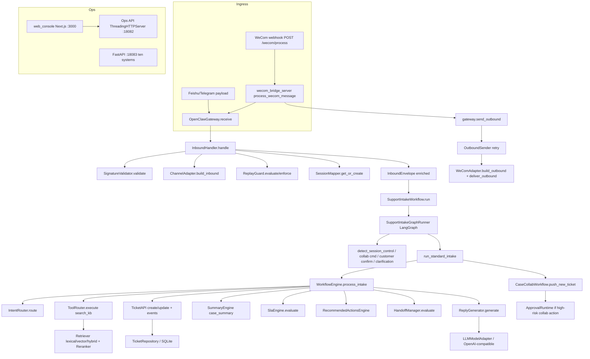
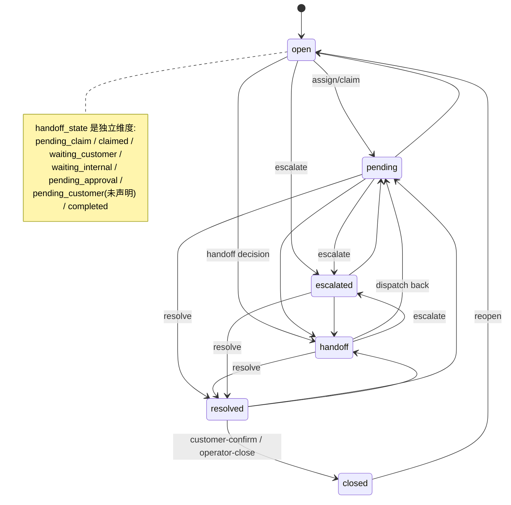
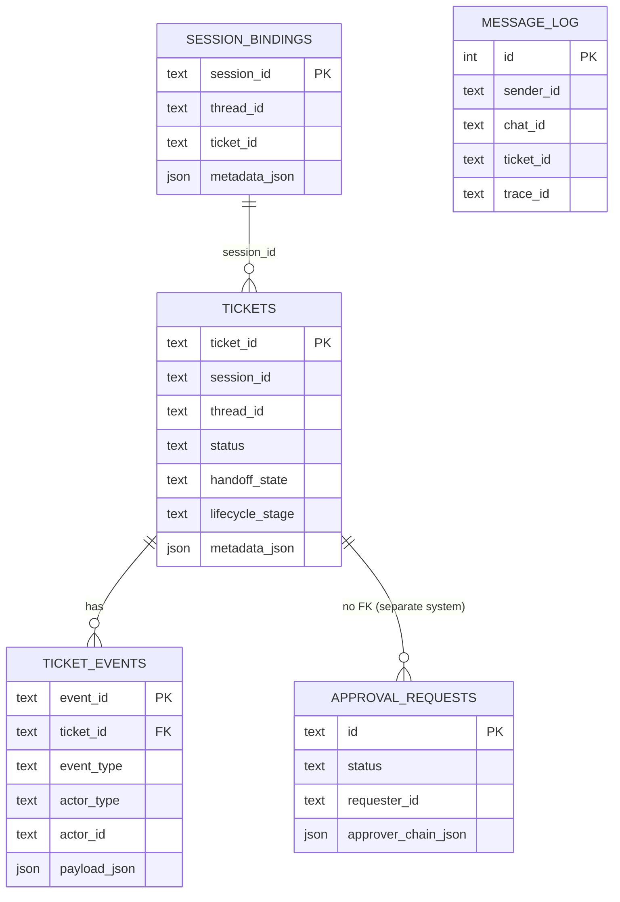
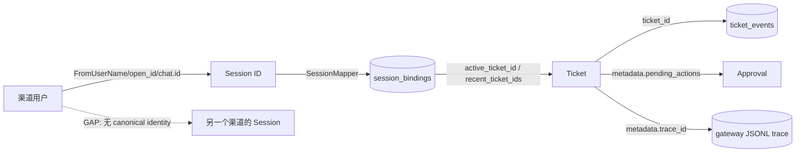

# LEGACY ARCHITECTURE AUDIT

> **REFERENCE ONLY**
>
> This document describes the legacy `support-agent-platform`.
>
> Do NOT reproduce its architecture automatically.
>
> Use it only to:
> - understand previous behavior
> - locate reusable algorithms
> - identify regressions
> - extract test scenarios

---

# Support Agent Platform — Architecture Audit

> 本文档是**架构取证式审计**产物：所有结论均从真实代码、SQL schema、测试、fixture 与配置中还原；无法证明的内容被明确标注为 `INFERENCE` / `GAP` / `UNCERTAIN`。阅读者不需要访问 Git 仓库，即可据此理解本项目现状。
>
> 文中行号均来自审计时的 `rg` 检索结果，仅标注已确认的行号；未确认的一律只写 `文件 + class/function name`。

---

## 0. Audit Metadata

| Item | Value |
| --- | --- |
| Repository | `/home/kkk/Project/support-agent-platform` |
| Branch | `feat/upgrade5-closure-20260314` |
| Commit SHA | `52b6d12b4a3188561f2085fc57f9afbdc3ca228f` |
| Branch state | `ahead of origin/feat/upgrade5-closure-20260314 by 1 commit` |
| Working tree | **NOT clean**：549 个已跟踪文件处于 modified 状态（审计开始前即如此），另有 1 个未跟踪目录 `.claude/`。审计过程未修改任何业务代码。 |
| Audit date | 2026-08-13 (Asia/Shanghai) |
| Audit method | 静态代码阅读 + `rg` 全仓库检索；未运行测试（见 §24） |
| Declared version | `pyproject.toml` / `README.md` 声称 v0.3.0（2026-03-12），但分支名为 upgrade5/upgrade6 迭代，代码中存在明显超出 v0.3.0 的能力（十系统、v2 领域层、reply 工作台等） |

**FACT**: `git status` 显示全部文件 modified；这是仓库初始状态，非本次审计造成。

---

## 1. Executive Summary

`support-agent-platform` 是一个 **workflow-first、agent-assisted** 的工单/服务台平台。现状可概括为：

1. **入口层**（`openclaw_adapter/` + `channel_adapters/`）：三个渠道适配器（wecom / feishu / telegram）将原始 webhook 归一化为 `InboundEnvelope`，附带签名校验、重放防护、session 绑定与 JSONL trace。这是目前设计最完整、边界最清晰的一层。
2. **业务层**（`core/` + `workflows/`）：`SupportIntakeWorkflow`（2560 行）是事实上的"巨类控制器"，内部按固定顺序执行 session 控制、协同命令、澄清、标准 intake；`WorkflowEngine.process_intake` 完成 intent → retrieval → summary → SLA → recommendation → handoff → reply 的主链路。
3. **领域层双轨制**：存在 Legacy `core/ticket_api.TicketAPI`（被 workflow 实际使用）与 v2 `app.domain.ticket.TicketAPI`（被 Ops API v2 端点使用），以及**从未被生产代码实例化**的 `TicketLifecycleAPI` 与 `LegacyTicketAPIAdapter`。
4. **Ticket 状态是复合状态**：`status` + `lifecycle_stage` + `handoff_state` 三字段组合，另有未声明的 `pending_customer` 等取值泄漏；迁移 0020 是占位符，数据库层无 CHECK 约束。
5. **身份模型缺失**：没有 canonical user / identity resolver / cross-channel mapping。Session ID 是渠道原生的（wecom `FromUserName`/`dm:user`/`group:chat:user`、feishu `open_id`、telegram `chat.id`），跨渠道无法识别同一用户。
6. **Ticket Resolution 是 session-based + ticket-id-based 的混合**：`requested_ticket_id` → metadata `ticket_id/active_ticket_id` → `session_context.active_ticket_id` → runtime session context → disambiguation 建议 → candidate[0]。换渠道 = 新 session = 找不到原 ticket（除非用户口头报出工单号且该 ID 恰好在候选列表）。
7. **HITL 是"记录 + 恢复"，不是真正的暂停/恢复工作流**：`ApprovalRuntime` 把 `PendingAction` 存在 `ticket.metadata["pending_actions"]`，置 `handoff_state=pending_approval`，批准后由调用方 `execute_action_without_approval` 重新执行动作。另有独立的十系统 `ApprovalSystem`（`approval_requests` 表）与本 HITL 无关联。
8. **RAG 是本地启发式检索**：lexical（分词/二元组）+ 伪向量（blake2b 哈希 n-gram，**不是真实 embedding**）+ hybrid（0.55/0.45）+ 规则 rerank。无阈值拦截的硬性 no-answer 保护；规则兜底是模板回复。
9. **Memory 不存在**：只有 session_context（active/recent ticket）、`latest_message`、`message_log`（wecom bridge 原始消息表）。没有 rolling summary、memories 表、user profile、跨 session 事实抽取。`TicketInvestigationAgent.memory_store` 参数是空实现。
10. **OpenClaw 是仓库内自研适配层**，不是外部 OpenClaw 进程；它只做 ingress/session/routing，不参与 ticket 业务规则。

**最重要的三个架构结论**：

- **当前系统真正的核心是 Ticket + Session 的隐式绑定链**，而不是 Agent 或 Workflow 类本身；几乎所有业务逻辑都围绕 `session_id → active_ticket_id/recent_ticket_ids` 展开。
- **系统是 session-centric**：Ticket Resolution、disambiguation、collab push、`dm:` 私聊上下文重置全部以 session_id 为键。
- **存在三层并行实现（Legacy API / v2 API / 十系统 TicketSystem）与两套 intent router、两套 approval 机制**，是最大的复杂度来源与 Lite 重构风险点。

---

## 2. Repository Map

整理后的目录树（省略 `.git`、缓存、日志、虚拟环境、数据集压缩包等无关内容）：

```text
support-agent-platform/
├── app/                                # Upgrade5/6 新增的领域/应用/传输层（FastAPI 风格）
│   ├── agents/deep/                    # 深度代理（规则化工具编排，非 LLM 自治）
│   │   ├── operator_dispatch_agent.py  # OperatorSupervisorAgent / DispatchCollaborationAgent
│   │   └── ticket_investigation_agent.py # TicketInvestigationAgent（advice-only）
│   ├── application/                    # 应用服务
│   │   ├── collab_service.py           # CollabService：包装 collab graph（checkpoint 暂停/恢复）
│   │   ├── intake_runtime_service.py   # /api/v2/intake/run 服务
│   │   ├── intake_service.py           # IntakeService：规则化 intent/会话控制
│   │   ├── reply_runtime_service.py    # reply-draft / reply-send v2
│   │   ├── session_runtime_service.py  # session new-issue / end v2
│   │   ├── session_service.py          # SessionService（ConversationState 存取）
│   │   ├── ticket_runtime_service.py   # ticket action v1/v2 分派 + close compat
│   │   └── systems/                    # 十系统 intent / runtime router
│   ├── bootstrap/runtime.py            # Ops API 进程内 bootstrap（核心组装点）
│   ├── domain/
│   │   ├── conversation/conversation_state.py  # ConversationState（v2 session 状态）
│   │   ├── systems/                    # 十系统基类/状态迁移/注册（BaseSystem 等）
│   │   │   └── adapters/               # ERPNext 适配器（可选 ERPNEXT_ENABLED）
│   │   └── ticket/                     # v2 ticket 领域层
│   │       ├── states.py               # 统一状态枚举（TicketStatus/HandoffState/LifecycleStage/...）
│   │       ├── ticket_workflow_state.py # TicketWorkflowState + can_* guard
│   │       ├── ticket_api.py           # v2 TicketAPI（resolve/customer_confirm/operator_close/end_session）
│   │       ├── lifecycle_api.py        # TicketLifecycleAPI（命令模式；生产未实例化）
│   │       ├── commands.py / results.py / repository.py / legacy_adapter.py
│   ├── graph_runtime/                  # LangGraph 包装
│   │   ├── intake_graph.py             # build_intake_graph（v2）+ SupportIntakeGraphRunner（workflow1 graph）
│   │   └── collab_graph.py             # CollabGraphRuntime（checkpoint 暂停/恢复，内存态）
│   └── transport/http/                 # Ops API 路由 + FastAPI 十系统层
│       ├── server.py                   # build_http_handler（ThreadingHTTPServer handler）
│       ├── handlers.py                 # 各路由 try_handle_* 函数
│       ├── routes.py / api.py / models.py
│       ├── fastapi_app.py              # FastAPI 入口（端口 18083）
│       └── systems/routes.py           # /api/systems/* 与 /api/route
├── channel_adapters/                   # 渠道适配器（统一接口）
│   ├── base.py                         # BaseChannelAdapter + ChannelAdapterError
│   ├── wecom_adapter/adapter.py        # WeComAdapter（451 行，含真实 API 发送）
│   ├── feishu_adapter/adapter.py       # FeishuAdapter（121 行）
│   └── telegram_adapter/adapter.py     # TelegramAdapter（71 行）
├── config/                             # TOML + .env + secrets 加载
│   ├── settings.py                     # load_app_config（AppConfig/LLMConfig/...）
│   ├── secrets.py                      # read_secret（ENV -> *_FILE -> /run/secrets）
│   └── environments/dev.toml, prod.toml
├── core/                               # 业务核心（Legacy 主链路）
│   ├── workflow_engine.py              # WorkflowEngine.process_intake（604 行）
│   ├── ticket_api.py                   # Legacy TicketAPI（595 行，状态机守卫）
│   ├── intent_router.py                # IntentRouter（rules-first + 可选 LLM fallback）
│   ├── disambiguation.py               # NewIssueDetector / detect_session_control（774 行）
│   ├── reply_generator.py              # ReplyGenerator（LLM-first + fallback）
│   ├── reply_orchestration.py          # ReplyContext / 变量组装
│   ├── summary_engine.py               # SummaryEngine（intake/case/wrap-up summary）
│   ├── model_adapter.py                # DeterministicModel/ModelAdapter（仅测试使用）
│   ├── retriever.py                    # Retriever（lexical/vector/hybrid）
│   ├── retrieval/                      # vector_retriever / hybrid_retriever / reranker / source_attribution / normalized_docs
│   ├── tool_router.py                  # ToolRouter（search_kb/create/update/assign/close/escalate）
│   ├── handoff_manager.py              # HandoffManager（401 行，规则化）
│   ├── sla_engine.py                   # SlaEngine（306 行，规则化）
│   ├── recommended_actions_engine.py   # RecommendedActionsEngine（规则化建议 + evidence）
│   ├── priority_detector.py            # detect_ticket_priority（关键词）
│   ├── priority_llm_detector.py        # LLM 优先级检测（辅助）
│   ├── trace_logger.py                 # JsonTraceLogger（append-only JSONL）
│   ├── duplicate_merge/detector.py     # DuplicateDetector（文本相似度）
│   └── hitl/                           # approval_policy / approval_runtime / pending_actions / handoff_context
├── openclaw_adapter/                   # 自研"OpenClaw"网关层
│   ├── gateway.py                      # OpenClawGateway（108 行）
│   ├── inbound_handler.py              # InboundHandler（签名/session/replay/enrich）
│   ├── session_mapper.py               # SessionMapper（466 行，session_bindings 表）
│   ├── replay_guard.py                 # ReplayGuard（idempotency）
│   ├── signature_validator.py          # SignatureValidator
│   ├── outbound_sender.py / retry_manager.py / channel_router.py / bindings.py
├── workflows/                          # 两个业务工作流
│   ├── support_intake_workflow.py      # SupportIntakeWorkflow（2560 行，最大文件）
│   └── case_collab_workflow.py         # CaseCollabWorkflow（799 行，slash 命令）
├── storage/                            # 持久化
│   ├── models.py                       # Ticket/TicketEvent/InboundEnvelope/OutboundEnvelope/SessionBinding/KBDocument/TraceRecord
│   ├── ticket_repository.py            # TicketRepository（tickets.db）
│   ├── systems_repository.py           # 十系统 repository（systems.db，885 行）
│   ├── systems/                        # base_repository + JSONSystemRepository
│   ├── migration_manager.py            # MigrationManager
│   └── migrations/0001..0020           # SQL 迁移
├── scripts/                            # CLI / 服务器 / 工具脚本
│   ├── ops_api_server.py               # Ops API 入口（1878 行）
│   ├── wecom_bridge_server.py          # WeCom bridge 入口（1524 行）
│   ├── run_acceptance.py               # AcceptanceRuntime（bridge 使用的 runtime 构建）
│   ├── replay_gateway_event.py / gateway_status.py / trace_debug.py / trace_kpi.py / healthcheck.py
│   └── dev_reloader.py / deploy_release.py / verify_release.py / rollback_release.py
├── llm/                                # LLM 层
│   ├── manager.py                      # LLMModelAdapter / build_summary_model_adapter
│   ├── openai_compatible_client.py     # OpenAICompatibleClient（httpx）
│   ├── providers/                      # base / openai_compatible / fallback_router
│   ├── tracing/prompt_registry.py      # 从 llm/prompts/**/*.md 加载提示词
│   ├── prompts/                        # intake / case_copilot / dispatch / operator 提示词（v1）
│   └── eval/retrieval_eval.py
├── runtime/                            # Upgrade5 scaffold（仅测试引用）
│   ├── graph/scaffold.py               # RuntimeScaffold（checkpoint 演示）
│   ├── state/schema.py                 # RuntimeState
│   ├── agents/registry.py / tools/registry.py / checkpoints/store.py
├── tools/                              # 工具函数（供 ToolRouter / SystemToolRouter）
│   ├── search_kb.py / create_ticket.py / update_ticket.py / assign_ticket.py / close_case.py / escalate_case.py
│   └── create_*.py / system_command_router.py / system_tool_router.py
├── seed_data/                          # 知识库与规则种子
│   ├── faq/faq_documents*.json / sop/sop_documents*.json / historical_cases/history_documents*.json
│   ├── sla_rules/default_sla_rules.json
│   ├── acceptance_samples/default_samples.json / system_corpus.json
│   └── systems/entities.json
├── artifacts/                          # 评估/验收产物（不参与运行）
├── tests/                              # unit(33) / workflow(3) / regression(12) / integration(24)
└── web_console/                        # Next.js 15 Ops Console（React 19 + TS + Vitest）
    ├── app/(dashboard)/                # tickets / traces / queues / kb / channels / systems 页面
    ├── components/                     # ticket-table / timeline / approval / trace 组件
    ├── lib/api/ + hooks/               # API client 与 hooks
    └── tests/                          # vitest 前端测试
```

**应用入口速查**：

| 入口 | 文件 | 端口/路径 | 服务器类型 |
| --- | --- | --- | --- |
| Ops API（主业务 API） | `scripts/ops_api_server.py:main` | 18082，`/healthz`、`/api/*` | `ThreadingHTTPServer` |
| WeCom Bridge | `scripts/wecom_bridge_server.py:main` | 18081，`POST /wecom/process`、`GET /healthz` | `ThreadingHTTPServer` |
| FastAPI 十系统层 | `app/transport/http/fastapi_app.py:app` | 18083，`/docs`、`/api/systems/*`、`/api/route` | uvicorn/FastAPI |
| Web Console | `web_console/`（Next.js 15） | 3000 | `next dev/start` |
| Docker | `Dockerfile` | - | CMD 为 `python scripts/healthcheck.py --env dev`（非业务服务） |

---

## 3. Runtime / Startup Architecture

### 3.1 Ops API 启动流程（真实代码）

入口 `scripts/ops_api_server.py`：

```text
main()
 ├─ parse_args()（--env/--host/--port/--reload）
 ├─ [--reload 时] run_with_reloader(...)（dev_reloader 子进程方案）
 ├─ build_runtime(args.env)
 │   └─ build_ops_api_bootstrap(environment, seed_root)
 │       ├─ load_app_config(environment)            # config/settings.py：TOML + .env + secrets
 │       ├─ build_default_bindings(app_config)      # openclaw_adapter/bindings.py
 │       │   ├─ SessionMapper(storage/tickets.db)   # 建 session_bindings 表
 │       │   ├─ ChannelRouter({feishu, telegram, wecom})
 │       │   └─ JsonTraceLogger(storage/gateway-dev.log)
 │       ├─ OpenClawGateway(bindings)
 │       ├─ TicketRepository(sqlite_path).apply_migrations()   # 0001..0020
 │       ├─ TicketAPI(repo, session_mapper)          # Legacy（DeprecationWarning）
 │       ├─ _TicketWorkflowRepositoryAdapter(repo)   # 桥接 storage -> v2 领域协议
 │       ├─ SessionService(_SessionMapperConversationStore)   # v2 session 状态
 │       ├─ TicketAPIV2(repo_adapter, session_service)        # v2 ticket API
 │       ├─ Retriever(seed_root)                     # 加载 FAQ/SOP/history JSON
 │       ├─ SummaryEngine(model_adapter=build_summary_model_adapter(llm_config))
 │       ├─ RecommendedActionsEngine()
 │       ├─ ToolRegistry / AgentRegistry             # 仅注册元数据
 │       └─ ApprovalRuntime(ticket_api=Legacy, policy=ApprovalPolicy.default(), trace_logger)
 │   ├─ build_ticket_investigation_agent(...)        # 工具闭包绑定 Legacy TicketAPI/Retriever
 │   ├─ build_intake_graph(IntakeService(), investigation_agent)  # v2 intake graph
 │   ├─ CollabService(build_collab_graph())          # collab checkpoint 图（内存态）
 │   ├─ build_operator_supervisor_agent(...) / build_dispatch_collaboration_agent(...)
 │   └─ OpsApiRuntime(...)
 ├─ _build_handler(runtime)                          # app/transport/http/server.py:build_http_handler
 ├─ ThreadingHTTPServer((host, port), handler)
 └─ serve_forever()
```

**FACT**：
- Ops API 是同步 `ThreadingHTTPServer`；每个请求在 `do_POST/_dispatch` 中读 JSON body（仅 POST/PATCH），无中间件、无认证、无 CORS 处理（`app/transport/http/server.py:build_http_handler`）。
- 路由分派在 `scripts/ops_api_server.py:handle_api_request` 中按顺序 try 一组 `try_handle_*` 函数（handlers.py）。
- 初始化顺序：config → bindings/gateway → migrations → Legacy API → v2 API → Retriever → Summary/LLM → ApprovalRuntime → agents → graph runtimes → HTTP server。

### 3.2 WeCom Bridge 启动流程

入口 `scripts/wecom_bridge_server.py:main`：

```text
main()
 ├─ parse_args()（--env/--host/--port/--path/--reload）
 ├─ SystemRegistry.reset_instance()
 ├─ runtime = build_runtime(args.env)     # 来自 scripts/run_acceptance.py:build_runtime！
 │   ├─ load_app_config → build_default_bindings → OpenClawGateway
 │   ├─ TicketRepository.apply_migrations → Legacy TicketAPI
 │   ├─ Retriever + ToolRouter + SummaryEngine(LLM adapter)
 │   ├─ WorkflowEngine(...)
 │   ├─ SupportIntakeWorkflow(workflow_engine, case_collab_workflow=CaseCollabWorkflow(ticket_api))
 │   ├─ register_all_systems() → SystemRuntimeRouter   # 十系统（群 ID 路由用）
 │   └─ AcceptanceRuntime(gateway, intake_workflow, trace_logger, system_router)
 ├─ _build_handler(runtime, path)         # POST /wecom/process + GET /healthz
 └─ ThreadingHTTPServer(...).serve_forever()
```

**INFERENCE**：WeCom bridge 与 Ops API 是**两套独立进程、两套独立 runtime 组装**，各自打开同一 SQLite 文件（`storage/tickets.db`）与同一 trace 日志；没有共享内存态，跨进程一致性只依赖 SQLite。

### 3.3 FastAPI 层

`app/transport/http/fastapi_app.py:create_app`：lifespan 中 `register_all_systems()`（十系统）；挂载 `api_router`（`/api/health`、`/api/systems`）与 `systems/routes.py` 的 `/api/systems/{system}/...` 与 `/api/route`。该层**只服务十系统 CRUD/action**，不接入 SupportIntakeWorkflow / ApprovalRuntime / SessionMapper。

---

## 4. End-to-End Request Flow

### 4.1 WeCom 消息完整调用链（最普通输入："办公室空调坏了"）

```text
HTTP POST /wecom/process                         scripts/wecom_bridge_server.py BridgeHandler.do_POST
 ↓
process_wecom_message(runtime, payload)          scripts/wecom_bridge_server.py:process_wecom_message
 ↓ 提取 text / sender_id / chat_id / chat_type / MsgId；_compose_session_id()
   单聊 -> "dm:<sender>"；群聊 -> "group:<chatid>:user:<sender>"
 ↓
runtime.gateway.receive("wecom", ingress_payload) openclaw_adapter/gateway.py:OpenClawGateway.receive
 ↓
InboundHandler.handle                          openclaw_adapter/inbound_handler.py:27
 ├─ SignatureValidator.validate(channel, payload, adapter)   # 有 signature 才校验
 ├─ WeComAdapter.build_inbound(payload)         channel_adapters/wecom_adapter/adapter.py
 │   session_id = session_id or FromUserName；text = Content or text；metadata{msg_id, create_time, inbox=wecom.default, ...}
 ├─ trace_id = payload.trace_id or new_trace_id()
 ├─ idempotency_key = WeComAdapter.idempotency_key()  # wecom:<MsgId> 或 wecom:<session>:<CreateTime>
 ├─ SessionMapper.get_or_create(session_id, metadata)  # 建/更 session_bindings
 ├─ ReplayGuard.evaluate + enforce             # 重复 -> ChannelAdapterError(duplicate_webhook)
 ├─ 从 binding.metadata.session_context 取 active_ticket_id / recent_ticket_ids
 ├─ detect_session_control(message_text)       # core/disambiguation.py:detect_session_control
 ├─ 组装 enriched InboundEnvelope（metadata 加入 trace_id/inbox/thread_id/ticket_id/idempotency_key/replay_count/active_ticket_id/recent_ticket_ids/session_context）
 └─ trace: ingress_normalized
 ↓
runtime.intake_workflow.run(envelope)           workflows/support_intake_workflow.py:SupportIntakeWorkflow.run(419)
 ↓
SupportIntakeGraphRunner.run（use_graph_runtime=True 默认）  app/graph_runtime/intake_graph.py
 ├─ ingest_message
 ├─ classify_intent → workflow.assess_disambiguation(envelope)  # core/workflow_engine.py:347
 │     IntentRouter.route("办公室空调坏了") → repair（关键词"空调"在 _SYSTEM_TEXT_HINTS，但 intent 关键词含"报修/故障/坏了"…"空调"本身不命中 intent 关键词，实际为 other/低置信 → 见 §8）
 │     NewIssueDetector.evaluate(...)          # core/disambiguation.py
 ├─ session_control_detect → _build_session_end_result / _build_session_new_issue_result / list / detail / misc
 ├─ customer_confirm_detect → _build_collab_command_result / _build_customer_confirmation_result / _build_collab_advice_only_result / _build_clarification_result
 ├─ retrieve_context（节点无实现，仅路径标记）
 ├─ faq_answer_or_ticket_open → workflow.run_standard_intake(envelope, disambiguation, existing_ticket_id)
 │     └─ _run_standard_intake                workflows/support_intake_workflow.py:538
 │         ├─ WorkflowEngine.resolve_existing_ticket_id(envelope, requested)   # §11
 │         ├─ if disambiguation==new_issue_detected: force_new_ticket=True
 │         ├─ WorkflowEngine.process_intake(envelope, existing_ticket_id, force_new_ticket)
 │         │    core/workflow_engine.py:72
 │         │    ├─ IntentRouter.route(message)                       # rules-first
 │         │    ├─ ToolRouter.execute("search_kb", {source_type: faq|grounded, top_k:3})  # RAG
 │         │    ├─ resolved_existing_ticket_id is None ?
 │         │    │    ├─ consulting（greeting/faq 且高置信）→ create/reuse FAQ 咨询 ticket
 │         │    │    └─ else → TicketAPI.create_ticket(channel, session_id, thread_id, title=msg[:24], intent, priority=detect_ticket_priority, queue=support, metadata)
 │         │    │         └─ storage/ticket_repository.py:create_ticket + append_event(ticket_created)
 │         │    │         └─ SessionMapper.set_ticket_id(session_id, ticket_id)   # 绑定 active
 │         │    └─ else → TicketAPI.update_ticket(latest_message, intent) + bind_session_ticket
 │         │    ├─ TicketAPI.list_events(ticket_id)
 │         │    ├─ SummaryEngine.case_summary(ticket, events)        # LLM（或 fallback）
 │         │    ├─ SlaEngine.evaluate(ticket, events)               # seed_data/sla_rules
 │         │    ├─ RecommendedActionsEngine.recommend(...)
 │         │    ├─ HandoffManager.evaluate(...)                     # 是否转人工
 │         │    ├─ if handoff: HandoffManager.mark_handoff(...)
 │         │    ├─ ReplyGenerator.generate(...)                     # LLM 回复（prompt 见 §19）
 │         │    └─ trace: route_decision/summary_generated/sla_evaluated/recommended_actions/handoff_decision/reply_generated
 │         ├─ _record_intake_trace(envelope, outcome)               # workflows/support_intake_workflow.py:2360
 │         │    └─ TicketAPI.update_ticket(metadata{similar_cases, grounding_sources, next_steps, risk_flags, llm_trace, handoff_context...}, lifecycle_stage=drafted|awaiting_human)
 │         │    └─ add_event: ticket_classified / ticket_context_retrieved / ticket_draft_generated / ticket_reply_generated / ticket_summary_generated / ticket_recommendations_generated / ticket_handoff_requested+handoff_context_captured
 │         └─ if _should_push_to_collab(outcome, existing_id): CaseCollabWorkflow.push_new_ticket(ticket_id)
 │              └─ workflows/case_collab_workflow.py:55（handoff_state none→pending_claim，add_event collab_push）
 ├─ emit_collab_push / emit_user_reply
 ↓
wecom bridge 收尾（scripts/wecom_bridge_server.py:process_wecom_message 后半段）
 ├─ chat_based_system = GROUP_CHAT_TO_SYSTEM.get(chat_id)；非 ticket 群 → system_router.route_create(...) 跳过工单
 ├─ _build_dispatch_decision（DispatchCollaborationAgent.analyze，advice-only）
 ├─ _resolve_collab_target（WECOM_DISPATCH_TARGETS_JSON 映射）
 ├─ _evaluate_dispatch_policy_gate（ticket_action 白名单 + auto_enabled）
 ├─ user_receipt：gateway.send_outbound(wecom, session_id, body, metadata{outbound_type: user_receipt})
 │    └─ OutboundSender.send → WeComAdapter.build_outbound + deliver_outbound
 │         └─ WECOM_APP_API_ENABLED=1 时真实调用 qyapi.weixin.qq.com（gettoken + message/send 或 appchat/send）
 ├─ 群聊时 group_fast_reply + 私聊详情（dm:sender，异步+重试）
 ├─ collab_dispatch：gateway.send_outbound(wecom, group session, collab_message)
 └─ trace: wecom_dispatch_decision / wecom_dispatch_delivery / wecom_dispatch_blocked
```

### 4.2 Feishu 消息调用链

代码中没有 Feishu bridge 服务；Feishu 只通过 `OpenClawGateway.receive("feishu", payload)` 进入（acceptance/replay/测试均如此）：

```text
gateway.receive("feishu", {event:{sender:{sender_id:{open_id}}, message:{text, message_id}}, event_id, tenant_key})
 → InboundHandler.handle
   → SignatureValidator.validate（可带 signature；源码默认不强制）
   → FeishuAdapter.build_inbound：session_id = sender_id.open_id or union_id or session_id
                                   text = event.message.text or text
                                   idempotency = feishu:<message_id> or feishu:<event_id>
   → SessionMapper / ReplayGuard / enrich / ingress_normalized
 → intake_workflow.run(envelope)  （与 4.1 相同下游）
```

**GAP**：没有生产环境的 Feishu webhook 入口端点（bridge 只有 wecom）；若上线 Feishu 需要新增 webhook 服务或把 Feishu 事件接入 Ops API/FastAPI。

### 4.3 End-to-End Call Graph（Mermaid，仅当前实现）



---

## 5. Channel Adapters

### 5.1 统一接口（`channel_adapters/base.py`）

```python
class BaseChannelAdapter(ABC):
    channel: str
    def build_inbound(payload) -> InboundEnvelope      # 必实现
    def build_outbound(envelope) -> dict               # 必实现
    def verify_inbound(payload) -> None                # 可选签名校验
    def idempotency_key(payload) -> str | None         # 可选幂等键
```

### 5.2 WeCom（`channel_adapters/wecom_adapter/adapter.py`）

| 问题 | 答案（真实代码） |
| --- | --- |
| Webhook 入口 | 仓库内为 `scripts/wecom_bridge_server.py`：`POST /wecom/process`（`BridgeHandler.do_POST`）；文档另描述外部 OpenClaw profile 转发到该地址。**无真实 WeCom 回调签名解密（AES）实现** |
| HTTP method | POST，JSON body（`_read_json_body`） |
| 请求字段 | `text/Content`、`sender_id/FromUserName`（多别名）、`chatid/chat_id`、`MsgId/msgid`、`CreateTime`、`chattype` |
| Signature | `verify_inbound`：HMAC-SHA256(secret, "timestamp:nonce") 与 `signature/msg_signature` 比对；时间戳窗口 ±300s；无 signature 字段则跳过。**注意**：这是自定义 HMAC，不是微信官方 `msg_signature` AES 签名算法 |
| Source 校验 | `_DEFAULT_ALLOWED_SOURCES={"wecom","wecom_bridge","openclaw_replay"}`；带 `require_source_validation` 时强制 |
| 用户解析 | `session_id = payload.session_id or FromUserName`；bridge 层合成 `dm:<user>` / `group:<chatid>:user:<sender>` |
| 会话标识 | `FromUserName`（单聊）或 `group:<chatid>:user:<sender>`（群聊）；`metadata.conversation_id=session_id` |
| 幂等键 | `wecom:<MsgId>`；无 MsgId 时 `wecom:<session_id>:<CreateTime>` |
| Outbound | `build_outbound` 返回 `{touser: session_id, msgtype:text, text:{content}}`；`deliver_outbound` 在 `WECOM_APP_API_ENABLED=1` 时调用 `gettoken` + `message/send`（或群聊 `appchat/send`）；默认 render-only |

### 5.3 Feishu（`channel_adapters/feishu_adapter/adapter.py`）

| 问题 | 答案 |
| --- | --- |
| 请求格式 | 飞书事件：`event.sender.sender_id.{open_id|union_id}`、`event.message.{message_id,text}`、`event_id`、`tenant_key`、`chat_id`（inbox 用） |
| 用户解析 | `sender_id.get("open_id") or sender_id.get("union_id") or payload.session_id` —— **实际优先 open_id** |
| 会话标识 | `session_id = open_id/union_id`；`metadata.conversation_id=session_id`；`inbox = payload.inbox or event.chat_id or feishu.default` |
| 幂等键 | `feishu:<message_id>`；无则 `feishu:<event_id>` |
| Signature | 与 WeCom 相同的自定义 HMAC（`timestamp:nonce`）；未实现飞书官方 `Encrypt` 事件解密 |

### 5.4 Telegram（`channel_adapters/telegram_adapter/adapter.py`）

- `session_id = message.chat.id`；幂等键 `telegram:<update_id>`（或 `<chat_id>:<message_id>`）。
- `verify_inbound` 未覆写（默认跳过）；outbound 返回 `{chat_id, text}`，无 `deliver_outbound`（即只渲染，不发真实 API）。

### 5.5 其它渠道

- **DingTalk（钉钉）**：README 声称支持，代码中**没有** dingtalk adapter。见 §25。

---

## 6. Unified Message Contract

### 6.1 InboundEnvelope（`storage/models.py`）

```python
@dataclass(frozen=True)
class InboundEnvelope:
    channel: str                 # wecom | feishu | telegram
    session_id: str              # 渠道原生用户/会话标识（见 §9）
    message_text: str
    metadata: dict               # 见下
```

`InboundHandler.handle` 后 metadata 实际包含（源码逐项拼装）：

| metadata 字段 | 含义 | 来源 |
| --- | --- | --- |
| `trace_id` | 全链路 trace | payload 或 `new_trace_id()` |
| `inbox` | 收件箱（默认 `<channel>.default`） | payload/适配器 |
| `thread_id` | 会话线程 ID（`uuid5(session_id)`） | SessionMapper |
| `ticket_id` / `active_ticket_id` | 会话当前绑定的 ticket | session_context |
| `recent_ticket_ids` | 最近 ticket 列表（≤5） | session_context |
| `idempotency_key` | 幂等键 | adapter |
| `replay_count` | 该 session 命中重复次数 | session metadata |
| `session_context` | `{active_ticket_id, recent_ticket_ids, session_mode, last_intent, updated_at}` | SessionMapper |
| `session_control_*` | 会话控制动作/原因（如 `/end`） | detect_session_control |
| 渠道原始字段 | `msg_id/create_time/conversation_id/external_message_id/contract_version/...` | adapter metadata |

### 6.2 OutboundEnvelope（`storage/models.py`）

```python
@dataclass(frozen=True)
class OutboundEnvelope:
    channel: str
    session_id: str
    body: str
    metadata: dict
```

---

## 7. Workflow Architecture

### 7.1 WorkflowEngine（`core/workflow_engine.py`）

真实职责：**单条 intake 消息的确定性编排器**。它不是"可插拔工作流引擎"，而是一个 `process_intake` 大函数。

| Public method | 职责 |
| --- | --- |
| `process_intake(envelope, existing_ticket_id, force_new_ticket)`（L72） | intent → retrieval → create/update ticket → summary(LLM) → SLA → recommendations → handoff → reply |
| `assess_disambiguation(envelope, requested_ticket_id)`（L347） | 调 `NewIssueDetector.evaluate` 做多工单消歧 |
| `resolve_existing_ticket_id(envelope, requested_ticket_id)`（L370） | ticket resolution（§11） |

内部依赖：`TicketAPI`（Legacy）、`IntentRouter`、`ToolRouter`、`SummaryEngine`、`HandoffManager`、`SlaEngine`、`RecommendedActionsEngine`、`ReplyGenerator`、`NewIssueDetector`、`JsonTraceLogger`。

**修改 Ticket 的位置**：`create_ticket` / `update_ticket` / `bind_session_ticket` / `mark_handoff`。
**调用 LLM 的位置**：`SummaryEngine.case_summary` 与 `ReplyGenerator.generate`（LLM 仅产出文本/摘要，不直接改状态）。
**访问 Session 的位置**：`_ticket_candidates_from_metadata`（L502）、`_find_recent_consulting_ticket`（按 session_id 全表扫 2000 条）、`bind_session_ticket`。

### 7.2 SupportIntakeWorkflow（`workflows/support_intake_workflow.py`，2560 行）

`run()`（L419）默认走 `SupportIntakeGraphRunner`（LangGraph），节点顺序：

```text
ingest_message → classify_intent → session_control_detect → [customer_confirm_detect] → retrieve_context → faq_answer_or_ticket_open → emit_collab_push → emit_user_reply
```

`_run_without_graph`（L459，graph 关闭时的等价顺序）：

```text
1. assess_disambiguation（含 detect_session_control）
2. _build_session_end_result        # /end、结束对话 → 重置 session context + event session_end_requested
3. _build_session_new_issue_result  # /new、新问题 → 重置 session context + event session_new_issue_requested
4. _build_session_list_tickets_result
5. _build_view_ticket_detail_result
6. _build_session_misc_control_result
7. _build_collab_command_result     # /claim /resolve /escalate /reassign ...（转 CaseCollabWorkflow）
8. _build_customer_confirmation_result
9. _build_collab_advice_only_result # 终态动作保护：只给建议
10. _build_clarification_result     # awaiting_disambiguation → 澄清回复
11. _run_standard_intake            # 主链路
```

每个分支是否修改 ticket/session/调用 LLM：

| 分支 | 触发 | 修改 ticket | 修改 session | 调用 LLM |
| --- | --- | --- | --- | --- |
| session_end | `/end`/结束会话 | 否（仅 event） | 是（reset） | 否 |
| session_new_issue | `/new`/新问题 | 否（仅 event） | 是（reset） | 否 |
| collab command | `/claim` 等 17 个命令 | 是（经 CaseCollabWorkflow） | 是（switch_active） | 否 |
| customer confirm | 自然语言确认 | 是（close） | 是 | 否 |
| advice only | "请帮我关闭这个工单"等 | 否 | 否 | 否 |
| clarification | 多 ticket 低置信 | 否（仅 event + switch active） | 是 | 否 |
| standard intake | 其它 | 是（create/update） | 是（bind） | 是（summary+reply） |

### 7.3 CaseCollabWorkflow（`workflows/case_collab_workflow.py`，799 行）

- `push_new_ticket(ticket_id)`（L55）：handoff_state `none→pending_claim`，写 `collab_push` event，返回 push payload。
- `handle_command(ticket_id, actor_id, command_line)`（L82）：`claim/reassign/escalate/customer-confirm/operator-close/close(compat)/end-session/resolve/state/reopen/priority/status/needs-info/merge/link/assign/list` 的 if-elif 大分派。
- 高风险动作（escalate 始终、reassign 命中敏感目标）经 `ApprovalRuntime.request_approval_if_needed`；其余直接改 TicketAPI。
- **注意**：`/needs-info` 把 `handoff_state` 设为 `pending_customer`（不在统一枚举中）；`/state` 允许任意 `ALL_HANDOFF_STATES | ALL_TICKET_STATUSES` 值（§13）。

### 7.4 复杂度事实

| 指标 | 文件/函数 | 行数 |
| --- | --- | --- |
| 最大 workflow 文件 | `workflows/support_intake_workflow.py` | 2560 |
| 最大服务器脚本 | `scripts/ops_api_server.py` | 1878 |
| 最大 bridge 脚本 | `scripts/wecom_bridge_server.py` | 1524 |
| 最大 handler | `app/transport/http/handlers.py` | 1183 |
| 最大消歧器 | `core/disambiguation.py` | 774 |
| 最大 workflow 函数 | `CaseCollabWorkflow.handle_command` | ~600 行 if-elif |
| 分支最多的流程 | `SupportIntakeWorkflow._run_without_graph` / graph 节点 | 11 个分支 |

**重复逻辑**：
- `support_intake_workflow._SYSTEM_TEXT_HINTS` 与 `system_intent_router.INTENT_MAPPINGS` 两套系统关键词。
- `core/disambiguation.detect_session_control` 与 `IntakeService` 的 `_SESSION_END_HINTS/_NEW_ISSUE_HINTS` 两套会话控制规则。
- Legacy `TicketAPI` 与 v2 `TicketAPI` 的状态守卫重复（`can_*` vs `_assert_transition_allowed`）。
- `_parse_collab_command`（workflows）与 `tools/system_command_router.parse_command` 重复。

---

## 8. Intent Routing

### 8.1 真实 Intent 集合

`core/intent_router.py:IntentRouter._VALID_INTENTS`：

```text
greeting, faq, progress_query, repair, complaint, billing, other
```

另有 v2 入口 `IntakeService.classify_intent` 只输出 `faq|support`；十系统 `SystemIntentRouter` 输出 10 个 system_key。

### 8.2 路由算法（rules-first + LLM fallback）

`IntentRouter.route`（core/intent_router.py）：

```text
1. 空消息 → other/0.0/low-confidence
2. >500 字符 → repair（免规则）
3. 关键词打分：每个 intent 命中词数 → score = min(1.0, 0.65 + 0.2*(hits-1))；并列按 _intent_weights
4. 若 best_score >= threshold(0.58) → 返回 keyword-match
5. 若低于阈值且配置了 llm_classify_fn → LLM 分类（_default_llm_classify：生成式 prompt，输出合法 intent 则置信 0.85）
6. 否则 → other / is_low_confidence=True / reason=below-threshold:0.58
```

**关键事实**：生产组装点 `scripts/run_acceptance.py:build_runtime` 与 `app/bootstrap/runtime.py` 都使用 `IntentRouter()`（**未传 `llm_classify_fn`**）。因此**当前实际运行模式是纯 rules-first，LLM fallback 是未被接线的死代码**（`_default_llm_classify` 只存在于模块级，无调用方）。

**INFERENCE**：`"办公室空调坏了"` 含"空调"但不含 repair 关键词（报修/故障/坏了/维修…），FAQ 关键词也不命中 → 大概率 `other`/低置信 → `_derive_ticket_action` 走 `conservative_ticket`（建单但不 handoff）。

### 8.3 执行顺序与 fallback

- 顺序：session control（detect_session_control）→ intent route → disambiguation（NewIssueDetector）。
- fallback：低置信 → `other`；`_derive_ticket_action` 中低置信/`faq` 弱命中（score<0.20）→ `conservative_ticket`。
- 无 clarification 的置信度提示之外的自动追问机制；`awaiting_disambiguation` 只发生在多候选场景。

---

## 9. Identity Model

### 9.1 是否存在 Canonical User？

**GAP: No canonical cross-channel identity model found.**

证据：
- `rg -i "identity|canonical|user_mapping|user_map"` 全仓库（排除 tests/artifacts）无用户映射实现。
- Ticket 有 `customer_id` 字段，但生产路径从未写入（`WorkflowEngine.create_ticket` 不传 `customer_id`；CaseCollabWorkflow push payload 中 `customer_id` 来自 `ticket.customer_id`，恒为 None）。
- `_resolve_actor_id`（workflows/support_intake_workflow.py:2211）只是从 metadata 中猜字段，不是身份解析。
- 没有 `users` / `user_aliases` / `identity_links` 表。

### 9.2 各渠道 session_id 生成

| 渠道 | session_id | 生成代码 |
| --- | --- | --- |
| WeCom 单聊 | `dm:<FromUserName>` | `wecom_bridge_server._compose_session_id` |
| WeCom 群聊 | `group:<chatid>:user:<sender>` | 同上 |
| WeCom 直连（非 bridge） | `FromUserName` | `WeComAdapter.build_inbound` |
| Feishu | `open_id`（优先）或 `union_id` | `FeishuAdapter.build_inbound` |
| Telegram | `chat.id` | `TelegramAdapter.build_inbound` |

### 9.3 跨渠道同一用户

**NO**。张三在 WeCom（`dm:zhangsan`）建 T1001，再到 Feishu（`ou_xxx`）发"刚才那个工单怎么样了？"：新 session 无任何用户关联，`session_context` 为空，`resolve_existing_ticket_id` 返回 None → 会新建 ticket 或走默认流程。仅当消息文本包含 `TCK-1001` 且该 ID 恰好在 metadata 候选里才会命中——跨渠道时候选为空，`_pick_non_closed_ticket_id([explicit])` 也只在 `explicit_ticket_id in ticket_candidates` 时生效（`resolve_existing_ticket_id` L374-376），因此**即使报出工单号也找不到**。

---

## 10. Session Model

### 10.1 Schema（`openclaw_adapter/session_mapper.py` + `storage/models.py`）

```sql
CREATE TABLE IF NOT EXISTS session_bindings (
  session_id TEXT PRIMARY KEY,
  thread_id TEXT NOT NULL,        -- uuid5("support-agent-platform/<session_id>")
  ticket_id TEXT,                 -- 顶层绑定（fallback）
  metadata_json TEXT NOT NULL,    -- 见下
  updated_at TEXT NOT NULL
);
```

`metadata_json` 内结构（`_normalize_session_context`）：

```json
{
  "session_context": {
    "active_ticket_id": "TCK-...",
    "recent_ticket_ids": ["TCK-...", ...],   // 上限 5
    "session_mode": "single_issue | multi_issue | awaiting_new_issue | awaiting_disambiguation",
    "last_intent": "repair|faq|...",
    "updated_at": "..."
  },
  "processed_message_ids": [...],   // 幂等历史（上限 50）
  "replay_count": 0,
  "replay_events": [...],
  "last_message_id": "...", "last_trace_id": "...",
  "channel": "wecom", "inbox": "wecom.default", "trace_id": "...",
  "awaiting_customer_confirmation": false,
  "session_mode": "...", "last_intent": "..."
}
```

### 10.2 Session 关键方法

| 方法 | 行为 |
| --- | --- |
| `get_or_create` | 存在则 merge metadata；否则建 thread_id |
| `set_ticket_id` / `switch_active_ticket` | `_bind_ticket_context`：旧 active 推入 recent（≤5），新 active 置顶，模式 inferred |
| `reset_session_context` | active→None，模式→`awaiting_new_issue`，可选 keep_recent |
| `get_session_context` | 返回规范化 context（顶层 ticket_id 作为 fallback active） |
| `list_session_ticket_ids` | active + recent + binding.ticket_id 去重 |
| `record_idempotency_key` | 幂等键历史 + replay 计数 |

### 10.3 v2 Session（ConversationState）

`app/domain/conversation/conversation_state.py`：`session_id / active_ticket_id / recent_ticket_ids / conversation_mode(faq|support|idle) / awaiting_customer_confirmation / last_user_intent`。由 `SessionService` 存取，落地到 `_SessionMapperConversationStore`（bootstrap/runtime.py）——即**同一 session_bindings 表**。

---

## 11. Ticket Resolution

### 11.1 算法（真实优先级）

`WorkflowEngine.resolve_existing_ticket_id`（core/workflow_engine.py:370）：

```text
1. 文本中显式工单号（TCK-/TICKET- 正则）且 ∈ metadata 候选集 → 取第一个非 closed
2. requested_ticket_id（调用方显式传入）→ 非 closed
3. 进度类消息（进度/到哪/状态/什么时候/查询工单/progress）→ metadata.active_ticket_id → 非 closed
4. metadata 候选集（active_ticket_id + recent_ticket_ids，含 session_context 内嵌）→ 依次取非 closed
5. None
```

`_resolve_active_ticket_id`（workflows/support_intake_workflow.py:2175，供协同命令/确认/澄清用）：

```text
requested_ticket_id
 → envelope.metadata.ticket_id / active_ticket_id
 → envelope.metadata.session_context.active_ticket_id
 → TicketAPI.get_session_context(session_id).active_ticket_id（runtime 重新读库）
 → disambiguation.active_ticket_id
 → disambiguation.suggested_ticket_id
 → disambiguation.candidate_ticket_ids[0]
```

### 11.2 场景 A：单 active ticket（T1001 空调），问"处理了吗？"

- `detect_session_control` 无命中；intent 含"处理"（非关键词）→ 大概率 `other` 低置信。
- `resolve_existing_ticket_id`：无显式 ID；`_is_progress_query_text("处理了吗")` 不含"进度/状态/什么时候"等关键词 → False；候选集 `[T1001]` → 返回 T1001（非 closed）。
- `process_intake` 走 update T1001 + summary/reply。**能找到**。

### 11.3 场景 B：三个 active（T1001/T1002/T1003），问"处理了吗？"

- `NewIssueDetector.evaluate`：候选>1，intent 低置信 → `awaiting_disambiguation`（0.66）；若为进度查询（"处理进度"）→ 优先 active。
- `_build_clarification_result` 用 `suggested/active/candidates[0]` 做 anchor，回复"继续当前（T1001）/新问题/报工单号"。
- **代码行为**：普通"处理了吗" → 澄清；带"进度"关键词 → 默认绑定 active（T1001），不逐一展示三个工单。

### 11.4 场景 C：换渠道后 Session ID 改变

- **不能找到原 ticket**（除极少数情况：文本显式报号且该号在候选集——跨渠道候选集为空）。原因见 §9.3。

---

## 12. Ticket Domain Model

### 12.1 实体（`storage/models.py:Ticket` + migrations 0001-0004）

| 字段 | 类型/默认 | 含义 | 谁写入 |
| --- | --- | --- | --- |
| `ticket_id` | TEXT PK，`TCK-<10hex>` | 工单号 | repository.create_ticket |
| `channel` / `source_channel` | TEXT | 来源渠道 | create_ticket（source_channel 默认=channel） |
| `session_id` / `thread_id` | TEXT | 会话/线程绑定 | create_ticket |
| `customer_id` | TEXT NULL | 客户 ID（**生产未写入**） | create_ticket 参数 |
| `title` / `latest_message` | TEXT | 标题/最新消息 | create/update |
| `intent` | TEXT | 路由意图 | create/update |
| `priority` | P1-P4（默认 P3；读取时归一化 legacy 值） | 优先级 | create（detect_ticket_priority）/collab /priority |
| `status` | open/pending/escalated/handoff/resolved/closed（默认 open） | 状态 | TicketAPI._transition_status 等 |
| `queue` | TEXT（默认 support/faq） | 队列 | create |
| `assignee` | TEXT NULL | 处理人 | assign_ticket |
| `needs_handoff` | INT 0 | 转人工标记 | resolve/close 时清 False |
| `inbox` | TEXT default | 收件箱 | create/update |
| `lifecycle_stage` | intake/classified/retrieved/drafted/awaiting_human/resolved/closed（默认 intake） | 处理阶段 | _transition_status / _record_intake_trace |
| `first_response_due_at` / `resolution_due_at` | TEXT NULL | SLA 截止 | SlaEngine 结果回写 |
| `escalated_at` / `resolved_at` / `closed_at` | TEXT NULL | 时间戳 | escalate/resolve/close |
| `resolution_note` / `resolution_code` / `close_reason` | TEXT NULL | 解决/关闭信息 | resolve/close |
| `handoff_state` | none/pending_claim/claimed/in_progress/waiting_customer/waiting_internal/pending_approval/completed（+legacy requested/accepted，+**未声明** pending_customer） | 协同状态 | collab 命令/ApprovalRuntime |
| `last_agent_action` | TEXT NULL | 最后动作 | 各 action |
| `risk_level` | low/medium/high（默认 medium） | 风险 | create/approval |
| `metadata` | JSON `{}` | **大杂烩**：trace_id、llm_trace、reply_trace、grounding_sources、similar_cases、next_steps、risk_flags、handoff_context、pending_actions、merge 记录、linked_tickets、system 等 | 多处 |
| `created_at` / `updated_at` | TEXT | 时间 | repository |

### 12.2 谁写入

- 创建：`WorkflowEngine.process_intake`（intake 主链路）、`IntakeService` 相关 v2 路径（`/api/v2/intake/run` 不直接建 ticket，见 §4.1 注）、十系统 `TicketSystem.create`（FastAPI，不绑 session）。
- 状态变更：`Legacy TicketAPI`（assign/resolve/close/reopen/escalate/_transition_status）、v2 `TicketAPI`（resolve/customer_confirm/operator_close）、`CaseCollabWorkflow`（merge/state 等直写 update）、`ApprovalRuntime`（handoff_state/risk/metadata）。

---

## 13. Ticket State Machine

### 13.1 枚举值（真实）

- `status`：`open, pending, escalated, handoff, resolved, closed`（`app/domain/ticket/states.py`）
- `lifecycle_stage`：`intake, classified, retrieved, drafted, awaiting_human, resolved, closed`
- `handoff_state`：`none, pending_claim, claimed, in_progress, waiting_customer, waiting_internal, pending_approval, completed`（枚举）＋ legacy `requested/accepted`（迁移映射）＋ 代码直写 `pending_customer`（未声明）
- `approval_state`（仅 v2 `TicketWorkflowState`）：`none, pending_approval, approved, rejected, timeout`——**不是表字段**，由 `handoff_state=pending_approval` + metadata pending_actions 表达
- `priority`：P1-P4；`risk_level`：low/medium/high

### 13.2 状态机（Legacy `core/ticket_api.py:24`）

```text
open    -> pending, escalated, handoff, resolved, closed
pending -> open, escalated, handoff, resolved, closed
escalated -> pending, handoff, resolved, closed
handoff -> pending, escalated, resolved, closed
resolved -> open, pending, handoff, closed
closed  -> open
```

同一张表也存在于 `app/domain/ticket/lifecycle_api.py:90`（`TicketLifecycleAPI`）。`_transition_status`（core/ticket_api.py:529）与 `_assert_transition_allowed`（:574）是 guard；`closed` 后任何写入被 `_ensure_not_closed` 拦截。

### 13.3 复合状态模型

实际是 **status + lifecycle_stage + handoff_state 三元复合**，相互间无强约束：

- `resolve`（Legacy）→ status=resolved, lifecycle=resolved, handoff_state 不变（需调用方再设 waiting_customer）；v2 `TicketAPI.resolve` → status=resolved + handoff_state=waiting_customer。
- `approval` → handoff_state=pending_approval，status 不变。
- `/state` → 任意 handoff_state（校验仅枚举成员）。
- `/merge` → 直接 `update_ticket({"status":"closed",...})`（经 Legacy update 的 transition guard，但 lifecycle_stage 被设为 `resolved` 而非 `closed`——**不一致**：CaseCollabWorkflow merge 写 `lifecycle_stage: "resolved"` 同时 status=closed）。

### 13.4 状态机图（Mermaid，当前实现）



### 13.5 为什么复杂（事实，不给出重构方案）

1. 三个状态字段各自演化，动作在不同层写入不同组合（Legacy vs v2 行为不一致）。
2. `handoff_state` 存在枚举外取值（`pending_customer`）与 legacy 值（`requested/accepted`），`_normalize_handoff_state`（bootstrap）做隐式映射。
3. 迁移 0020 只写注释 + `SELECT 1`，数据库无 CHECK 约束，合法性完全靠代码。
4. 十系统 `TicketSystem` 另有一套 `TICKET_LIFECYCLE`（new/triaged/assigned/in_progress/escalated/resolved/closed）与 action 表，与主状态机**不互通**。

---

## 14. Ticket Event / Timeline

### 14.1 Schema（`storage/migrations/0002`）

```sql
CREATE TABLE ticket_events (
  event_id TEXT PRIMARY KEY,        -- evt_<uuid12>
  ticket_id TEXT NOT NULL REFERENCES tickets(ticket_id),
  event_type TEXT NOT NULL,
  actor_type TEXT NOT NULL,         -- system | agent | trace
  actor_id TEXT NOT NULL,
  payload_json TEXT NOT NULL,
  created_at TEXT NOT NULL
);
```

**FACT**：无 UPDATE/DELETE API；`append_event` 仅 INSERT（含幂等键去重：payload 中带 `idempotency_key` 时命中同 ticket+type 则返回旧事件）。

### 14.2 真实 event_type 清单（从代码提取）

```text
ticket_created, ticket_updated, ticket_status_changed,
ticket_assigned, ticket_reassigned, ticket_resolved, ticket_closed, ticket_reopened, ticket_escalated,
ticket_classified, ticket_context_retrieved, ticket_draft_generated, ticket_reply_generated,
ticket_summary_generated, ticket_recommendations_generated, ticket_handoff_requested, handoff_context_captured,
ticket_clarification_requested, session_end_requested, session_new_issue_requested,
collab_push, collab_claim, collab_reassign, collab_reassign_pending_approval, collab_escalate,
collab_escalate_pending_approval, collab_customer_confirm, collab_operator_close, collab_close,
collab_resolve, collab_state_changed, collab_reopen, collab_reopen_noop, collab_priority_changed,
collab_status_query, collab_needs_info, collab_merge, collab_merged, collab_link, collab_assign,
collab_list_tickets, collab_session_end_requested,
approval_requested, approval_decision, approval_resumed,
merge_suggestion_accepted, merge_suggestion_rejected, duplicate_merged_in, duplicate_candidates_generated,
ticket_customer_confirmed, ticket_operator_closed
```

### 14.3 状态修改是否总写 event？

- Legacy `update_ticket`：status 变更走 `_transition_status`（写 `ticket_status_changed` 或专用事件）；普通字段写 `ticket_updated`。**总是写**。
- v2 `TicketAPI`：每个 action 显式 `append_event`（`ticket_resolved` 等）。**总是写**，但由调用方负责。
- `CaseCollabWorkflow` 直写 `update_ticket`（如 `/priority`）→ 由 Legacy 写 `ticket_updated`。
- 十系统 `TicketSystem.execute_action` → 写 `ticket_<action>` 事件（但 `storage/ticket_repository.py` 没有 `add_event(ticket_id,event_type,operator_id,content,trace_id,metadata)` 签名——见 §25 兼容层问题）。

### 14.4 Timeline 与审计依赖

Ops API `_ticket_timeline_events`（ops_api_server.py）把 `ticket_events` 与 trace JSONL（按 ticket_id 过滤）合并排序返回。**状态恢复/审计目前依赖 event timeline + trace 日志双源**；没有基于 event 的物化投影表。

---

## 15. Agent / LLM Boundary

### 15.1 LLM 调用点（完整清单）

| 场景 | 代码位置 | 说明 |
| --- | --- | --- |
| 工单摘要（intake/case/wrap-up） | `core/summary_engine.py:SummaryEngine._render` | `llm/manager.LLMModelAdapter.generate_with_trace`，prompt `intake_summary/case_summary/wrap_up_summary` |
| 用户回复生成（6 类） | `core/reply_generator.py:ReplyGenerator.generate` | prompt `faq_reply/progress_reply/handoff_reply/intake_user_reply/disambiguation_reply/switch_reply` |
| 意图分类 LLM fallback | `core/intent_router.py:_default_llm_classify` | **生产未接线** |
| 回复草稿（人工接管） | `app/application/reply_runtime_service.py` | `/api/v2/tickets/{id}/reply-draft` |
| 优先级 LLM 检测 | `core/priority_llm_detector.py` | 辅助，主路径未使用（主路径用 `detect_ticket_priority` 关键词） |

### 15.2 LLM 能否直接改 Ticket？

**不能**。所有状态变更必须经过 `TicketAPI` / `CaseCollabWorkflow` / `ApprovalRuntime` 的确定性代码：

- `ReplyGenerator` / `SummaryEngine` 只返回字符串与 trace metadata。
- `TicketInvestigationAgent`（app/agents/deep）`safety.advice_only=True`、`requires_hitl_for_terminal_actions=True`，且 `run_ticket_investigation_v2`（intake_runtime_service）强制 `advice_only=True`。
- `OperatorSupervisorAgent` / `DispatchCollaborationAgent` 的 policy gate `blocked_execution=True`，`disallowed_actions` 显式列出 reassign/resolve/operator-close/approve。

**FACT**：`IntakeService.run` 返回 `advice_only=True, high_risk_action_executed=False`；`build_intake_graph` 的 decision 固定 `high_risk_action_executed=False`。

### 15.3 Structured Output

- 提示词 front-matter 声明 `expected_schema: application/json`，正文要求仅输出 `{"reply_text": "string"}`。
- `ReplyGenerator._parse_structured_reply` 解析 JSON 并对畸形 JSON 做正则抢救。
- **没有**复杂的多字段 structured schema（如 category/priority_suggestion/recommended_action）；只有 `reply_text`。摘要为自由文本。

---

## 16. Approval / HITL

### 16.1 哪些动作需要 approval

`core/hitl/approval_policy.py:ApprovalPolicy.evaluate`：

| action | 条件 | rule_id |
| --- | --- | --- |
| `escalate` | 总是 | `approval.escalate` |
| `reassign` | `target_queue` ∈ {security,legal,finance-critical} 或 `target_assignee` ∈ {security_oncall,legal_lead,finance_owner} | `approval.reassign_sensitive` |
| 其它 | 不要求 | `approval.none` |

注意：collab graph（`app/graph_runtime/collab_graph.py:_prepare_action_node`）另有一套**更宽**的列表（resolve/customer_confirm/operator_close/reassign/escalate 都 requires_approval），但那是内存态演示图，实际审批决策以 `ApprovalPolicy` 为准。

### 16.2 Approval Schema（`core/hitl/pending_actions.py:PendingAction`，存在 ticket.metadata["pending_actions"]）

```json
{
  "approval_id": "apr_<12hex>",
  "ticket_id": "TCK-...",
  "action_type": "escalate|reassign",
  "risk_level": "high",
  "status": "pending_approval|approved|rejected|timeout",
  "requested_by": "u_ops_01",
  "requested_at": "ISO",
  "timeout_at": "ISO",
  "reason": "escalation_requires_manual_confirmation",
  "payload": {"actor_id":..., "note":...},
  "context": {"resume_handoff_state": "...", "command_line": "...", "payload_preview": {...}},
  "approved_by"/"rejected_by"/"decided_at"/"decision_note"
}
```

另有两张"旁路"schema：migration 0007 的 `approval_requests` 表（`ApprovalRepository`/`ApprovalSystem` 使用，`AP-` 前缀，十系统域），**与 ticket HITL 无关联**。

### 16.3 完整 escalation 流程（真实调用链）

```text
（入口）POST /api/tickets/{id}/escalate            → ops_api_server._resolve_action
 → app/application/ticket_runtime_service.resolve_action
   → CollabService.prepare_action（内存 graph，记录 collab_checkpoint_id；不决策）
   → ApprovalRuntime.request_approval_if_needed
       → ApprovalPolicy.evaluate → requires_approval=True
       → build_pending_action(status=pending_approval, timeout=30min)
       → TicketAPI.update_ticket(handoff_state=pending_approval, risk_level=high, metadata.pending_actions+)
       → add_event(approval_requested) + trace
 → 返回 approval_required=True + approval_id

（决策）POST /api/approvals/{id}/approve           → handlers.try_handle_approval_action_routes
 → get_pending_action（list_pending_actions 全表扫描 5000 张工单找 approval_id；顺带 _apply_timeouts）
 → execute_action_without_approval(runtime, action=escalate, ...)   # 先执行真实动作！
     → TicketAPI.escalate_ticket(status=escalated, ...)
 → resume_collab_action_state_from_payload（内存 graph 恢复）
 → ApprovalRuntime.mark_approved(execution_ticket=已升级的工单)
     → 更新 pending_action.status=approved + handoff_state=resume_state + events approval_decision/approval_resumed

（拒绝）POST /api/approvals/{id}/reject
 → mark_rejected（不动 status，只恢复 handoff_state）

（超时）list/pending 路径懒触发 _apply_timeouts → status=timeout + handoff_state 恢复 + approval_decision event
```

### 16.4 Approval 与 Ticket status 的关系

**`PENDING_APPROVAL` 不是 `ticket.status` 的取值**。`ticket.status` 枚举只有 open/pending/escalated/handoff/resolved/closed。审批挂起状态表达为：

```text
handoff_state = "pending_approval"   # tickets 表
+ metadata.pending_actions[].status  # 审批自身状态机（独立）
+ v2 TicketWorkflowState.approval_state（派生，非存储字段）
```

**FACT**：`ARCHITECTURE.md` 图 6 中 `pending_approval` 画在 status 维度，与代码不符（文档 vs 实现差异，见 §25）。

---

## 17. RAG

### 17.1 文档存在哪里

- 静态种子：`seed_data/faq/*.json`、`seed_data/sop/*.json`、`seed_data/historical_cases/*.json`（`load_normalized_documents` 加载全部 json，主文件优先）。
- 运行时 KB：`storage/ops_api_kb.json`（Ops API 首次启动时从种子写入；`/api/kb/*` CRUD 读写该文件）。
- 不读数据库 KB 表（`kb_articles` 属十系统域，与 Retriever 无关）。

### 17.2 Ingestion

**无 ingestion 流水线**。文档在进程启动时由 `Retriever.__init__` 同步解析为内存对象；向量由 `VectorRetriever.__init__` 即时计算。`scripts/build_knowledge_base.py` / `scripts/import_external_kb_seed.py` 是构建/导入脚本（写入 seed/ops_api_kb），不参与运行。

### 17.3 Retrieval 模式（真实实现）

| 模式 | 实现 | 说明 |
| --- | --- | --- |
| lexical | `Retriever._tokenize + _score` | 空格分词；中文无空格时转二元组（bigram）+ 字符重叠兜底 |
| vector | `core/retrieval/vector_retriever.py` | **哈希特征向量**：blake2b 哈希 2/3-gram 到 384 桶，余弦相似度。**不是 embedding 模型** |
| hybrid | `core/retrieval/hybrid_retriever.py` | `0.55*lexical + 0.45*vector + source_boost` |
| rerank | `core/retrieval/reranker.py` | 词覆盖 + 标题命中 + 新鲜度（30/180 天），规则式 |
| grounded | `Retriever.search_grounded_with_details` | history_case/sop/faq 三路 fan-out 合并 + source 优先级/boost |

### 17.4 FAQ 请求完整流程

```text
query
 → IntentRouter.route → intent=faq
 → ToolRouter.execute("search_kb", source_type=faq, top_k=3, retrieval_mode=默认 lexical)
    → tools/search_kb.py：source 检索（lexical）→ 空则 grounded fallback → Reranker.rerank → build_source_payloads
 → WorkflowEngine._normalize_docs → list[KBDocument]
 → ReplyGenerator：generation_type=faq → LLM prompt faq_reply.v1.md（grounding_sources 注入）
 → 若 LLM 失败/降级 → fallback_reply = "参考{doc.title}：{doc.content}"（_build_reply）
 → _record_intake_trace：grounding_sources 写入 ticket.metadata + ticket_context_retrieved event
```

### 17.5 无答案保护

- **规则阈值**：`_derive_ticket_action` 中 `faq` intent 且 `top_score < faq_score_threshold(0.20)` → `conservative_ticket`（建单而非直答）。这是唯一的确定性 no-answer 保护。
- **LLM 路径**：prompt 要求"必须引用 grounding_sources 中最相关信息点"、"若资料不足，明确告知下一步补充信息"——但**代码没有对 LLM 输出做相似度/空引用校验**（只有 JSON schema 校验）。
- **无检索结果**：`retrieved_docs=[]` 时 fallback reply 为通用"已收到，我们正在处理你的工单"；LLM 若成功仍可能基于 prompt 生成回复（受 prompt 约束，非硬约束）。
- **是否 fallback 到 ticket**：`faq` 弱命中 → 建单；`other` 低置信 → conservative_ticket（建单）。**有**。

---

## 18. Memory

严格区分四级，逐项标注：

| 级别 | 现状 | 证据 |
| --- | --- | --- |
| Session 状态 | **Implemented** | `session_bindings.session_context`（active/recent ticket、mode、last_intent） |
| Message History | **Partial** | 未存完整消息历史；只有 `tickets.latest_message`（单条）与 wecom bridge 的 `message_log` 表（原始消息记录，仅 wecom） |
| Short-term Memory | **Partial** | 无 rolling summary；无最近 N 条消息窗口；ticket metadata 存 `summary/similar_cases/grounding_sources/handoff_context`（快照而非记忆） |
| Long-term Memory | **Not implemented** | 无 memories 表、无 user profile、无偏好、无跨 session 稳定事实抽取、无 close 时抽取 |

**关键证据**：
- `rg -i "memory|rolling|long_term|short_term"` 全仓库仅命中 `app/agents/deep/ticket_investigation_agent.py:114 memory_store: Any = None`，且 `build_ticket_investigation_agent` 中 `_ = memory_store`（**空实现**）。
- 没有任何 `CREATE TABLE ... memory` 迁移。
- `Ticket.close` 不抽取任何 stable facts。

**不要混淆**：数据库保留聊天记录（`message_log`、`ticket_events`）≠ Long-term Memory。当前系统没有可复用的用户级记忆。

---

## 19. Context Engineering

### 19.1 主要 LLM 调用（ReplyGenerator）实际注入的变量

`core/reply_orchestration.py:build_reply_variables` 组装：

```text
user_message, intent, intent_confidence,
ticket_id, ticket_status, ticket_priority, ticket_queue, ticket_assignee,
handoff_decision, handoff_reason,
summary,                                    # SummaryEngine 产物
grounding_sources (JSON: doc_id/source_type/title/score, top-3),
recommendations (JSON: action/reason/source/risk/confidence/evidence, top-3),
latest_events (JSON: event_type/actor, last-5),
tone, session_mode, disambiguation_decision, disambiguation_reason
```

系统提示固定为：`"你是内部服务台客服助手。回答要自然、具体、可执行，避免空泛套话。"`（`ReplyGenerator.__init__`）。prompt 模板见 `llm/prompts/intake/*.v1.md`（front-matter: prompt_key/version/scenario/expected_schema）。

### 19.2 未注入的内容（GAP）

- **不含**完整消息历史、user profile、长期记忆、Ticket Timeline 全文、SLA 原始规则、approval 状态。
- SummaryEngine 的 `case_summary` 变量只有 `ticket` 与 `timeline`（最近 5 个 event_type）。

### 19.3 Context 组装位置

分散在 `ReplyGenerator`（reply）、`SummaryEngine`（summary）、`build_handoff_context`/`build_approval_context`（handoff/approval）、`_build_collab_payload`（collab push）四处，无统一 ContextBuilder。

---

## 20. Persistence / Database

### 20.1 数据库

SQLite（无 PostgreSQL）。文件：

| 文件 | 内容 | 写入方 |
| --- | --- | --- |
| `storage/tickets.db` | tickets / ticket_events / schema_migrations / session_bindings / message_log | TicketRepository / SessionMapper / wecom bridge |
| `storage/systems.db` | 十系统表（procurement/finance/approval/hr/assets/kb/crm/projects/supply_chain） | SystemRepository 族 |
| `storage/gateway-dev.log` | JSONL trace（非 SQLite） | JsonTraceLogger |
| `storage/ops_api_kb.json` | KB 文档 CRUD | ops_api_server |

### 20.2 业务表

| table | purpose | important columns |
| --- | --- | --- |
| `tickets` | 工单主表 | ticket_id, channel, session_id, thread_id, customer_id, title, latest_message, intent, priority, status, queue, assignee, needs_handoff, inbox, lifecycle_stage, handoff_state, risk_level, SLA/时间戳列, metadata_json, created_at, updated_at |
| `ticket_events` | 工单审计事件 | event_id, ticket_id(FK), event_type, actor_type, actor_id, payload_json, created_at |
| `session_bindings` | 会话绑定 | session_id(PK), thread_id, ticket_id, metadata_json, updated_at |
| `message_log` | wecom 原始消息 | id, sender_id, chat_id, text, channel, result, ticket_id, trace_id, created_at |
| `schema_migrations` | 迁移记录 | migration_id(PK), applied_at |
| `procurement_requests` | 采购（十系统） | id, status, requester_id, item_name, category, quantity, budget, urgency... |
| `finance_invoices` | 财务（十系统） | id, status, vendor_id, invoice_no, po_no, amount, currency... |
| `approval_requests` | 审批实体（十系统） | id, status, request_type, requester_id, title, content, approver_chain_json... |
| `hr_onboardings` / `assets` / `kb_articles` / `crm_cases` / `projects` / `supply_chain_orders` | 其余十系统 | 各自业务列 |

### 20.3 Repository / DAO

| Repository | 管理 | 事务边界 |
| --- | --- | --- |
| `TicketRepository`（storage/ticket_repository.py） | tickets/ticket_events | 每次方法调用独立 `sqlite3.connect` + commit；**无跨表事务** |
| `SessionMapper`（openclaw_adapter/session_mapper.py） | session_bindings | 每次方法独立连接 + commit |
| `SystemRepository` 族（storage/systems_repository.py） | systems.db | 持有长连接 `_conn`（单例），方法内 commit |
| `JSONSystemRepository` | JSON 文件 | threading.Lock，整文件读写 |
| `MigrationManager` | schema_migrations | `executescript` + insert 同事务 |

**INFERENCE/风险**：`TicketAPI.update_ticket`（写 tickets）+ `append_event`（写 ticket_events）是两个独立 commit；崩溃可能造成状态已改但事件缺失（或反之）。`ApprovalRuntime` 的审批状态保存在 tickets.metadata JSON，与事件写入同样非原子。

### 20.4 ER（Mermaid）



**FACT**：`approval_requests` 与 tickets 无外键、无关联字段——十系统审批实体与工单 HITL 是两套独立数据。

---

## 21. Trace / Observability

### 21.1 trace_id 生命周期

- 创建：`InboundHandler.handle`（`payload.trace_id or metadata.trace_id or new_trace_id()`）；bridge 侧 `req_id` 优先取自 `trace_id/MsgId/time_ns`。
- 贯穿：metadata → `ingress_normalized` → workflow（WorkflowEngine 用 `envelope.metadata.trace_id`）→ `ticket.metadata["trace_id"]` → `_record_intake_trace` → egress metadata → `wecom_dispatch_*`。
- 存储：`storage/gateway-dev.log` JSONL（append-only）。**没有 trace 表**。
- 还原：`JsonTraceLogger.query_by_trace/ticket/session`；Ops API `/api/traces*` 按 trace_id 分组聚合；`/api/tickets/{id}/events` 合并 trace 事件到 timeline。

### 21.2 记录了什么

| 类别 | event_type 示例 |
| --- | --- |
| ingress | ingress_normalized / signature_validated / signature_rejected / ingress_replay_guard / ingress_failed |
| egress | egress_rendered / egress_delivered / egress_delivery_skipped / egress_failed / egress_retry_scheduled / egress_retry_exhausted |
| 路由 | route_decision / tool_call_start / tool_call_end / tool_call_error |
| workflow | summary_generated / sla_evaluated / recommended_actions / handoff_decision / reply_generated / intake_run_v2 / ticket_action_v2 / ticket_action_v1_close_compat |
| approval | approval_requested / approval_decision |
| dispatch | wecom_dispatch_decision / wecom_dispatch_delivery / wecom_dispatch_blocked / wecom_group_template_dedup_suppressed |
| session | session_new_issue / session_end_v2 / gateway_bind_ticket |

### 21.3 能力边界

- **模型请求**：LLM trace metadata（provider/model/prompt_key/prompt_version/latency/request_id/token_usage/retry/success/degraded）写入 `ticket.metadata.llm_trace`、`reply_trace` 与 summary event——可还原。
- **Retrieval**：tool_call 事件含 output_preview；`ticket_context_retrieved` event 含 doc_ids/grounding——可还原。
- **状态变化**：ticket_events（DB）+ trace JSONL 双写，`/events` 接口合并——可还原（非原子，见 §20.3）。
- **不能**：跨进程追踪（bridge 与 Ops API 的 trace 若为同一 req_id 也只在各自日志/DB 中可查）；无 metrics 聚合；trace 日志无轮转。

---

## 22. Idempotency / Retry / Failure Handling

| 故障/场景 | 当前实现 | retry? | fallback? | 可能状态 |
| --- | --- | --- | --- | --- |
| 重复 webhook（同 MsgId/update_id/message_id） | ReplayGuard：processed_message_ids 去重；第二次 `duplicate_webhook` → gateway 返回 `duplicate_ignored`；bridge 返回 handled 空回复 | 否 | 是（静默忽略） | 无副作用（幂等键在 session 内） |
| 同 session 不同 MsgId 但同 CreateTime | 幂等键 `wecom:<session>:<CreateTime>` 可能误判重复 | 否 | 是 | 可能丢消息（GAP） |
| LLM timeout/provider 失败 | OpenAICompatibleProvider retry_count(默认1) + ProviderFallbackRouter（OPENAI_FALLBACK_MODEL）；再失败 LLMGenerationError → ReplyGenerator/SummaryEngine 降级模板 | 是（provider 层） | 是（fallback reply/degraded=True） | 正常建单，回复为模板 |
| retrieval 失败 | search_kb 返回空列表，不抛错 | 否 | 是（grounded fallback） | 弱命中→conservative_ticket |
| 数据库失败 | KeyError→404 / ValueError→400 / 其它→500（ops_api handle_api_request 顶层 catch） | 否 | 否 | 请求失败，无部分提交保证 |
| approval timeout | `_apply_timeouts` 仅在 list/pending/get 时懒触发（无后台任务） | 否 | 恢复 handoff_state | timeout 状态已写 |
| channel 回复失败 | OutboundSender 立即重试（RetryManager：retryable 分类，默认 2 次，**无退避**）→ 抛错 | 是（同请求内） | bridge 返回 `DEFAULT_REPLY_ON_ERROR` | **ticket 已创建但用户可能未收到回执**（部分成功） |
| 群模板重复发送 | wecom bridge `_dedupe_group_template_message` 60s 窗口内存去重 | 否 | 是（抑制发送但返回 True） | 可能少发一条群消息 |

---

## 23. OpenClaw Analysis

### 23.1 OpenClaw 在当前项目究竟是什么

仓库内 `openclaw_adapter/` 是**自研"OpenClaw 兼容"网关层**，不依赖外部 OpenClaw 进程：

- `OpenClawGateway.receive`（openclaw_adapter/gateway.py:30）：ingress 归一化 + session 绑定 + replay + trace。
- `bind_ticket` / `send_outbound`：session→ticket 绑定与 egress。
- `InboundHandler` / `SignatureValidator` / `ReplayGuard` / `SessionMapper` / `OutboundSender` / `RetryManager`：各司其职。

真实调用链：webhook → `gateway.receive` → `InboundHandler.handle` → adapter.build_inbound → SessionMapper → ReplayGuard → enriched InboundEnvelope；egress：`gateway.send_outbound` → OutboundSender → adapter.build_outbound/deliver_outbound。

### 23.2 删除 OpenClaw 会失去什么

1. 渠道 payload → `InboundEnvelope` 的归一化。
2. 签名/来源校验（`SignatureValidator`）。
3. 重放防护（`ReplayGuard` + processed_message_ids）。
4. session/thread 绑定与 `session_context` 持久化（`SessionMapper`）。
5. egress 渲染/真实发送/重试可观测（OutboundSender/RetryManager）。
6. 上述对应的全部 trace 事件。

### 23.3 哪些业务逻辑不依赖 OpenClaw

- Ticket 状态机/事件（`TicketAPI`/`TicketRepository`）。
- Approval/HITL（`ApprovalRuntime`，虽经 workflow 调用，但不经 gateway）。
- RAG（`Retriever` 独立加载 seed）。
- 十系统层（FastAPI + SystemRepository）。
- 前端/Ops API 的只读与管理端点。

### 23.4 OpenClaw 是否参与…

| 能力 | 参与度 | 证据 |
| --- | --- | --- |
| ticket lifecycle | NO | gateway.py 注释与实现均无状态逻辑 |
| approval | NO | approval 只在 CaseCollabWorkflow/ApprovalRuntime |
| RAG | NO | Retriever 与 gateway 无依赖 |
| identity | PARTIAL | 只建 session 绑定，**无 canonical identity** |
| memory | NO | 只有 session metadata |
| business rules | NO | 规则在 core/workflows/scripts |

---

## 24. Test Coverage

### 24.1 测试目录结构

```text
tests/
├── unit/          # 33 文件 / 128 个测试函数
│   ├── systems/   # L1-L5 / L6-L10 / base（十系统）
│   ├── test_channel_adapters.py / test_wecom_adapter_delivery.py / test_wecom_bridge_server.py
│   ├── test_session_mapper.py / test_intent_router_new.py / test_new_issue_detector.py
│   ├── test_ticket_api.py / test_ticket_repository.py
│   ├── test_approval_policy.py / test_approval_runtime.py
│   ├── test_retriever.py / test_retrieval_eval.py
│   ├── test_reply_generator.py / test_summary_engine_llm_trace.py / test_summary_handoff_sla.py
│   ├── test_llm_* / test_model_adapter.py / test_prompt_registry.py
│   └── test_trace_logger.py / test_tool_router_*.py / test_outbound_sender_retry.py / ...
├── workflow/      # 3 文件 / 43 个测试
│   ├── test_support_intake_workflow.py（38）
│   ├── test_case_collab_workflow.py（4）
│   └── test_workflow_r_s_chain.py（1）
├── regression/    # 12 文件 / 43 个测试（main path、replay guard、timeline、collab state machine、system corpus...）
└── integration/   # 24 文件 / 46 个测试（ingress→ticket、gateway、ticket actions、traces、reply send、wecom dispatch bridge、u5 runtime...）
```

总计约 **260 个 Python 测试函数**；前端另有 `web_console/tests/`（Vitest，13 个页面/组件测试文件 + 1 个 e2e）。

### 24.2 按领域覆盖

| 领域 | 测了什么 | 没测什么（静态判断） |
| --- | --- | --- |
| adapter | 三渠道 build_inbound 归一化、幂等键、wecom 签名/交付/outbound retry | feishu 官方加密事件、真实 API 调用 |
| gateway | ingress→ticket、duplicate_ignored、session/ticket 绑定、replay events | 跨进程/多实例 |
| workflow | SupportIntakeWorkflow 38 个分支场景、collab 状态机、R→S 链 | LLM 真实调用（均 mock/fallback） |
| ticket/state | legacy 状态迁移 guard、repository CRUD、timeline | v2 `TicketAPI` 的完整矩阵、`pending_customer` 等未声明状态 |
| approval | request/approve/reject/timeout、policy | collab graph checkpoint 与真实审批联动、超时后台化 |
| session | 持久化/重启恢复/replay | 跨渠道同一用户（不存在此能力） |
| idempotency | replay guard 回归 | 并发重复、幂等键误判（session+CreateTime） |
| integration | Ops API 各端点、reply send/draft、traces、wecom dispatch bridge | 端到端真实 LLM、真实微信 API |
| e2e | web_console `upgrade2-minimal-flow.test.tsx`（前端） | 前后端联调 e2e |

### 24.3 测试运行结果

```text
TEST EXECUTION SKIPPED (user instruction)

Command (official): make test  /  python -m pytest
Environment facts:
  - 系统仅提供 python3.12（/usr/bin/python3），无 pip、无 ensurepip、无 python 别名。
  - 仓库无 .venv；litellm-env 仅有 fastapi 等少量依赖，缺 langgraph/langchain/pytest 等。
  - 曾尝试在 /tmp 建立临时 venv + bootstrap pip 安装 ".[dev]"，用户中途指示跳过测试。
Result: 未运行。本报告 §24.1/§24.2 为静态测试代码审查。
Does it prevent architectural analysis? NO（核心结论均来自代码阅读；测试内容已静态核对）
```

---

## 25. Documentation vs Implementation

| Capability | README/ARCHITECTURE claims | Code proves | Status |
| --- | --- | --- | --- |
| WeCom 接入 | 支持企业微信 | `channel_adapters/wecom_adapter` + bridge | ✅ implemented |
| Feishu 接入 | 支持飞书 | adapter 存在，但无生产 webhook 入口 | 🟡 partial |
| DingTalk 接入 | "支持企业微信、飞书、钉钉等渠道"（README L56） | 无 dingtalk adapter/路由 | ⚠️ docs/code mismatch |
| OpenClaw Gateway | "OpenClaw Gateway 统一入口" | 自研 `openclaw_adapter`，无外部 OpenClaw 依赖 | 🟡 partial（命名/形态不一致） |
| 三个工作流 | Workflow1/2/3 | 真实只有 SupportIntakeWorkflow + CaseCollabWorkflow；"前端工作台工作流"是 Ops API 而非 workflow 类 | ⚠️ docs/code mismatch |
| 状态机 | 图6：new/claimed/in_progress/... pending_approval 在 status 维度 | status 枚举为 open/pending/escalated/handoff/resolved/closed；pending_approval 在 handoff_state | ⚠️ docs/code mismatch |
| 四个 Agent | Intake/Case Copilot/Operator/Dispatch | IntakeService+3 个 deep agent 类；intake agent 实际是 workflow | 🟡 partial |
| HITL 审批 | "高风险动作必须审批，可暂停、可恢复" | ApprovalRuntime 记录 + 批准后重新执行；无真实暂停（graph checkpoint 为内存演示） | 🟡 partial |
| RAG | lexical/vector/hybrid + rerank + source attribution | 全部存在，但 vector 是哈希伪向量 | 🟡 partial |
| 全链路 Trace | "每个请求完整追踪" | JSONL 日志 + 接口聚合，非数据库存储 | ✅ implemented（形态为日志） |
| Memory | README 未声称 | 无实现 | 🔴 absent（也未声称，故无 mismatch） |
| Cross-session/跨渠道工单续接 | README 未明确声称（README 提到"会话绑定"） | 仅同 session 可续接 | 🔴 absent |
| 十系统统一协议层 | README Upgrade6 段落 | FastAPI `/api/systems/*` + SystemRepository | ✅ implemented |
| `/close` 兼容 | README 协同命令表 | `close_compat_mode → operator-close` + v1/v2 close compat | ✅ implemented |
| 迁移 0020 状态约束 | 文件注释声称"代码层面验证" | 确为占位符（`SELECT 1`） | ⚠️ 文档自证，DB 无约束 |

---

## 26. Complexity / Technical Debt

### A. God classes / large workflows

| file | function | why | impact |
| --- | --- | --- | --- |
| `workflows/support_intake_workflow.py`（2560 行） | `SupportIntakeWorkflow` + 11 个 `_build_*` 分支 | 会话控制、协同命令、澄清、标准 intake、跨群同步、系统路由全部揉在一个类 | 分支顺序脆弱；新增意图需理解全部前置分支 |
| `workflows/case_collab_workflow.py`（799 行） | `handle_command` | 17 个命令的 if-elif，直接写 handoff_state | 状态一致性靠人肉；`pending_customer` 泄漏 |
| `scripts/ops_api_server.py`（1878 行） | `handle_api_request` + 全部 `_xxx_to_dict` | HTTP 路由 + 视图模型 + 业务闭包混在一起 | 每加一个端点都要改这个大函数 |
| `scripts/wecom_bridge_server.py`（1524 行） | `process_wecom_message` | 渠道协议 + 派发策略 + 群模板 + 系统路由混合 | 渠道逻辑泄漏到业务 |
| `core/disambiguation.py`（774 行） | `NewIssueDetector.evaluate` | 30+ 分支的规则瀑布 | 行为难以预测/测试矩阵爆炸 |

### B. Duplicated responsibility

- 4 个 Ticket 入口：Legacy `core.ticket_api.TicketAPI`（在用）、v2 `app.domain.ticket.TicketAPI`（在用）、`TicketLifecycleAPI`（**生产未实例化**）、十系统 `TicketSystem`（FastAPI 用）。各自状态语义不一致。
- 2 个 intent router：`core.intent_router.IntentRouter` + `SystemIntentRouter` + `IntakeService.classify_intent`。
- 2 套 approval：`ApprovalRuntime`（metadata）与 `ApprovalSystem`（approval_requests 表）。
- 2 套 session 状态：`SessionMapper.metadata.session_context` 与 `ConversationState`（后者经 adapter 存到前者）。

### C. Hidden coupling

- `SupportIntakeGraphRunner` 直接调用 workflow 私有方法 `_build_*`（app/graph_runtime/intake_graph.py）。
- `SupportIntakeWorkflow` 通过 `getattr(case_collab_workflow, "_ticket_api", None)` 偷取私有依赖（L404）。
- ops_api_server 用大量 lambda/闭包把 runtime 注入 handlers（依赖倒置过度使用，调用图难以静态追踪）。

### D. State explosion

- 复合状态（status × lifecycle_stage × handoff_state）由不同层写入不同组合（§13）。
- 未声明取值：`handoff_state=pending_customer`（CaseCollabWorkflow needs-info）、legacy `requested/accepted`。
- 迁移 0020 无 DB 约束；`_row_to_ticket` 在读取时抛 `ValueError`（坏数据即 500）。

### E. Session-centric assumptions

- ticket resolution 全部以 session_id 为键；`_find_recent_consulting_ticket` 按 session_id 全表扫描 2000 条。
- `dm:<customer_id>` 重置假设 customer_id 存在（CaseCollabWorkflow close/resolve 时 `dm:None` 也调用，被 try/except 吞掉）。

### F. Channel-specific leakage

- wecom bridge 内含业务派发策略、群模板、系统映射（`GROUP_CHAT_TO_SYSTEM`）——渠道层承担业务路由。
- `support_intake_workflow._resolve_actor_id` 解析 `group:...:user:...` 与 `dm:` 格式（渠道格式泄漏进 workflow）。
- `wecom_adapter._parse_session_id` 解析 `dm:`/`group:` 前缀（同样泄漏）。

### G. Prompt/business logic mixing

- 大量中文关键词表硬编码在 `intent_router.py`、`disambiguation.py`、`support_intake_workflow.py`、`priority_detector.py`、`system_intent_router.py`；prompt 只负责最终回复措辞。
- fallback 回复同时承担业务决策（"已转接人工"）与文案。

### H. Storage/business logic mixing

- `tickets.metadata_json` 承载 pending_actions、handoff_context、llm_trace、grounding、merge 记录、linked_tickets——审批/记忆/审计事实以 JSON blob 存在业务行内。
- `session_bindings.metadata_json` 承载幂等历史 + 会话上下文。

### I. Dead / obsolete code

- `core/model_adapter.py`（DeterministicModel/ModelAdapter/PromptRegistry）仅被 `tests/unit/test_model_adapter.py` 引用。
- `core/intent_router._default_llm_classify` 生产未接线。
- `app/domain/ticket/lifecycle_api.py` + `legacy_adapter.py` 生产未实例化（仅导出）。
- `runtime/`（RuntimeScaffold/FileCheckpointStore/RuntimeState）仅被 u5 测试引用。
- `core/priority_llm_detector.py` 主路径未使用。

### J. Compatibility layers

- `/close` → `operator-close` 别名（collab）+ v1 close → v2 的 `execute_close_compat_action`（action 推断）。
- Legacy handoff 状态 `requested/accepted` → `pending_claim/claimed` 归一化。
- Legacy SLA/handoff 配置双格式解析（`_from_legacy_payload`）。
- 十系统 `TicketSystem.create` 调用 `create_ticket(priority="medium")`——与主 priority 枚举 P1-P4 冲突，`_row_to_ticket` 读取时映射回 P3。

---

## 27. Lite Capability Gap Analysis

| Lite capability | Already exists | Partial | Missing | Evidence |
| --- | --- | --- | --- | --- |
| WeCom adapter | ✅ | | | `channel_adapters/wecom_adapter` + bridge |
| Feishu adapter | ✅ | | | `feishu_adapter/adapter.py`（缺生产 webhook 入口） |
| Unified envelope | ✅ | | | `storage/models.py:InboundEnvelope` |
| Canonical user identity | | | ❌ | 无 users/identity 表、无 resolver |
| Session | ✅ | | | `SessionMapper` + `session_context` |
| Cross-channel identity | | | ❌ | 无 open_id↔FromUserName 映射 |
| Ticket resolver | ✅ | | | `WorkflowEngine.resolve_existing_ticket_id` |
| Cross-channel same-ticket continuation | | | ❌ | §11.4 场景 C 明确失败 |
| Intent router | ✅ | | | `IntentRouter`（rules-first，LLM fallback 未接线） |
| FAQ RAG | ✅ | | | Retriever + search_kb + faq prompt |
| Ticket state machine | ✅ | | | `_ALLOWED_STATUS_TRANSITIONS` + handoff_state |
| Ticket events | ✅ | | | `ticket_events` append-only |
| Agent recommendation | ✅ | | | RecommendedActionsEngine + deep agents（advice-only） |
| HITL | | ✅ | | ApprovalRuntime 记录+批准后重执行；无真实暂停 |
| Short-term memory | | ✅ | | 仅 ticket summary/metadata 快照；无 rolling/N-window |
| Long-term memory | | | ❌ | 无 memories 表/抽取 |
| Memory extraction on close | | | ❌ | close 无抽取逻辑 |
| Trace | ✅ | | | JsonTraceLogger + Ops API 聚合（日志型） |

---

## 28. Reuse / Rewrite / Delete Matrix

| Current module | Decision | Why | Dependencies | Lite replacement |
| --- | --- | --- | --- | --- |
| `channel_adapters/`（base + wecom + feishu + telegram） | **KEEP / REUSE** | 接口清晰、归一化干净；feishu/telegram 无渠道业务泄漏 | 仅 storage.models | 直接复用；补生产 webhook 入口 |
| `storage/models.py` InboundEnvelope/OutboundEnvelope | **KEEP / REUSE** | 最小契约，类型清晰 | 无 | 直接复用 |
| `openclaw_adapter/`（gateway/inbound/session_mapper/replay/signature/outbound） | **REUSE CONCEPT, REWRITE IMPLEMENTATION** | 概念正确但 SessionMapper 与 tickets.db 同库耦合、幂等键依赖渠道格式 | sqlite / trace_logger | 独立 session/identity 存储 + 更简单的 ChannelGateway |
| `core/workflow_engine.py` WorkflowEngine | **REUSE CONCEPT, REWRITE IMPLEMENTATION** | 编排顺序正确，但与 ToolRouter/Legacy API/硬编码关键词耦合 | ticket_api/retriever/llm/hitl | 显式 pipeline 或 graph 节点化 |
| `workflows/support_intake_workflow.py` | **DELETE FROM LITE（提取规则）** | 2560 行巨型类；分支顺序即"架构"；channel/session 假设内嵌 | 全部 core | 拆为 session-control/intent/FAQ/ticket 独立模块 |
| `workflows/case_collab_workflow.py` | **REUSE CONCEPT, REWRITE IMPLEMENTATION** | 命令集有价值，但 if-elif 与未声明状态需收敛到状态机 | ticket_api/hitl | 命令解析 + 状态机 action 注册表 |
| `core/ticket_api.py`（Legacy） | **REUSE CONCEPT, REWRITE IMPLEMENTATION** | 状态机表正确；deprecated 且与 v2 双轨 | repository/session_mapper | 单一 TicketStateMachine |
| `app/domain/ticket/`（v2 + lifecycle + adapter） | **DELETE FROM LITE（保留 states.py）** | 四套 API 并存是债务源；`states.py` 枚举保留 | - | states.py + 单一 API |
| `core/hitl/approval_runtime.py` + pending_actions | **REUSE CONCEPT, REWRITE IMPLEMENTATION** | 记录+重执行模式可接受，但 JSON blob 存储与全表扫描需改 | ticket_api/policy | approval 独立表 + 事件驱动恢复 |
| `core/retriever.py` + `core/retrieval/` | **REUSE CONCEPT, REWRITE IMPLEMENTATION** | 词法/hybrid/归因设计好；伪向量应替换为真实 embedding（或保持词法） | seed JSON | Retriever 接口保留，向量引擎可换 |
| `core/intent_router.py` | **REUSE（规则）+ NEW（LLM 接线）** | rules-first 正确；把 LLM fallback 真正接上 | llm | 同上 + 显式 fallback 策略 |
| `core/disambiguation.py` | **REUSE CONCEPT, REWRITE IMPLEMENTATION** | 规则瀑布难维护；消歧决策应依赖 canonical user + ticket 索引 | - | 精简规则 + 数据驱动候选 |
| `core/trace_logger.py` | **KEEP / REUSE** | JSONL append-only 简单可靠 | 无 | 复用（可加 DB 表选项） |
| `storage/ticket_repository.py` + migrations | **REUSE（表结构）** | tickets/ticket_events/session_bindings 表结构基本合理 | sqlite | 复用表，隔离事务 |
| `storage/systems*` + `app/domain/systems` + FastAPI 层 | **DELETE FROM LITE** | 十系统与工单核心正交；若 Lite 需要可后续独立引入 | ERPNext | 不迁移 |
| `scripts/ops_api_server.py` | **REWRITE** | 1878 行单体路由；视图与业务混合 | 全部 | FastAPI/轻量框架 + 分层 handler |
| `scripts/wecom_bridge_server.py` | **REWRITE** | 渠道+业务混合；仅 wecom 专属 | intake/gateway | 通用 ChannelGateway + 插件化 dispatch |
| `web_console/` | **REUSE CONCEPT** | 页面组件可参考，但依赖 Ops API 形态 | - | 按 Lite API 重接 |
| `runtime/`（scaffold） | **DELETE FROM LITE** | 仅测试演示 | - | 不迁移 |
| `core/model_adapter.py`、`legacy_adapter.py`、`TicketLifecycleAPI` | **DELETE** | 死代码/未接线 | - | 不迁移 |

---

## 29. Answers to Architecture Questions

### Q1 当前项目真正的核心是什么？

**Ticket + Session 的隐式绑定链**。所有能力（retrieval/summary/handoff/approval/reply）都挂在 `session_id → ticket_id` 这条线上：
- 入口层把 channel 用户压成 session_id（`InboundHandler`/`_compose_session_id`）；
- workflow 用 `active_ticket_id/recent_ticket_ids` 决定建单还是续单（`resolve_existing_ticket_id`）；
- 事件/审批/trace 都按 ticket_id 归档。
Agent/Workflow 类只是外壳；`WorkflowEngine.process_intake` 是核心函数，但它本身围绕 ticket+session 工作。

### Q2 最强的设计点

**入口归一化 + 重放防护 + 会话持久化的完整性**：
- `InboundEnvelope` 契约极小（channel/session_id/message_text/metadata）；
- `ReplayGuard` 幂等（`processed_message_ids`）+ `SessionMapper` 持久化 + JSONL trace，三者闭环；
- 渠道层（channel_adapters）不碰业务规则，边界在 `base.py` docstring 与 `gateway.py` 注释中声明并在实现中遵守。
证据：`openclaw_adapter/gateway.py:OpenClawGateway` 无任何 ticket 状态代码；`tests/unit/test_session_mapper.py` 验证重启恢复。

### Q3 最复杂、最难解释的三部分

1. **SupportIntakeWorkflow 分支顺序**（2560 行）：11 个分支的先后顺序即系统行为，graph 节点与 `_run_without_graph` 还要保持一致。
2. **复合状态机**（status × lifecycle_stage × handoff_state × metadata.pending_actions × 十系统 TICKET_LIFECYCLE）：同一动作在不同层写不同字段组合，Legacy/v2 行为不一致。
3. **ops_api_server/handlers 的闭包注入路由**：`handle_api_request` 里数十个 try_handle_* 各自带 5-10 个 lambda 参数，调用链只能动态追踪。

### Q4 是否 session-centric？

**是**。证据：
- `resolve_existing_ticket_id` / `_resolve_active_ticket_id` 全部以 session 上下文为候选来源；
- `_find_recent_consulting_ticket` 按 `session_id` 扫 2000 条；
- `CaseCollabWorkflow` close/resolve 用 `dm:<customer_id>` 重置会话；
- disambiguation 的 `session_mode`/`last_intent` 直接决定决策；
- 没有任何按用户（非 session）维度的查询。

### Q5 实现 `wecom zhangsan = feishu ou_xxx = user_001` 最自然的插入点

（仅分析，不实现）

1. **最自然**：`openclaw_adapter/inbound_handler.py` 的 `handle()`——在 `adapter.build_inbound` 之后、`SessionMapper.get_or_create` 之前，用渠道身份解析 canonical user，并把 `session_id` 替换/附加上 canonical 键。
2. **次选**：`SessionMapper` 增加 identity 维度（user_id 列/表），`_compose_session_id`（wecom bridge）与 `FeishuAdapter.build_inbound` 之后统一走 `IdentityResolver.resolve(channel, raw_ids) -> user_id`。
3. 需要新表：`user_aliases(channel, channel_user_id, user_id)` 或 `users` + `user_aliases`；tickets 需加 `requester_user_id`（现有 `customer_id` 可复用但从未写入）。

### Q6 是否存在 IdentityResolver？

**没有**。目前承担"相似责任"的模块是 `openclaw_adapter/session_mapper.SessionMapper`（把渠道 ID 映射为 session/thread，但不跨渠道）与 `wecom_bridge_server._pick_string`/`_compose_session_id`（猜字段名并拼 session）。

### Q7 Ticket Resolution 类型

**session-based + ticket-id-based 的混合**（文本显式工单号 → 请求参数 → session active/recent），不是 user-based（无用户维度），也不是 message-based。

### Q8 三个 active tickets 如何 disambiguate

- 消息含工单号且命中候选 → 直接继续；
- 进度关键词 → 默认 active；
- 否则多候选 + 低置信 → `awaiting_disambiguation`，回复"继续当前/新问题/报工单号"（`_build_clarification_reply`）；
- intent shift（repair→complaint 等）+ 低相似度 → 判新问题。

### Q9 另一渠道新 Session 能否找到之前 Ticket

**不能**（§11.4 / §9.3）。session 无跨渠道关联，candidate 为空；即使报出 `TCK-` 号，`resolve_existing_ticket_id` 要求显式号 ∈ 候选集。

### Q10 当前所谓 Memory 到底是什么

```text
session context   = session_bindings.session_context（active/recent ticket、mode、last_intent）✅
message history   = tickets.latest_message（单条）+ message_log（仅 wecom 原始记录）🟡
ticket summary    = ticket.metadata.summary/handoff_context（快照，不更新）🟡
short-term memory = 不存在（无 rolling、无 N 窗口）❌
long-term memory  = 不存在 ❌
```

### Q11 Agent 能否绕过 Workflow/Ticket API 直接改敏感状态

**不能**（生产路径）。LLM 只进 `SummaryEngine`/`ReplyGenerator`/`ReplyRuntimeService`；deep agents 全部 `advice_only`；`run_ticket_investigation_v2` 强制 `advice_only=True`。所有写操作经 TicketAPI/CaseCollabWorkflow/ApprovalRuntime。**例外**：`CaseCollabWorkflow` 是"agent 可执行路径"（slash 命令），但它是确定性代码而非 LLM 自主工具调用。

### Q12 HITL 是真正暂停/恢复还是简单记录

**介于两者之间，实质是"记录 + 批准后重执行"**：
- `ApprovalRuntime.request_approval_if_needed` 只写 `handoff_state=pending_approval` + metadata pending_action（没有真正挂起一个执行栈）；
- approve 时由 HTTP handler 先 `execute_action_without_approval`（重新执行原 action）再 `mark_approved`；
- 真正的 checkpoint 暂停/恢复（`CollabGraphRuntime`、`RuntimeScaffold`）存在但**是内存态/文件演示**，不驱动真实 ticket 状态，且 Ops API 的 approve 流程只把 `collab_graph` 作为附带信息返回。
调用链证据：§16.3。

### Q13 RAG fallback 是否足够确定性

**部分**：
- 确定性部分：faq score < 0.20 → 建单；source-specific 空 → grounded fallback；LLM 失败 → 模板。
- 不确定性部分：LLM 成功路径没有引用/相似度硬校验；`Retriever` 的"向量"是哈希伪向量，分数语义不可靠；`reranker` 是规则加分，非模型。

### Q14 删除 OpenClaw、重写 ChannelGateway 需替代的职责

§23.2 六项：归一化、签名/来源校验、重放防护、session/thread 绑定、egress 渲染/重试、trace 事件。另需保留 `bind_ticket`（session→ticket）语义，否则 workflow 的 active ticket 绑定会断。

### Q15 Lite 中绝对不应复制过去的代码

- `workflows/support_intake_workflow.py`（巨型分支类）；
- `scripts/ops_api_server.py` / `scripts/wecom_bridge_server.py` 的单体路由与渠道-业务混合；
- 双轨 ticket API（Legacy + v2 + TicketLifecycleAPI + 十系统 TicketSystem）的并存结构；
- `tickets.metadata_json` 承载审批/记忆/上下文的做法；
- 哈希伪向量检索（除非接受词法近似）；
- `runtime/` scaffold 与 `core/model_adapter.py` 等死代码；
- 十系统域（除非 Lite 需要 ERPNext）。

---

## 30. Recommended Reading Order for Another Engineer

1. `README.md` + `ARCHITECTURE.md`（了解声明；随后以本文 §25 对照修正）。
2. `storage/models.py` + `app/domain/ticket/states.py`（数据契约与状态枚举）。
3. `openclaw_adapter/`（gateway → inbound_handler → session_mapper → replay_guard → outbound_sender）。
4. `core/workflow_engine.py` + `workflows/support_intake_workflow.py` 的 `run/_run_standard_intake/_resolve_active_ticket_id`。
5. `core/ticket_api.py`（Legacy 状态机）→ `app/domain/ticket/ticket_api.py`（v2）对照。
6. `core/hitl/`（approval_policy → approval_runtime → pending_actions）。
7. `core/retriever.py` + `core/retrieval/` + `tools/search_kb.py`。
8. `llm/manager.py` + `llm/tracing/prompt_registry.py` + `llm/prompts/intake/*.v1.md`。
9. `scripts/wecom_bridge_server.py`（先读 `process_wecom_message` 主流程，再读 dispatch/policy 段）。
10. `scripts/ops_api_server.py` 的 `build_runtime/handle_api_request` + `app/transport/http/handlers.py`。
11. `app/bootstrap/runtime.py`（理解双 runtime 组装差异）。
12. `storage/ticket_repository.py` + `storage/migrations/*.sql`。
13. `tests/`（unit → workflow → regression → integration）。

---

## Appendix A — Important Files

| File | Why it matters |
| --- | --- |
| `scripts/ops_api_server.py` | 主 API 进程 + runtime 组装 + 全部视图函数 |
| `scripts/wecom_bridge_server.py` | 唯一生产渠道入口 + 派发策略 |
| `scripts/run_acceptance.py` | bridge 实际使用的 runtime 构建（AcceptanceRuntime） |
| `app/bootstrap/runtime.py` | Ops API bootstrap（Legacy+v2 双轨组装点） |
| `openclaw_adapter/gateway.py` / `inbound_handler.py` / `session_mapper.py` | 入口归一化/会话/幂等 |
| `channel_adapters/*/adapter.py` | 渠道契约实现 |
| `workflows/support_intake_workflow.py` | 最复杂业务类 |
| `workflows/case_collab_workflow.py` | 协同命令与审批触发 |
| `core/workflow_engine.py` | intake 主链路 |
| `core/ticket_api.py` | Legacy 状态机 |
| `app/domain/ticket/states.py` + `ticket_api.py` | v2 状态枚举与动作 |
| `core/hitl/*` | HITL/审批 |
| `core/retriever.py` + `core/retrieval/*` | RAG |
| `llm/manager.py` + `llm/tracing/prompt_registry.py` | LLM 适配与提示词版本 |
| `storage/ticket_repository.py` + `storage/migrations/` | 持久化 |
| `core/trace_logger.py` | 全链路 trace 日志 |
| `app/transport/http/handlers.py` + `routes.py` | Ops API 路由表 |
| `app/transport/http/fastapi_app.py` + `app/domain/systems/` | 十系统层 |
| `tests/` | 260 个 Python 测试 + 前端 Vitest |

## Appendix B — Important Classes and Functions

| 符号 | 位置 | 一句话职责 |
| --- | --- | --- |
| `OpenClawGateway.receive` | openclaw_adapter/gateway.py:30 | 入口归一化 + 会话 + replay + trace |
| `InboundHandler.handle` | openclaw_adapter/inbound_handler.py:27 | 签名 → 归一化 → 会话 → 幂等 → 富化 envelope |
| `SessionMapper` | openclaw_adapter/session_mapper.py:16 | session_bindings 持久化与 ticket 绑定 |
| `ReplayGuard` | openclaw_adapter/replay_guard.py | 幂等/重放防护 |
| `WorkflowEngine.process_intake` | core/workflow_engine.py:72 | intake 主链路编排 |
| `WorkflowEngine.resolve_existing_ticket_id` | core/workflow_engine.py:370 | ticket resolution |
| `SupportIntakeWorkflow.run` | workflows/support_intake_workflow.py:419 | 入口工作流（graph） |
| `SupportIntakeWorkflow._resolve_active_ticket_id` | workflows/support_intake_workflow.py:2175 | 协同/确认场景的 active 解析 |
| `SupportIntakeWorkflow._record_intake_trace` | workflows/support_intake_workflow.py:2360 | metadata + events + grounding 落库 |
| `CaseCollabWorkflow.handle_command` | workflows/case_collab_workflow.py:82 | 17 个协同命令 |
| `TicketAPI._transition_status` / `_assert_transition_allowed` | core/ticket_api.py:529/574 | Legacy 状态迁移 guard |
| `TicketAPI`（v2）resolve/customer_confirm/operator_close | app/domain/ticket/ticket_api.py | v2 终态动作 |
| `TicketWorkflowState.can_*` | app/domain/ticket/ticket_workflow_state.py | v2 守卫 |
| `ApprovalRuntime.request_approval_if_needed / mark_approved / mark_rejected` | core/hitl/approval_runtime.py | HITL 生命周期 |
| `ApprovalPolicy.evaluate` | core/hitl/approval_policy.py | 高风险分类 |
| `IntentRouter.route` | core/intent_router.py | rules-first 意图 |
| `NewIssueDetector.evaluate` | core/disambiguation.py | 多工单消歧 |
| `ReplyGenerator.generate` | core/reply_generator.py | LLM 回复 + JSON 解析 + fallback |
| `SummaryEngine._render` | core/summary_engine.py | LLM 摘要 + fallback |
| `Retriever.search_grounded_with_details` | core/retriever.py | 三路合并检索 |
| `JsonTraceLogger.log` | core/trace_logger.py | JSONL 追加 |
| `TicketRepository.create_ticket/update_ticket/append_event` | storage/ticket_repository.py:41/139/257 | SQLite 读写 |

## Appendix C — Database Schema

见 §12.1（tickets 字段）、§14.1（ticket_events）、§10.1（session_bindings）、§20.2（全部表）。迁移文件：`storage/migrations/0001..0020`；0020 为占位符。

## Appendix D — State / Call Graphs

- Ticket 状态机：§13.4（Mermaid）。
- 入站调用图：§4.3（Mermaid）。
- 审批流：§16.3。
- 身份/会话/工单关系：



## Appendix E — Commands and Test Results

```text
Audit start commands:
  git status                -> NOT clean（549 modified + 1 untracked .claude/）
  git branch --show-current -> feat/upgrade5-closure-20260314
  git rev-parse HEAD        -> 52b6d12b4a3188561f2085fc57f9afbdc3ca228f

Tests:
  Command: make test / python -m pytest
  Result:  SKIPPED（用户指示跳过；环境无 pip/ensurepip/项目依赖，详见 §24.3）

Audit end commands:
  git status                -> 除本报告外无新增修改（复核见最终回复）
```

---

*END OF AUDIT*
